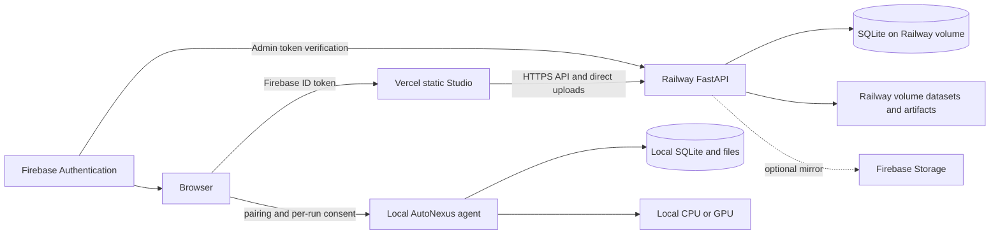

# AutoNexus Hybrid Deployment

This deployment keeps the browser, cloud control plane, identity provider, blob
backup, and local compute boundary separate.



Firebase Authentication provides identity. Firebase Storage can mirror dataset
and artifact blobs. AutoNexus does **not** use Firestore or Firebase Realtime
Database. Run metadata is stored in SQLite; working blobs live on the Railway
persistent volume or in the local-agent workspace.

## 1. Firebase

1. Create a Firebase project and Web app.
2. Enable **Authentication > Sign-in method > Email/Password**.
3. Create each allowed user under **Authentication > Users**.
4. Enable Storage and create a bucket if cloud mirroring is required.
5. Generate a service account under **Project settings > Service accounts**.
6. Keep the service-account JSON private. It belongs in Railway, never Git or
   Vercel's public frontend bundle.
7. Add the final Vercel domain to Firebase Authentication authorized domains.

## 2. Railway Backend

1. Create a Railway project from the AutoNexus GitHub repository.
2. Railway detects `railway.json` and builds `Dockerfile`.
3. Add a persistent volume mounted at `/data`.
4. Generate a Railway public domain for the service.
5. Add these Railway variables:

```text
AUTONEXUS_DEPLOYMENT=railway
AUTONEXUS_AUTH_MODE=firebase
AUTONEXUS_FIREBASE_API_KEY=<web API key>
AUTONEXUS_FIREBASE_PROJECT_ID=<project ID>
AUTONEXUS_FIREBASE_AUTH_DOMAIN=<project-id>.firebaseapp.com
AUTONEXUS_FIREBASE_APP_ID=<web app ID>
AUTONEXUS_FIREBASE_SERVICE_ACCOUNT_JSON=<complete service-account JSON>
AUTONEXUS_FIREBASE_STORAGE_BUCKET=<bucket name>
AUTONEXUS_FIREBASE_STORAGE_PREFIX=autonexus
AUTONEXUS_ALLOW_REMOTE_LOCAL_PATHS=false
AUTONEXUS_WEB_WORKSPACE=/data/studio-runs
AUTONEXUS_WEB_DB=/data/autonexus.sqlite3
AUTONEXUS_WEB_WORKERS=1
AUTONEXUS_CORS_ORIGINS=https://<project>.vercel.app
```

`AUTONEXUS_FIREBASE_STORAGE_BUCKET` is optional. Without it, datasets and
artifacts remain only on the Railway volume. SQLite stores metadata and paths,
not large binary files.

Add `LLM_MODEL` and one provider API key only when shared server-managed LLM
mode is required. BYOK keys remain memory-only for one run.

Verify the backend before deploying the frontend:

```text
https://<railway-domain>/api/health
```

The response must report `auth_mode: firebase`, `persistence:
sqlite+filesystem`, and the expected Firebase Storage status.

## 3. Vercel Frontend

Import the same GitHub repository into Vercel and use:

| Setting | Value |
|---|---|
| Framework preset | Other |
| Root directory | Repository root / blank |
| Build command | From `vercel.json` |
| Output directory | From `vercel.json` (`vercel-dist`) |
| Install command | Default / blank |

Add one Vercel environment variable to Production and Preview:

```text
AUTONEXUS_PUBLIC_API_BASE_URL=https://<railway-domain>
```

Do not add the Firebase service account or server LLM key to Vercel. The static
frontend receives non-secret Firebase Web configuration from Railway's
`/api/auth/config` endpoint. Redeploy after changing the API URL.

After Vercel assigns the final domain, update `AUTONEXUS_CORS_ORIGINS` on
Railway and redeploy Railway. Add comma-separated preview origins only when they
are trusted.

## 4. Local GPU Training

A hosted page cannot directly access a user's GPU. Install AutoNexus locally and
start a loopback-only paired agent:

```powershell
pip install "AutoNexus[serve,vision,boosting,explain,memory]"
autonexus-agent --allow-origin https://<project>.vercel.app
```

The agent prints a new memory-only pairing token. In the Studio:

1. Select **My local machine**.
2. Paste the printed pairing token and select **Pair agent**.
3. Select a local path or browser dataset.
4. Start the mission.
5. Approve the per-run CPU/GPU permission dialog.

The token is revoked when the agent stops. The agent binds only to loopback,
requires a trusted-origin CORS match, and rejects every mission that lacks the
explicit `local_gpu_consent` flag. Local metadata uses SQLite; datasets and
artifacts remain in the local-agent workspace.

Some browsers enforce Private Network Access for requests from an HTTPS website
to localhost. Approve the browser's local-network prompt when shown. Corporate
browser policies may block localhost access; in that case use `autonexus-web`.

## 5. Production Checks

1. Confirm unauthenticated Railway `/api/runs` returns HTTP 401.
2. Confirm two Firebase users cannot access one another's runs or artifacts.
3. Restart Railway and verify runs survive through SQLite and the mounted volume.
4. Upload a dataset and confirm it goes directly to Railway, not through Vercel.
5. If mirroring is enabled, confirm objects use
   `autonexus/<uid>/<run-id>/...` in Firebase Storage.
6. Confirm a local-agent mission fails without consent and succeeds after the
   permission dialog.
7. Rotate Firebase and shared LLM secrets if they were exposed during setup.
