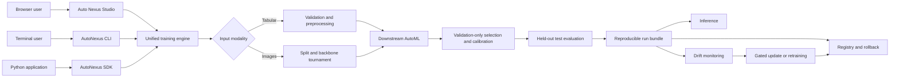
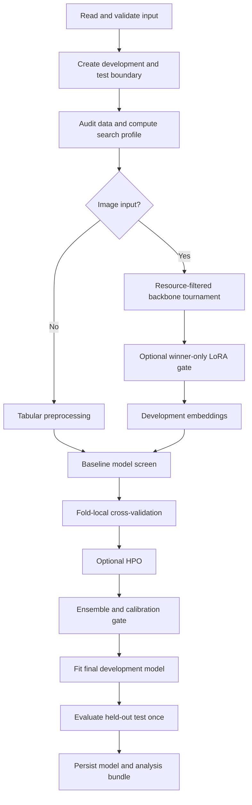
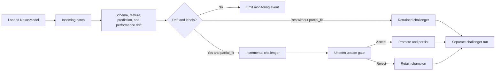

# AutoNexus

**Leakage-aware, resource-conscious AutoML for tabular and image learning**

AutoNexus is a Python framework, web studio, and command-line interface for training,
evaluating, packaging, and monitoring machine-learning models. A single engine
supports tabular classification, tabular regression, and folder-based image
classification. It combines development-only model selection, resource-aware
vision backbone search, optional LoRA adaptation, probability calibration,
reproducible artifacts, drift monitoring, and gated incremental updates.

```python
from autonexus import AutoNexus

model = AutoNexus(preset="balanced").fit("data.csv", target="label")
predictions = model.predict("unseen.csv")
```

> **Project status:** The current source targets AutoNexus `0.2.0`; `0.1.1` is
> the latest published framework release. The packaged runtime is
> designed for local and batch experimentation, but users should independently
> validate models, data splits, licenses, and operational controls before
> deploying them in high-risk environments.

## Contents

- [Abstract](#abstract)
- [Features](#features)
- [Supported Scope](#supported-scope)
- [System Architecture](#system-architecture)
- [Methodology](#methodology)
- [Technology Stack](#technology-stack)
- [Installation](#installation)
- [Usage](#usage)
- [Web Studio](#web-studio)
- [Python API](#python-api)
- [Configuration](#configuration)
- [Run Artifacts](#run-artifacts)
- [Data Analytics Notebook](#data-analytics-notebook)
- [Monitoring and Model Lifecycle](#monitoring-and-model-lifecycle)
- [Project Structure](#project-structure)
- [Results](#results)
- [Performance Considerations](#performance-considerations)
- [Reproducibility and Safety](#reproducibility-and-safety)
- [Limitations](#limitations)
- [Future Work](#future-work)
- [Development and Testing](#development-and-testing)
- [References](#references)
- [License](#license)

## Abstract

AutoNexus provides a unified AutoML workflow for heterogeneous tabular data and
image datasets. Its primary design objective is to reduce manual model search
without allowing the held-out test set to influence representation selection,
hyperparameter optimization, ensembling, or calibration. Image inputs are
converted into learned vector representations through a resource-filtered,
successive-halving tournament over frozen vision backbones. An optional LoRA
candidate is trained only for the selected compatible transformer and must pass
a separate development-data acceptance gate. Tabular and image representations
then share the same downstream model-screening, cross-validation, tuning,
generalization, and persistence path.

Every successful run produces a deployable model bundle, a machine-readable
manifest, a dataset search profile, a Markdown explanation, and an executable
analysis notebook. The resulting model can be used for inference, drift
monitoring, gated incremental updates when the estimator supports
`partial_fit`, local version registration, and optional HTTP serving.

## Features

| Area | Capability |
|---|---|
| Unified training | One SDK, CLI, and Web Studio for tabular classification, tabular regression, and image classification |
| Web Studio | Local-first dataset inspection, background training queue, live mission telemetry, run history, and safe artifact downloads |
| Leakage control | Development-only search, fold-local preprocessing, group-aware validation, and one final held-out test evaluation |
| Vision search | Automatic comparison of CLIP, DINOv2, ResNet-50, and SigLIP frozen representations |
| Efficient adaptation | Optional transformer LoRA with augmentation, AdamW weight decay, gradient checkpointing when applicable, early stopping, and best-checkpoint restoration |
| Model search | Fast landmark screening, cross-validation, optional randomized or grid search, and lazy optional boosters |
| Generalization | Structurally diverse ensemble gate and post-hoc temperature scaling on development data |
| Resource awareness | RAM/VRAM filtering, lazy imports, cooperative time budgets, FP16 embedding caches, and stage telemetry |
| Analytics | Pre-training-first notebook, image-quality audit, split diagnostics, calibration analysis, error analysis, and model card |
| Explainability | Permutation importance, optional SHAP, and representation-faithful nearest-neighbor diagnostics |
| LLM independence | LiteLLM, Ollama, local Transformers, custom callables, generic JSON APIs, or deterministic offline reporting |
| Lifecycle support | Batch inference, drift monitoring, gated incremental updates, replacement retraining, registry promotion, and rollback |
| Extensibility | Custom estimators, callbacks, data sources, drift detectors, LLM providers, monitoring sinks, and plugin factories |
| Local meta-memory | Optional FAISS or NumPy retrieval over sanitized dataset meta-features; raw examples are not stored |

## Supported Scope

| Modality | Training input | Tasks | Target definition |
|---|---|---|---|
| Tabular | `pandas.DataFrame`, CSV, XLSX, XLS | Classification and regression | Required target column |
| Vision | Image folder hierarchy | Classification | Class-folder names |
| Batch/stream source | DataFrame batches, CSV, Excel, Parquet, Python iterables, SQL, Kafka/Redpanda | Initial tabular training and monitoring | Required for supervised training or labelled monitoring |

Image training supports either class folders directly or explicit
`train`/`val`/`test` directories:

```text
dataset/                      dataset/
  cats/                         train/
  dogs/                           cats/
                                  dogs/
                                val/        # optional
                                  cats/
                                  dogs/
                                test/
                                  cats/
                                  dogs/
```

With explicit splits, `test/` remains unavailable to representation and model
selection. Without explicit splits, AutoNexus attempts to infer repeated
subject, video-folder, or frame-sequence groups. Reliable groups remain
disjoint; otherwise, the system uses a stratified image split.

Audio, video, text, executable-file analysis, neural architecture search, and
distributed multi-node training are outside the packaged `0.2.0` runtime.

## System Architecture

The SDK, CLI, and Web Studio translate user input into the same immutable run configuration
and call the same training engine. This avoids separate implementations for
interactive and programmatic use.



### Architectural Principles

1. **One engine:** Web Studio, CLI, and SDK behavior converge on `main.run`.
2. **Test-set firewall:** the test partition is evaluated after all choices are fixed.
3. **Modality adapter:** images become dense feature tables and reuse the downstream tabular path.
4. **Cheap-to-expensive search:** short baseline screens precede cross-validation and optional HPO.
5. **Evidence-gated complexity:** LoRA and ensembles are accepted only when development evidence supports them.
6. **Artifact-first execution:** configuration, metrics, resources, provenance, and outputs are persisted for every successful run.
7. **Capability-aware lifecycle:** incremental updates occur only for models that support a safe `partial_fit` path.

## Methodology

### End-to-End Training



### Data Splitting and Leakage Controls

- Tabular data uses stratified splitting for classification and random splitting
  for regression, subject to dataset size and target validity.
- Image paths are split before heavyweight model loading or embedding.
- Explicit test folders are not used by backbone search, LoRA, classifier
  screening, cross-validation, HPO, ensembling, or calibration.
- Repeated image groups, when inferred reliably, remain disjoint across the
  development/test boundary and group-aware validation folds.
- Imputation, scaling, encoding, target statistics, and other learned
  transformations are fitted within each training fold.
- Fitted training accuracy is treated as a diagnostic; cross-validated
  development performance is the primary selection estimate.

### Vision Backbone Selection

Automatic vision search evaluates four registered representation families:

| Key | Model | Family | Embedding size | Adaptation |
|---|---|---|---:|---|
| `clip` | `openai/clip-vit-base-patch32` | Vision-language transformer | 512 | LoRA-compatible |
| `dinov2` | `facebook/dinov2-small` | Self-supervised transformer | 384 | LoRA-compatible |
| `resnet` | `microsoft/resnet-50` | Convolutional network | 2048 | Frozen only |
| `siglip` | `google/siglip-base-patch16-224` | Vision-language transformer | 768 | LoRA-compatible |

Candidates first pass conservative RAM/VRAM checks. SigLIP is omitted from
CPU-only automatic search. Surviving frozen backbones enter a nested
successive-halving tournament:

| Stage | Development sample | Probe folds | Maximum survivors |
|---|---:|---:|---:|
| 1 | 10% | 2 | 3 |
| 2 | 30% | 3 | 2 |
| 3 | 100% | 5 | 1 |

Each candidate uses the same regularized logistic probe and the same available
group structure. Ranking considers mean accuracy, fold variance, negative log
likelihood, embedding latency, process RAM, and device memory. Accuracy remains
the dominant criterion; model size and latency resolve statistically close
outcomes. Candidate failures are isolated, and CLIP is the final fallback when
the remaining search cannot complete.

Embeddings are cached using the model identity, resolved revision, adapter,
file metadata, labels, split, and cache schema. Cached arrays are stored as
FP16 and restored to FP32 for downstream estimators.

### LoRA Adaptation

`adapt_lora=True` or `--adapt-lora` requests adaptation; it does not force an
adapted representation. AutoNexus trains a LoRA candidate only for the selected
compatible transformer backbone. The training path includes:

- training-only crop and color augmentation;
- automatic removal of horizontal flips for directional labels;
- AdamW weight decay on adapter parameters;
- gradient clipping and conditional gradient checkpointing;
- early stopping and restoration of the best checkpoint; and
- a frozen-versus-adapted comparison using the same development probe.

The adapter is accepted only when its accuracy and NLL evidence beats, or
safely matches, the selected frozen representation. ResNet-50 remains frozen
because query/value LoRA is not structurally valid for its convolutional
blocks.

### Downstream AutoML

The downstream catalogue includes linear models, stochastic-gradient models,
nearest-neighbor methods, support-vector machines, neural networks, decision
trees, regularized random forests and ExtraTrees, bagging, AdaBoost, histogram
gradient boosting, and optional XGBoost/LightGBM estimators.

The search proceeds in four stages:

1. A bounded baseline screen evaluates a data fraction and removes clearly weak candidates while retaining useful model-family diversity.
2. Surviving models are evaluated using stratified, grouped, or regression cross-validation as appropriate.
3. Optional grid or randomized HPO evaluates the strongest validation-ranked candidates.
4. Classification runs may compare the best single model with an equal-weight probability ensemble containing one GBDT, one linear model, and one nonlinear model.

The diverse ensemble must improve gate accuracy by at least `0.002` and remain
within `0.005` of the best member's CV reference. Temperature scaling then
optimizes one positive scalar on development probabilities to minimize NLL;
calibration is rejected if NLL worsens. Because positive temperature scaling
preserves the probability argmax, it changes confidence rather than class
predictions.

### Final Evaluation

Once the representation, preprocessing, model, ensemble decision, and
temperature are fixed, AutoNexus evaluates the held-out test set once.
Classification reports accuracy, weighted precision, weighted recall, weighted
F1, and ROC AUC when valid probabilities are available. Regression reports
RMSE, MAE, and R2. Training accuracy, CV performance, gate performance, and
test performance are recorded as distinct quantities.

## Technology Stack

| Layer | Technologies |
|---|---|
| Core runtime | Python 3.12+, NumPy, pandas, SciPy, scikit-learn, Joblib |
| CLI | argparse, Rich |
| Visualization | Matplotlib, Seaborn, nbformat; optional UMAP and SHAP |
| Vision | PyTorch, Transformers, PEFT, Pillow |
| Optional boosting | XGBoost, LightGBM |
| Meta-memory | FAISS with a NumPy fallback |
| LLM reporting | LiteLLM, Ollama, local Transformers, callable and HTTP adapters |
| Monitoring | JSONL, logging, webhooks, and optional Prometheus metrics |
| Streaming and data access | pandas batches, SQL/DB-API, Kafka/Redpanda, PyArrow |
| Web Studio and serving | FastAPI, Uvicorn, multipart upload handling, packaged HTML/CSS/JavaScript |
| Packaging and tests | `pyproject.toml`, uv, setuptools, pytest |

Heavy capabilities are optional and imported lazily. A core tabular run does
not require Torch, Transformers, FAISS, SHAP, an LLM client, or a web server.

## Installation

### From PyPI

After the distribution is published:

```bash
pip install AutoNexus
```

Install only the capabilities required by the application:

| Extra | Install command | Purpose |
|---|---|---|
| Boosters | `pip install "AutoNexus[boosting]"` | XGBoost and LightGBM |
| Vision | `pip install "AutoNexus[vision]"` | Image backbones and LoRA |
| Analytics | `pip install "AutoNexus[analytics]"` | UMAP notebook analysis |
| Explainability | `pip install "AutoNexus[explain]"` | SHAP explanations |
| LLM | `pip install "AutoNexus[llm]"` | LiteLLM and dotenv support |
| Memory | `pip install "AutoNexus[memory]"` | FAISS-backed meta-memory |
| Monitoring | `pip install "AutoNexus[monitoring]"` | Prometheus metrics and monitoring dependencies |
| Streaming | `pip install "AutoNexus[streaming]"` | Kafka, Parquet, and SQL extras |
| Web Studio and serving | `pip install "AutoNexus[serve]"` | Local training studio and FastAPI inference service |
| All | `pip install "AutoNexus[all]"` | All optional runtime capabilities |

GPU users should install a PyTorch build compatible with their CUDA driver and
platform before installing the vision extra.

### Local Development

Python 3.12 or newer and [uv](https://docs.astral.sh/uv/) are required.

```bash
git clone https://github.com/dineshmc1/AutoNexus.git
cd AutoNexus
uv sync --extra dev
```

For all optional capabilities:

```bash
uv sync --extra all --extra dev
```

## Usage

### Python SDK

Train a tabular classifier in fewer than five lines:

```python
from autonexus import AutoNexus

model = AutoNexus(output_dir="artifacts/churn").fit(
    "customers.csv", target="churn"
)
```

Train from a DataFrame:

```python
import pandas as pd
from autonexus import AutoNexus

frame = pd.read_parquet("training.parquet")
model = AutoNexus(preset="balanced").fit(frame, label_column="label")
```

Train an image classifier:

```python
from autonexus import AutoNexus

model = AutoNexus(
    task="vision",
    preset="accurate",
    backbones=["auto"],
    adapt_lora=True,
).fit("dataset/")
```

Run inference:

```python
predictions = model.predict("unseen.csv")
probabilities = model.predict_proba("unseen.csv")

# Vision models accept one image, a folder, or a list of paths.
image_predictions = model.predict("unseen_images/")
```

Load an existing run:

```python
from autonexus import AutoNexus

model = AutoNexus.load("artifacts/churn")
```

### Command-Line Interface

After installation, launch the designed interactive CLI:

```bash
autonexus
```

The CLI prompts for a dataset path. It requests a target only for tabular
input; image labels are inferred from directory names.

```bash
autonexus data.csv --target label
autonexus prices.xlsx --target price --problem-type regression
autonexus images/ --backbones auto --backbone-time 15m
autonexus images/ --adapt-lora
```

The legacy `ml-builder` command remains an equivalent compatibility alias.
Repository users can also run `uv run python main.py`.

Selected CLI options:

| Option | Meaning | Default |
|---|---|---|
| `--target` | Tabular target column | Prompted when omitted |
| `--problem-type` | `classification` or `regression` override | Automatic |
| `--output-dir` | Run artifact directory | `artifacts` |
| `--models` | Comma-separated estimator keys | Resource-aware selection |
| `--cv` | Maximum CV folds | `5` |
| `--max-time` | Cooperative budget such as `30s`, `10m`, or `2h` | Unlimited |
| `--feature-engineering` | Enable adaptive engineered features | Disabled |
| `--tune` | Enable validation-ranked HPO | Disabled |
| `--backbones` | `auto` or explicit vision keys | `auto` |
| `--backbone-time` | Cooperative backbone-search budget | `15m` |
| `--adapt-lora` | Request winner-only LoRA evaluation | Disabled |
| `--shap` | Add SHAP analysis when available | Disabled |
| `--no-llm` | Use deterministic offline Markdown | LLM attempted |
| `--no-contribute-memory` | Disable sanitized local meta-memory contribution | Contribution enabled |

Use `autonexus --help` for the complete option set.

## Web Studio

Auto Nexus Studio provides a local graphical control plane for nontechnical
and technical users. It supports local dataset paths, browser uploads,
lightweight dataset inspection, configurable training missions, persisted run
history, live status polling, generalization metrics, and allowlisted artifact
downloads. Training remains inside `AutoNexus.fit`; the website does not
maintain a separate ML pipeline.

Install and launch the single-user Studio:

```bash
pip install "AutoNexus[serve]"
autonexus-web
```

For repository development:

```bash
uv sync --extra serve --extra dev
uv run autonexus-web
```

The browser opens at `http://127.0.0.1:8787`. Runs are stored outside the
source tree in the current user's application-data directory by default
(`%LOCALAPPDATA%\AutoNexus\studio-runs` on Windows). A different location or
port can be selected:

```bash
autonexus-web --workspace D:\AutoNexusRuns --port 9000
```

Local mode deliberately permits only loopback hosts. For a shared Studio,
install `AutoNexus[serve,auth]`, configure Firebase, and bind to the intended
interface. The server verifies every Firebase ID token and scopes runs,
artifacts, monitoring, deployments, and audit events to its UID. Remote users
are upload-only by default; server-local dataset paths require the explicit
`AUTONEXUS_ALLOW_REMOTE_LOCAL_PATHS=true` administrator override.

### Firebase Authentication

1. Create a Firebase project and Web app.
2. In Firebase Authentication, enable the Email/Password sign-in provider and
   create or invite users.
3. Install `pip install "AutoNexus[serve,auth]"`.
4. Configure server credentials through
   `GOOGLE_APPLICATION_CREDENTIALS` or Application Default Credentials.
5. Set the public Web app values below and launch the server.

```powershell
$env:AUTONEXUS_AUTH_MODE="firebase"
$env:AUTONEXUS_FIREBASE_API_KEY="your-web-api-key"
$env:AUTONEXUS_FIREBASE_PROJECT_ID="your-project-id"
$env:AUTONEXUS_FIREBASE_AUTH_DOMAIN="your-project-id.firebaseapp.com"
$env:AUTONEXUS_FIREBASE_APP_ID="your-web-app-id"
autonexus-web --host 0.0.0.0
```

The Firebase Web API key is public application configuration, not an Admin
credential. Service-account material must remain server-side and must never be
placed in the browser bundle or committed to Git.

### Web Studio LLM and BYOK

The mission composer provides four report-generation modes:

| Mode | Credential source | Behavior |
|---|---|---|
| Server environment | `LLM_MODEL` plus the provider variable in `.env` or the process environment | Uses centrally managed configuration |
| Bring your own API key | Password field held only in server memory for that queued/running mission | Uses the selected hosted provider, exact model identifier, and optional custom endpoint |
| Local Ollama | No hosted key; configurable local HTTP endpoint | Sends the final run context to the selected Ollama model |
| Deterministic offline | None | Writes the standard local Markdown explanation without an external call |

Hosted BYOK supports OpenAI, Anthropic, Google Gemini, OpenRouter, Groq,
Mistral AI, and custom LiteLLM/OpenAI-compatible endpoints. AutoNexus prefixes
the submitted model identifier with the selected provider when needed. It
does not maintain a hard-coded model catalogue because provider model IDs and
availability change independently of AutoNexus.

The API key is submitted only to the loopback server, separated from the
persistable run configuration, retained in process memory while the mission is
queued or running, and removed afterward. It is not written to `web_run.json`,
`run.json`, logs, browser storage, reports, or artifacts. Provider failures are
redacted before they can enter the offline fallback report.

| Endpoint | Purpose |
|---|---|
| `GET /api/health` | Runtime version and authentication mode |
| `GET /api/auth/config` | Public login configuration and local-path policy |
| `GET /api/auth/me` | Verified current principal |
| `POST /api/datasets/inspect` | Lightweight local dataset profile |
| `POST /api/runs` | Validate and enqueue a training mission |
| `GET /api/runs` | Owner-scoped persisted mission archive |
| `GET /api/runs/{id}` | Current status, metrics, events, and artifacts |
| `GET /api/runs/{id}/insights` | Lineage plus cached, model-ranked geometry with safe raw axes, class/prediction metadata, and conditional response surfaces |
| `GET/POST /api/runs/{id}/monitoring...` | Baseline health and production-batch drift |
| `POST /api/runs/{id}/incremental-update` | Immutable gated incremental challenger |
| `POST/DELETE /api/runs/{id}/deploy` | Activate or stop in-process inference |
| `POST /api/deployments/{id}/predict` | Authenticated prediction plus telemetry |
| `GET /api/runs/{id}/artifacts/{name}` | Download an allowlisted run artifact |

## Python API

### Core Objects

| Object | Responsibility |
|---|---|
| `AutoNexus` | Configure training, fit data, load run bundles, and register custom estimators |
| `NexusConfig` | Frozen configuration and preset translation |
| `NexusModel` | Inference, explanations, persistence, monitoring, updates, registration, and serving |
| `DataSource` | Restartable batch-source protocol |
| `FrameSource`, `FileSource`, `IterableSource` | Local and in-process batch inputs |
| `SQLSource`, `KafkaSource` | Database and event-stream inputs |
| `DriftBaseline`, `DriftDetector` | Persisted reference distributions and deterministic drift signals |
| `NexusMonitor` | Batch or continuous monitoring loop |
| `ModelRegistry` | Filesystem version registration, promotion, champion lookup, and rollback |
| `FAISSMetaMemory` | Sanitized nearest-run contribution and retrieval |
| `LLMProvider` implementations | Hosted, local, callable, or HTTP report generation |
| `Callback` and `PluginRegistry` | Lifecycle hooks and extension registration |

### Main Training Signature

```python
trainer = AutoNexus(
    task="auto",
    preset="balanced",
    output_dir="artifacts",
    models=None,
    use_memory=True,
    contribute_memory=True,
    memory_dir=None,
    llm=True,
    callbacks=(),
    **options,
)

model = trainer.fit(data, target="label")
```

`data` may be a supported path, a DataFrame, or an AutoNexus `DataSource`.
Image folders do not require `target`. See [`codes.md`](codes.md) for complete
examples covering custom estimators, callbacks, LLM providers, monitoring,
streaming, updating, serving, and registry operations.

## Configuration

### Presets

| Preset | Intended use | Principal behavior |
|---|---|---|
| `fast` | Rapid iteration | 2-fold CV, short baseline screen, no HPO, reduced backbone budget |
| `balanced` | General use | Default configuration |
| `accurate` | Higher search effort | 5-fold CV, larger landmark sample, HPO, longer backbone budget |
| `low_memory` | Constrained systems | 2-fold CV, small sample, compact estimators, CLIP/DINOv2 candidates |
| `online` | Incremental tabular workflows | SGD estimators with native `partial_fit` support |

Example customization:

```python
from autonexus import AutoNexus

trainer = AutoNexus(
    task="classification",
    preset="balanced",
    models=["logistic", "sgd_clf", "et_clf", "xgb_clf"],
    cv=5,
    max_time="90m",
    feature_engineering=True,
    tune=True,
    tune_iterations=30,
    shap=True,
    contribute_memory=False,
)
model = trainer.fit("fraud.csv", target="is_fraud")
```

## Run Artifacts

Every successful SDK or CLI run writes the following minimum contract:

| Artifact | Purpose |
|---|---|
| `model.pkl` | Deployable predictor containing transformations, estimator, labels, modality, and inference metadata |
| `run.json` | Model, target, configuration, metrics, split evidence, resources, timings, calibration, artifact paths, and memory status |
| `analysis.ipynb` | Executable pre-training-first data and model investigation |
| `analysis_bundle.zip` | Portable notebook plus bounded `analysis_data`, metrics, and plots required to run it |
| `report/explanation.md` | LLM-generated or deterministic offline explanation |
| `search_profile.json` | Versioned statistical and landmark dataset representation |

Additional outputs can include:

| Artifact | Purpose |
|---|---|
| `best_model.joblib` | Internal fitted preprocessing and estimator object |
| `metrics.csv` | Final held-out model metrics |
| `report/report.html` | Combined EDA and model report |
| `analysis_data/` | Bounded notebook inputs, predictions, probabilities, embeddings, fingerprints, and reproducibility context |
| `.cache/` | Split-aware preprocessing and FP16 embedding caches |
| `lora_adapter/` | Best candidate adapter and training metadata when adaptation is requested |
| `monitoring/baseline.json` | Training reference used by drift detection |
| `framework.json` | Compact public API and lifecycle metadata |

LLM failure does not invalidate a completed model. AutoNexus writes a
deterministic local Markdown explanation when the configured provider,
credentials, dependency, or network is unavailable.

Local meta-memory retrieval and contribution are enabled by default. Compatible
neighbors provide failure-aware shortlist advice after landmark screening, but
current-dataset validation remains authoritative. Future entries store
selection/CV evidence rather than held-out test metrics. Raw rows, images, and
clear-text dataset paths are excluded. Configure retrieval with
`use_memory=False` or `--no-memory-retrieval`; configure contribution with
`contribute_memory=False` or `--no-contribute-memory`.

## Data Analytics Notebook

`analysis.ipynb` is generated after training so it can reference final model
artifacts, but its narrative presents data evidence before model outcomes. For
image runs, the notebook includes, where data and optional dependencies permit:

- an executive run summary and major warnings;
- unreadable-file, duplicate, near-duplicate, imbalance, dimension, format,
  and potential leakage audits;
- class and group distributions across train, validation, and test;
- representative, unusual, and low-quality image galleries;
- resolution, aspect-ratio, brightness, contrast, blur, entropy, and channel
  statistics;
- PCA and optional UMAP views by class, split, group, and correctness;
- silhouette and nearest-neighbor class-consistency diagnostics;
- the complete backbone tournament and selection rationale;
- the downstream model leaderboard and performance-cost Pareto view;
- frozen-versus-LoRA evidence and acceptance decision;
- raw and normalized confusion matrices and per-class metrics;
- confused-class pairs, error galleries, and potential label errors;
- reliability diagrams, ECE, NLL, Brier score, and temperature comparison;
- learning curves and confidence/uncertainty distributions;
- group-level diagnostics when group information is available;
- nearest embedding neighbors and technically valid explainability outputs;
- versions, seed, hardware, split fingerprints, configuration, revisions,
  cache state, artifact paths, and a model card.

Expensive image statistics, perceptual duplicate search, embeddings, UMAP, and
learning curves use deterministic class-covering samples on large datasets.
Exact representative class coverage and exact same-size duplicate checks are
retained. AutoNexus does not fabricate Grad-CAM for downstream estimators that
operate only on saved vectors; nearest embedding neighbors are used instead.

## Monitoring and Model Lifecycle



Monitor one batch:

```python
monitor = model.monitor(
    feature_threshold=0.2,
    prediction_threshold=0.15,
    minimum_samples=100,
)
report = monitor.observe(incoming_frame)
```

Batches smaller than `minimum_samples` run schema and type validation but do
not claim population, prediction-frequency, or performance drift. Their report
uses `severity="insufficient_data"` and `drifted=False` unless a real schema
error is present. Aggregate more observations before making drift or update
decisions.

Run a labelled incremental workflow:

```python
from autonexus import AutoNexus

model = AutoNexus(preset="online").fit(
    "initial.csv", target="label"
)
result = model.update(new_labelled_rows, target="label")
```

An update candidate is evaluated on an unseen new-data gate, persisted under an
immutable version directory, and promoted only if it strictly outperforms the
champion. With `strategy="auto"`, incompatible trees and ensembles receive a
full retrained challenger. Explicit `strategy="incremental"` still returns
`retrain_required` when `partial_fit` is unavailable. Vision models return
`adapter_or_retrain_required` rather than pretending to support generic online
updates.

## One-Line Deployment

```python
deployment = model.deploy()
```

This starts an inference API on localhost in the background and returns a
handle containing `predict_url`, `health_url`, `stop()`, and `wait()`. Public
binding requires an API key plus explicit insecure-HTTP acknowledgement; use a
trusted TLS reverse proxy for internet-facing deployments. The blocking
`model.serve()` development API remains available.

## Project Structure

```text
AutoNexus/
|-- autonexus/                 # Public SDK and lifecycle package
|   |-- api.py                 # High-level AutoNexus facade
|   |-- config.py              # Presets and immutable configuration
|   |-- model.py               # Inference, updates, monitoring, serving
|   |-- deployment.py          # Authenticated background inference service
|   |-- data.py                # Batch and streaming data sources
|   |-- drift.py               # Drift baseline and detectors
|   |-- monitoring.py          # Monitoring loop and sinks
|   |-- memory.py              # Local FAISS/NumPy meta-memory
|   |-- llm.py                 # LLM provider adapters
|   |-- web_auth.py            # Local/Firebase identity verification
|   |-- registry.py            # Version promotion and rollback
|   |-- plugins.py             # Extension registry
|   |-- callbacks.py           # Lifecycle events
|   |-- web.py                 # Local web API and background run manager
|   `-- web_static/            # Packaged Studio frontend and PDF slots
|-- main.py                    # CLI and unified orchestration engine
|-- data_loader.py             # Tabular and image input boundaries
|-- image_splitting.py         # Group-aware image splitting
|-- vision_backbones.py        # Backbone registry and resource filters
|-- backbone_selector.py       # Successive-halving vision tournament
|-- multimodal_extractor.py    # Embedding extraction and cache
|-- lora_adapter_trainer.py    # Gated LoRA candidate training
|-- feature_processing.py      # Fold-local preprocessing
|-- feature_engineering.py     # Optional learned feature transformations
|-- model_trainer.py           # Baseline screen and cross-validation
|-- model_selector.py          # HPO, metrics, and atomic persistence
|-- generalization.py          # Diverse ensemble and calibration
|-- analytics_artifacts.py     # Audits and notebook data bundle
|-- notebook_generator.py      # Executable analysis notebook
|-- report_generator.py        # HTML reporting
|-- llm_explainer.py           # LLM and offline Markdown reports
|-- nexus_predictor.py         # Serializable inference boundary
|-- tests/                     # Production test suite
|-- codes.md                   # Public API examples
|-- understanding.md           # Detailed architecture and risk review
|-- pyproject.toml             # Package metadata and dependencies
`-- uv.lock                    # Reproducible dependency resolution
```

The repository and wheel contain only the maintained production framework,
its packaged Studio assets, compatibility modules, tests, and documentation.
Historical agent, NAS, W&B, and earlier meta-learning prototypes remain
recoverable from Git history but are not part of the active source tree.

## Results

The following values are preserved from two reported development runs and the
corresponding AutoGluon comparisons. They are case studies, not a controlled
benchmark: the repository does not contain the exact dataset revisions,
hardware specification, AutoGluon configuration, repeated seeds, confidence
intervals, or a common memory-measurement protocol. Validation definitions also
differ: AutoNexus reports cross-validation, whereas the comparison reports a
validation split. The results therefore demonstrate observed behavior only.

### Types of Rice Image Dataset

| System | Train accuracy | Development/validation accuracy | Test accuracy | Total time | Peak RAM | Peak VRAM | Representation |
|---|---:|---:|---:|---:|---:|---:|---|
| AutoNexus | 1.0000 | 0.9957 CV | 0.9973 | 1,912.4 s | 2,697.4 MiB | 1,064.4 MiB | Frozen DINOv2 Small |
| AutoGluon | 0.9998 | 0.9995 validation | 0.9996 | 11,471.32 s | 4,903.03 MB | 7,963.34 MB | Not recorded |

AutoNexus was `0.0023` lower in held-out accuracy and approximately `6.0x`
faster in this run. Its fitted-to-CV accuracy gap was `0.0043`.

### DomainNet Clipart Image Dataset

| System | Train accuracy | Development/validation accuracy | Test accuracy | Total time | Peak RAM | Peak VRAM | Representation |
|---|---:|---:|---:|---:|---:|---:|---|
| AutoNexus | 0.8837 | 0.8553 CV | 0.8608 | 28,198.7 s | 9,477.4 MiB | 3,721.2 MiB | Frozen SigLIP Base |
| AutoGluon | 0.9827 | 0.8412 validation | 0.8337 | 17,073.37 s | 4,732.11 MB | 8,112.51 MB | Not recorded |

AutoNexus was `0.0271` higher in held-out accuracy and approximately `1.65x`
slower in this run. Its fitted-to-CV accuracy gap was `0.0284`; the held-out
test score was slightly higher than the CV estimate.

### Interpretation

- The rice run indicates that staged frozen-feature search can approach the
  comparison accuracy with substantially less observed runtime and device
  memory.
- The DomainNet run indicates that a stronger representation can improve
  generalization, but automatic vision search and downstream AutoML can become
  more expensive than the comparison pipeline.
- Peak RAM values use different reported units (`MiB` and `MB`) and may use
  different instrumentation; direct percentage claims would be misleading.
- A fitted accuracy of `1.0` is not sufficient evidence of harmful overfitting.
  The CV-to-test relationship, group integrity, repeated runs, and per-class
  errors provide more useful evidence.

## Performance Considerations

AutoNexus optimizes repeated and large runs through:

- successive-halving rather than full-dataset evaluation of every backbone;
- incremental, content-aware FP16 embedding caches;
- lazy imports for Torch, Transformers, PEFT, boosters, SHAP, FAISS, and LLMs;
- a short model baseline screen before full cross-validation;
- shared fold-preprocessing caches;
- resource-based model/backbone pruning; and
- early stopping for compatible boosting and LoRA training paths.

Runtime telemetry separates input preparation, backbone search, optional LoRA,
embedding/gating, downstream AutoML, report generation, LLM reporting, and
notebook generation. Some image timings are nested inside input preparation and
must not be added together. The total completion time includes the entire
pipeline; downstream training time covers only classifier-related stages.

`--max-time` and `--backbone-time` are cooperative budgets. They are checked
between models, folds, candidates, and stages, but cannot interrupt a
third-party `fit`, model download, or active embedding batch.

## Reproducibility and Safety

- A configurable random seed defaults to `42`.
- `run.json` records the resolved configuration, metrics, resource use,
  representation decision, artifacts, and lifecycle metadata.
- The notebook context records hardware, package versions, split fingerprints,
  model revisions, and cache state where available.
- Model and metric persistence uses temporary files followed by atomic
  replacement.
- LLM output cannot select, reject, calibrate, or promote a model.
- Optional reporting failures are isolated from the trained model.
- Raw examples are excluded from local meta-memory contribution.
- High-risk systems should require human approval before promotion and should
  monitor per-class and per-group behavior rather than aggregate accuracy alone.

> **Serialization warning:** `model.pkl` and Joblib artifacts can execute Python
> code while loading. Load only artifacts created by trusted AutoNexus runs.

## Limitations

| Limitation | Consequence | Current mitigation |
|---|---|---|
| Vision weights download on first use | Offline runs fail without a populated cache | Pre-provision approved model revisions |
| Automatic grouping is heuristic | Unusual filenames can hide subject/video leakage | Prefer explicit split folders when provenance is known |
| Backbone search is staged and approximate | An early-stage sample can eliminate a late-improving candidate | Provide an explicit backbone list or single backbone when domain knowledge is stronger |
| Time budgets are cooperative | One estimator or download can exceed the requested budget | Budgets are checked between interruptible operations |
| LoRA defaults are fixed | One adapter configuration may not suit every domain | Early stopping, weight decay, and a frozen-representation gate reduce risk |
| Calibration uses one internal gate | Small datasets can produce unstable temperature estimates | Skip insufficient cases and reject NLL degradation |
| Meta-memory routing is advisory | Historical neighbors do not automatically guarantee better search | Keep contribution optional and validate routing before use |
| Incremental learning is estimator-dependent | Trees and vision models cannot use generic `partial_fit` | Return explicit retraining/adaptation requirements |
| No lightweight end-to-end vision CI | Model downloads are impractical for fast unit tests | Test split, selection, cache, and fallback logic without downloads |
| Local filesystem registry | It is not a distributed model-governance service | Use external access control and artifact storage in production |
| Pickle-compatible deployment | Untrusted artifacts are unsafe | Load trusted run bundles only |
| Limited empirical evaluation | Two single-run image case studies cannot establish general superiority | Add repeated, controlled, multimodal benchmarks |

AutoNexus does not replace domain review, causal leakage analysis, fairness
assessment, security testing, or regulatory validation.

## Future Work

The highest-priority extensions are:

1. A reproducible benchmark suite with public dataset revisions, fixed hardware profiles, repeated seeds, confidence intervals, and matched baselines.
2. Subprocess-isolated estimator workers for enforceable wall-clock and memory limits.
3. Explicit group manifests or group-column configuration for datasets whose provenance cannot be inferred from paths.
4. Mocked and cache-backed end-to-end vision tests suitable for continuous integration.
5. Deployment-time backbone revision locking and an explicit upstream model-license audit.
6. Evidence-based meta-memory routing, including failure-aware penalties, after out-of-sample benchmarking.
7. More robust calibration for small or highly imbalanced datasets.
8. External registry and object-storage adapters with authentication and audit controls.
9. Dedicated vision adaptation jobs for new labelled batches rather than generic incremental updates.
10. Broader controlled evaluation of the analytics notebook as a data-quality and debugging instrument.

## Development and Testing

Run the production test suite without changing an existing environment:

```bash
uv run --no-sync pytest
```

Build and validate the distribution:

```bash
uv build
uvx twine check dist/autonexus-0.2.0-py3-none-any.whl dist/autonexus-0.2.0.tar.gz
```

The tests cover the public framework lifecycle, mandatory artifacts, drift,
local meta-memory, calibration invariants, grouped image splitting, backbone
selection/fallback logic, and execution of the generated notebook. Large
pretrained models are not downloaded during the standard suite.

Contributions should preserve the test-set firewall, avoid importing optional
heavy dependencies on the base tabular path, and include tests for public
behavior. Review [`understanding.md`](understanding.md) before changing
architecture-sensitive code.

## References

AutoNexus implements or builds upon methods and software described in the
following works:

1. F. Pedregosa et al., "Scikit-learn: Machine Learning in Python," *Journal of Machine Learning Research*, 2011. [Paper](https://jmlr.org/papers/v12/pedregosa11a.html)
2. T. Chen and C. Guestrin, "XGBoost: A Scalable Tree Boosting System," *KDD*, 2016. [Paper](https://doi.org/10.1145/2939672.2939785)
3. G. Ke et al., "LightGBM: A Highly Efficient Gradient Boosting Decision Tree," *NeurIPS*, 2017. [Paper](https://papers.nips.cc/paper/6907-lightgbm-a-highly-efficient-gradient-boosting-decision-tree)
4. K. He et al., "Deep Residual Learning for Image Recognition," *CVPR*, 2016. [Paper](https://arxiv.org/abs/1512.03385)
5. A. Radford et al., "Learning Transferable Visual Models From Natural Language Supervision," *ICML*, 2021. [Paper](https://arxiv.org/abs/2103.00020)
6. M. Oquab et al., "DINOv2: Learning Robust Visual Features without Supervision," 2023. [Paper](https://arxiv.org/abs/2304.07193)
7. X. Zhai et al., "Sigmoid Loss for Language Image Pre-Training," *ICCV*, 2023. [Paper](https://arxiv.org/abs/2303.15343)
8. E. J. Hu et al., "LoRA: Low-Rank Adaptation of Large Language Models," *ICLR*, 2022. [Paper](https://arxiv.org/abs/2106.09685)
9. C. Guo et al., "On Calibration of Modern Neural Networks," *ICML*, 2017. [Paper](https://proceedings.mlr.press/v70/guo17a.html)
10. J. Johnson, M. Douze, and H. Jegou, "Billion-scale Similarity Search with GPUs," 2017. [Paper](https://arxiv.org/abs/1702.08734)
11. L. McInnes, J. Healy, and J. Melville, "UMAP: Uniform Manifold Approximation and Projection for Dimension Reduction," 2018. [Paper](https://arxiv.org/abs/1802.03426)
12. S. M. Lundberg and S.-I. Lee, "A Unified Approach to Interpreting Model Predictions," *NeurIPS*, 2017. [Paper](https://proceedings.neurips.cc/paper/2017/hash/8a20a8621978632d76c43dfd28b67767-Abstract.html)

These references describe the underlying methods; they do not imply
endorsement of AutoNexus by the cited authors or organizations.

## License

AutoNexus package metadata declares the
[Apache License 2.0](https://www.apache.org/licenses/LICENSE-2.0). The complete
license text must be included as a root `LICENSE` file before public
distribution.
