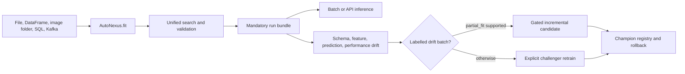

# AutoNexus

AutoNexus is a developer-first AutoML framework and CLI for leakage-safe
tabular and image learning. It combines resource-aware model search,
cross-validated selection, reporting, drift monitoring, pluggable LLMs,
streaming data sources, gated incremental updates, and a local model registry.

Train in fewer than five lines:

```python
from autonexus import AutoNexus

model = AutoNexus(preset="balanced").fit("data.csv", target="label")
predictions = model.predict("unseen.csv")
```

## Install

For a published distribution:

```powershell
pip install AutoNexus
pip install "AutoNexus[vision,memory,monitoring]"
```

For local development, Python 3.12 or newer and
[uv](https://docs.astral.sh/uv/) are required.

```powershell
uv sync --extra dev
```

Install only the optional capabilities you need:

```powershell
uv sync --extra boosting  # XGBoost and LightGBM
uv sync --extra vision    # Automatic vision backbones and LoRA
uv sync --extra explain   # SHAP
uv sync --extra llm       # LiteLLM-backed Markdown explanations
uv sync --extra all       # Every runtime capability
```

## Run

Running without arguments prompts for the dataset path. A target is requested
only for CSV/Excel input; image labels come from class-folder names.

```powershell
uv run python main.py
```

Trailing options are accepted at the path prompt, including paths with spaces:

```text
Dataset path (CSV, Excel, or image folder): C:\Datasets\Human Actions\train --adapt-lora
```

If the selected folder is named `train` and a sibling `test` folder exists,
ML-Builder automatically uses their parent as the dataset root.

The installed command and explicit forms are equivalent:

```powershell
uv run ml-builder data.csv --target label
uv run python main.py data.xlsx --target price --problem-type regression
uv run python main.py images --adapt-lora
uv run python main.py images --backbones auto --backbone-time 15m
```

Supported image layouts:

```text
dataset/                 dataset/
  cats/                    train/
  dogs/                      cats/
                             dogs/
                           val/       # optional
                             cats/
                             dogs/
                           test/
                             cats/
                             dogs/
```

With explicit `train/` and `test/` folders, the test folder remains untouched
until final evaluation. Otherwise, ML-Builder first looks for repeated
subject, video-folder, or frame-sequence groups. Reliable groups stay entirely
on one side of each split; ordinary independent images use a stratified
fallback.

Useful options:

```powershell
uv run ml-builder data.csv --target label --models logistic,rf,gb --max-time 10m
uv run ml-builder data.csv --target label --feature-engineering --tune
uv run ml-builder data.csv --target label --shap
uv run ml-builder data.csv --target label --no-report --no-llm
uv run ml-builder images --backbones clip,dinov2,resnet
uv run ml-builder images --backbones clip  # Disable backbone tournament
uv run ml-builder data.csv --target label --no-contribute-memory
uv run ml-builder --help
```

## Outputs

Every successful SDK or CLI run writes these contract artifacts to
`artifacts/` unless another output directory is supplied:

- `model.pkl`: portable AutoNexus inference bundle with feature engineering,
  preprocessing, label mapping, and the selected estimator.
- `analysis.ipynb`: pre-training-first data and model investigation.
- `report/explanation.md`: provider-generated or deterministic offline report.
- `run.json`: model, label column, complete configuration, metrics, resources,
  framework metadata, artifact paths, and memory-contribution result.
- `search_profile.json`: versioned statistical and landmark dataset embedding.

Additional outputs include:

- `best_model.joblib`: fitted internal preprocessing and final estimator.
- `metrics.csv`: final held-out metrics for the selected model.
- `analysis_data/`: compact notebook inputs including the image audit,
  prediction index, probabilities, embedding sample, model leaderboard,
  split fingerprints, and reproducibility context.
- `report/`: EDA plots, model explanations, `report.html`, and
  `explanation.md`.
- `.cache/`: split-aware image embeddings and fold preprocessing caches.
- `lora_adapter/`: candidate adapter checkpoint when `--adapt-lora` is enabled;
  `run.json` records whether the validation gate accepted it.

LLM reporting falls back to a deterministic local Markdown explanation when
LiteLLM, a provider key, or network access is unavailable.

Dataset meta-features contribute to local AutoNexus memory by default. Raw
rows, images, and the clear-text dataset path are never contributed. Disable
this per run with `contribute_memory=False` or `--no-contribute-memory`.

## Framework Lifecycle



The SDK accepts callbacks and custom estimators. LLM reporting can use
LiteLLM, Ollama, a local Transformers pipeline, any callable, or an arbitrary
JSON HTTP adapter. Monitoring can emit logs, JSONL, webhooks, or Prometheus
metrics. See `codes.md` for executable examples of every public workflow.

The notebook checks every image for readability before training. Exact
duplicates are checked across all same-size files; pixel-quality statistics
and perceptual near-duplicate search use a deterministic, class-covering sample
of at most 5,000 images. PCA, class-separation diagnostics, and learning curves
use a similarly bounded representation sample. Every class still appears in
the paginated representative-image gallery. UMAP runs when `umap-learn` is
available and otherwise reports a clear optional-dependency message.

## Safety Boundaries

- Model selection, tuning, ensembling, and temperature scaling use development
  data only. The test split is evaluated once after the final model is fixed.
- Cross-validated development accuracy is the primary selection estimate.
  Fitted training accuracy is reported only as an overfitting diagnostic.
- Preprocessors and target encoders are fitted within training folds.
- XGBoost and LightGBM use early stopping on validation folds, then refit
  cleanly on all development data.
- ExtraTrees uses depth/leaf/sample regularization and reports out-of-bag
  accuracy when selected. `--tune` searches its regularization using CV.
- `--adapt-lora` is a request, not an unconditional choice. Training-only
  augmentation, AdamW weight decay, early stopping, best-checkpoint
  restoration, and conditional gradient checkpointing are applied. A separate
  development gate compares frozen and adapted winner embeddings with the same
  logistic probe; the adapter is used only when accuracy/NLL evidence supports
  it. Horizontal flipping is disabled automatically for directional labels
  such as left/right or clockwise/counterclockwise. A selected frozen-only CNN
  is not given an invalid transformer LoRA.
- Backbone and downstream-model selection are metric-driven. The LLM only
  writes a report and cannot alter either winner.
- `--max-time` is a cooperative budget checked between model/fold operations;
  it cannot interrupt a third-party estimator in the middle of `fit()`.

## Image Model Selection

Image runs default to `--backbones auto`. The registry currently contains:

- `clip`: OpenAI CLIP ViT-B/32
- `dinov2`: DINOv2 Small
- `resnet`: ResNet-50
- `siglip`: SigLIP Base

Candidates that exceed conservative RAM/VRAM limits are removed first; the
heavy SigLIP candidate is skipped on CPU-only runs. Remaining frozen
backbones enter a successive-halving tournament:

```text
10% development data, 2-fold probe -> keep 3
30% development data, 3-fold probe -> keep 2
100% development data, 5-fold probe -> select 1
```

Every candidate uses the same regularized logistic probe and the same
group-aware folds. Ranking combines mean CV accuracy, fold variance, NLL,
embedding latency, estimated RAM, and estimated VRAM. Accuracy remains
dominant; a smaller model wins only inside a statistical tie, and a slower
model needs at least `0.002` accuracy or `0.01` NLL improvement over a faster
peer. Embeddings are accumulated across stages and cached by model, weights,
files, labels, adapter, and cache version. Mutable model branches are resolved
to a concrete commit hash before cache lookup and model loading.

The test folder is not embedded during this tournament. After the winner is
fixed, `--adapt-lora` optionally compares its frozen and adapted
representations. ResNet remains frozen because q/v LoRA is not structurally
valid for a CNN. Any backbone failure is isolated, and CLIP is the final
fallback when alternatives cannot complete. The chosen representation then
enters the separate downstream classifier search.

`--backbone-time` is cooperative: it stops between candidates/stages but
cannot interrupt a model download or one embedding batch already in progress.

## Verify

```powershell
uv run pytest
uv build
```

See `understanding.md` for the complete architecture, workflows, file map,
tradeoffs, and remaining risks.
