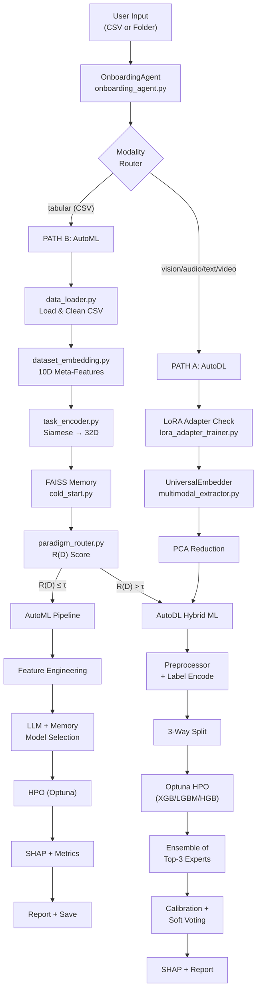

# ML-Builder Codebase Analysis

## System Architecture Overview

---

## PART 1: CSV File Upload (AutoML Path)

### Step-by-Step Process

| Step | File | Action |
|------|------|--------|
| 1 | `phase4_pipeline.py:main()` | User enters CSV path via CLI prompt |
| 2 | `onboarding_agent.py` | LLM extracts business objective, domain, target column |
| 3 | `data_loader.py:load_local_dataset()` | Reads CSV, detects problem type (clf if <10 unique targets), label-encodes |
| 4 | `dataset_embedding.py` | Computes 10D statistical fingerprint (log-rows, skewness, correlation, entropy, etc.) |
| 5 | `task_encoder.py` | Siamese encoder transforms 10D → 32D learned embedding |
| 6 | `cold_start.py` | FAISS L2 search for top-5 similar past datasets; warm-starts hyperparams if distance ≤ 0.50 |
| 7 | `llm_suggester.py` | LLM suggests 3 best models given meta-features |
| 8 | `paradigm_router.py` | Computes R(D) = λ₁·LLM(D) + λ₂·Memory(D) + λ₃·Heuristics(D); if R(D) > τ(0.5) → AutoDL, else AutoML |
| 9 | `feature_engineering.py` | Yeo-Johnson, outlier capping, text NLP extraction, rare category bucketing, interaction/ratio/poly features, correlated column drop |
| 10 | `feature_processing.py` | Builds sklearn ColumnTransformer (Standard/Robust scaling, OneHot/Target encoding) |
| 11 | `hpo_optuna.py` | Runs 20-30 Optuna trials per model with memory warm-start; MedianPruner |
| 12 | `multi_objective.py` | Selects winner via utility = w1·Accuracy + w2·Speed + w3·Complexity |
| 13 | `shap_explainer.py` | TreeExplainer/KernelExplainer generates SHAP plots |
| 14 | `llm_explainer.py` | LLM generates comprehensive natural-language report |
| 15 | `cold_start.py` | Saves winning model + hyperparams to FAISS memory for future warm-starting |
| 16 | `notebook_generator.py` | Generates Jupyter notebook with 4-pillar analytics |

---

## PART 2: Image/Video/Audio/Text Upload (AutoDL Path)

### Step-by-Step Process

| Step | File | Action |
|------|------|--------|
| 1 | `phase4_pipeline.py:main()` | User enters folder path via CLI |
| 2 | `onboarding_agent.py` | Detects modality by file extensions; LLM extracts domain (general/biology/remote_sensing) |
| 3 | `lora_adapter_trainer.py` | If no cached adapter: trains LoRA on base model (CLIP/AST/MiniLM) for the domain |
| 4 | `multimodal_extractor.py` | `UniversalEmbedder` initialized with domain-specific model from `domain_registry.py` |
| 5 | — | **Vision**: CLIP/BioCLIP/DINOv2 extracts 512D per image |
| 5 | — | **Audio**: AST (AudioSet) extracts 527D per clip |
| 5 | — | **Text**: MiniLM-L6-v2 extracts 384D per document |
| 5 | — | **Video**: CLIP extracts 512D per frame → mean-pooled per video |
| 6 | `multimodal_extractor.py` | Dynamic PCA: targets 95% variance, caps at 300D, floor at 100D |
| 7 | — | Embedding cache check (MD5 hash of folder path → `.npz` file) |
| 8 | `phase4_pipeline.py` | **Multi-modal override**: bypasses tabular FAISS + paradigm router; forces `paradigm = "AutoDL"` |
| 9 | `feature_processing.py` | Builds preprocessor on embedding features |
| 10 | — | Label encoding + 3-way split: Train 64% / Val 16% / Test 20% |
| 11 | — | DL FAISS Memory warm-start: PCA→100D→pad→query `dl_faiss_memory.py` |
| 12 | — | Optuna HPO: 20 trials over {XGBoost-GPU, LightGBM-GPU, HistGradientBoosting} with SuccessiveHalving pruner |
| 13 | — | Mixup augmentation if classification + <5000 samples |
| 14 | — | **Ensemble of Experts**: Top-3 trials retrained, calibrated (Isotonic), soft-voted |
| 15 | — | SHAP TreeExplainer on first expert; summary plot saved |
| 16 | `dl_faiss_memory.py` | Saves 100D PCA embedding + best params to modality-specific FAISS index |
| 17 | `llm_explainer.py` + `notebook_generator.py` | Comprehensive report + notebook generation |

---

## PART 3: Identified Inefficiencies & Bugs

### 🔴 Critical Issues

| # | Location | Issue | Impact |
|---|----------|-------|--------|
| 1 | [lora_adapter_trainer.py:114-121](file:///c:/Dinesh/AutoML/ML-Builder/lora_adapter_trainer.py#L114-L121) | **LoRA training loop is a no-op** — the forward pass and loss calculation are `pass`. No gradients are computed, no weights are updated. The saved adapter is identical to the initialized (random) weights. | LoRA adapters provide zero benefit. All "trained" adapters are random noise. |
| 2 | [phase4_pipeline.py:252-253](file:///c:/Dinesh/AutoML/ML-Builder/phase4_pipeline.py#L252-L253) | **Bare `except:` clauses** throughout — exceptions are silently swallowed (lines 252, 258, 303, 671, etc.). ROC-AUC, log-loss, and calibration errors fail silently. | Bugs and data issues are invisible; metrics report "N/A" with no diagnostics. |
| 3 | [phase4_pipeline.py:529](file:///c:/Dinesh/AutoML/ML-Builder/phase4_pipeline.py#L529) | **Mixup applied with original labels** — `y_tr_aug = y_tr` after feature mixing. True mixup requires interpolated soft labels. This trains on corrupted features with wrong hard labels. | Degrades model accuracy when triggered (<5000 samples). |
| 4 | [dataset_profiler.py:11](file:///c:/Dinesh/AutoML/ML-Builder/dataset_profiler.py#L11) | **Attempts OpenML API call for local datasets** — `openml.datasets.get_dataset(dataset_id)` is called with a filename like "bank.csv", which always fails and falls back silently. | Unnecessary network latency + silent failure on every local dataset run. |
| 5 | [phase4_pipeline.py:623](file:///c:/Dinesh/AutoML/ML-Builder/phase4_pipeline.py#L623) | **CalibratedClassifierCV with cv=5 on X_temp** — uses the combined train+val set for calibration fitting, but the model was already HPO'd on a subset. Cross-validated calibration on the same data used for training causes data leakage in the calibration stage. | Overly optimistic calibration; ECE metrics are unreliable. |

### 🟠 Performance Inefficiencies

| # | Location | Issue | Impact |
|---|----------|-------|--------|
| 6 | [multimodal_extractor.py:225-226](file:///c:/Dinesh/AutoML/ML-Builder/multimodal_extractor.py#L225-L226) | **`get_vision_model_config()` called inside every batch** in the extraction loop. This re-reads the domain registry dict on every single batch iteration. | Unnecessary overhead per batch (minor but accumulates on large datasets). |
| 7 | [multimodal_extractor.py:392-404](file:///c:/Dinesh/AutoML/ML-Builder/multimodal_extractor.py#L392-L404) | **Double PCA** — `PCA(n_components=512)` fitted first to determine variance, then a second `PCA(final_dim)` is fitted again from scratch. Should use `pca_full` directly with slicing. | 2× the PCA computation time on large embedding matrices. |
| 8 | [hpo_optuna.py:65-68](file:///c:/Dinesh/AutoML/ML-Builder/hpo_optuna.py#L65-L68) | **Full `baseline_screen` with 3-fold CV inside every Optuna trial** — each trial does 3-fold CV across the entire dataset. With 30 trials × 3 folds = 90 full training runs per model. | HPO is extremely slow on medium+ datasets. Should use a holdout or early stopping. |
| 9 | [phase4_pipeline.py:601-647](file:///c:/Dinesh/AutoML/ML-Builder/phase4_pipeline.py#L601-L647) | **Ensemble experts retrained on full X_temp** — the top-3 Optuna trials are re-instantiated and retrained from scratch on the combined train+val data, repeating all the work. | 3× redundant full retraining after HPO. |
| 10 | [cold_start.py:470-471](file:///c:/Dinesh/AutoML/ML-Builder/cold_start.py#L470-L471) | **FAISS index rebuilt from scratch on every `add()`** — `build_index()` calls `np.vstack` on all records then `faiss.IndexFlatL2`. With N records, this is O(N) per insertion. | Scales poorly as memory grows (though currently small). |
| 11 | [multimodal_extractor.py:179](file:///c:/Dinesh/AutoML/ML-Builder/multimodal_extractor.py#L179) | **`num_workers=0` on Windows** — DataLoader parallelism is disabled entirely on Windows. All I/O is serial. | Embedding extraction is CPU-bound on Windows; no parallel data loading. |

### 🟡 Code Quality & Design Issues

| # | Location | Issue |
|---|----------|-------|
| 12 | [phase4_pipeline.py:2-8](file:///c:/Dinesh/AutoML/ML-Builder/phase4_pipeline.py#L2-L8) | **Imports repeated inside functions** — `numpy`, `sklearn.metrics`, `sklearn.model_selection`, `torch` are re-imported at module top AND inside `run_single_dataset_pipeline()`. |
| 13 | [phase4_pipeline.py:52-805](file:///c:/Dinesh/AutoML/ML-Builder/phase4_pipeline.py#L52-L805) | **750-line monolithic function** — `run_single_dataset_pipeline()` handles AutoML, AutoDL, SHAP, metrics, reports, memory saving, and notebooks in one function with deep nesting. |
| 14 | [phase4_pipeline.py:631-642](file:///c:/Dinesh/AutoML/ML-Builder/phase4_pipeline.py#L631-L642) | **Closure `get_preds()` defined inside a loop** — captures `expert_model` from enclosing scope which changes each iteration; only works because it's called immediately. Fragile pattern. |
| 15 | [phase4_pipeline.py:403](file:///c:/Dinesh/AutoML/ML-Builder/phase4_pipeline.py#L403) | **`'final_accuracy' in locals()`** — using `locals()` to check variable existence is an anti-pattern; indicates poor control flow. |
| 16 | Multiple files | **Hardcoded paths** — `r"C:\Dinesh\AutoGluon Test\bank.csv"` in run scripts, `"memory_store.faiss"` repeated in 3+ files. |
| 17 | [modality_router.py](file:///c:/Dinesh/AutoML/ML-Builder/modality_router.py) | **Dead code** — `modality_router.py` is never imported anywhere. `onboarding_agent.py` duplicates its logic inline. |
| 18 | [multimodal_extractor.py:418-489](file:///c:/Dinesh/AutoML/ML-Builder/multimodal_extractor.py#L418-L489) | **Dead code** — `_process_vision_batch()`, `_process_text_batch()`, `_process_video_batch()` are superseded by `_extract_fast()` but never cleaned up. |
| 19 | [phase4_pipeline.py:483](file:///c:/Dinesh/AutoML/ML-Builder/phase4_pipeline.py#L483) | **GPU hardcoded** — `'device': 'cuda'` for XGBoost and `'device_type': 'gpu'` for LightGBM in the AutoDL path. Crashes on CPU-only machines. |
| 20 | [multimodal_extractor.py:99-105](file:///c:/Dinesh/AutoML/ML-Builder/multimodal_extractor.py#L99-L105) | **CPU parallelization stub** — `_process_single_file()` and `_extract_cpu_parallel()` both return `None` or fall back to serial extraction. |

### 🔵 Architectural Observations

| # | Observation |
|---|-------------|
| 21 | **Two separate entry points with duplicated logic** — `main.py` (standalone CLI pipeline) and `phase4_pipeline.py:main()` (MetaAutoML universal ingestion) share ~40% logic but are completely separate codepaths. |
| 22 | **Two separate FAISS memory systems** — Tabular uses `cold_start.py:MemoryStore` (32D embeddings), while multimodal uses `dl_faiss_memory.py:ModalityFAISSMemory` (100D PCA embeddings). They never cross-pollinate. |
| 23 | **LLM dependency is fragile** — `paradigm_router.py`, `llm_suggester.py`, `onboarding_agent.py`, and `llm_explainer.py` all independently call LiteLLM with different error handling. If the API key is missing, 4 separate fallbacks trigger. |
| 24 | **`feature_engineering.py` has two constructor signatures** — the `phase4_pipeline.py` instantiation (line 157) passes `corr_threshold` but not `fe_level`, while `main.py` passes `fe_level` and many more params. The two callers use different subsets of features. |

---

## Summary

**AutoML (CSV)**: `OnboardingAgent → Load CSV → 10D Embedding → 32D Siamese → FAISS Retrieval → LLM Suggestions → Paradigm Router → Feature Engineering → Optuna HPO (30 trials × 3-CV) → Multi-Objective Selection → SHAP → Report → Memory Save`

**AutoDL (Multimodal)**: `OnboardingAgent → LoRA Check → Domain-Specific Embedder (CLIP/AST/MiniLM) → GPU Batch Extraction → Dynamic PCA → Force AutoDL → Preprocessor → 3-Way Split → Optuna HPO (20 trials, GPU XGB/LGBM) → Top-3 Ensemble + Calibration → SHAP → Report → DL Memory Save`

**Top 3 fixes to prioritize:**
1. **Implement the LoRA training loop** — currently a complete no-op
2. **Replace 3-fold CV inside Optuna trials** with holdout eval — 3× speedup
3. **Fix Mixup implementation** — use soft labels or remove it entirely
