<![CDATA[# MetaAutoML — Codebase Analysis

> **Generated**: July 2026 | **Scope**: Full repository audit of all source files

---

## 1. System Architecture Summary

MetaAutoML implements a **meta-learning-augmented AutoML/AutoDL pipeline** with two execution paths (Classical ML and Hybrid DL) unified by a FAISS-backed memory store and an LLM-guided paradigm router.

### Data Flow

```
Input → OnboardingAgent → Modality Detection
  ├── Tabular → DataLoader → Cleaner → ResourceManager → FeatureEngineer
  └── Multi-Modal → UniversalEmbedder (CLIP/AST/MiniLM + LoRA)
        ↓
  DatasetEmbedding (10D) → SiameseEncoder (32D) → FAISS Retrieval
        ↓
  ParadigmRouter: R(D) = λ₁·LLM + λ₂·Memory + λ₃·Heuristics
  ├── R(D) ≤ τ → AutoML (Optuna HPO + SHAP)
  └── R(D) > τ → AutoDL (Hybrid ML-on-Embeddings + Ensemble)
        ↓
  Evaluation → SHAP → LLM Report → Notebook → W&B Logging
```

---

## 2. File-Level Analysis

### 2.1 Entry Points & Orchestration

#### `phase4_pipeline.py` (928 lines)
**Role**: Primary pipeline orchestrator — the central nervous system of the entire framework.

- **`extract_meta_features(X, y)`**: Computes 11 statistical meta-features (n_samples, n_features, num_ratio, cat_ratio, missing_rate, skewness_mean, mean_corr, n_classes, is_binary, target_entropy, majority_class_ratio).
- **`run_single_dataset_pipeline()`**: Core execution function (~750 lines). Handles:
  - Multi-modal override detection (bypasses FAISS for non-tabular data)
  - FAISS memory querying with cold-start fallback
  - LLM model suggestion integration
  - Paradigm routing via `route_paradigm()`
  - AutoML path: FeatureEngineer → HPO → SHAP → LLM Report → Memory Save
  - AutoDL path: PCA embedding → Optuna HPO (XGB/LGBM/HGB) → Ensemble of Experts (top-3 calibrated models, soft-voting) → SHAP → Report
  - System metrics: C(D), ECE, SCR, PR, TUS
- **`main()`**: Interactive CLI with OnboardingAgent, supports both agentic and direct pipeline modes.

**Key Design Decisions**:
- AutoDL uses a strict 3-way split (64% train / 16% val / 20% test) to prevent leakage.
- Ensemble uses `CalibratedClassifierCV` with isotonic regression for probability calibration.
- HPO subsamples to 15K rows max for speed on large datasets.
- Uses `SuccessiveHalvingPruner` to cut unpromising Optuna trials early.

#### `main.py` (486 lines)
**Role**: Legacy CLI pipeline (pre-Phase 4). Implements a simpler 7-step flow: Load → Clean → Resource Analysis → FE → Baseline Screen → Full Training → Report. Does **not** include meta-learning or paradigm routing. Retained for backward compatibility.

#### `run_metaautoml(ml).py` (124 lines)
**Role**: Benchmark script for tabular ML. Hardcoded to `bank.csv`. Includes threaded peak RAM monitoring, VRAM tracking, and structured metrics output (accuracy, precision, recall, F1, confusion matrix).

#### `run_metaautoml(dl).py` (140 lines)
**Role**: Benchmark script for multi-modal DL. Targets vision datasets (e.g., 102 Flowers). Initialises W&B, trains LoRA adapter if not cached, extracts embeddings, runs the full DL pipeline with train/val/test metrics.

---

### 2.2 Data Ingestion & Cleaning

#### `data_loader.py` (158 lines)
- **`load_local_dataset(path, target)`**: Loads CSV/Excel, drops constant/ID columns, detects problem type.
- **`detect_problem_type(y)`**: Classification if ≤20 unique values or object dtype; regression otherwise.
- **Leakage Detection**: Pearson correlation check (|r| > 0.95) + DecisionTree single-feature probing (AUC > 0.95) against the target.

#### `data_cleaner.py` (66 lines)
- Drops exact duplicates, imputes numeric with median, categorical with mode.
- Logs all actions to console.

#### `onboarding_agent.py` (93 lines)
- Scans file extensions to detect modality (`.jpg`/`.png` → vision, `.wav`/`.mp3` → audio, etc.).
- Uses LLM to extract business context (objective, success metric, domain, constraints).
- For tabular: prompts user for target column with auto-guess (last column).

#### `dataset_profiler.py` (41 lines)
- Gathers dataset context for LLM: OpenML description (if applicable), sample columns, missing %, class distribution, imbalance ratio.

---

### 2.3 Feature Engineering & Preprocessing

#### `feature_engineering.py` (346 lines) — `FeatureEngineer` class
**Capabilities**:
1. **NLP Stats**: Extracts word_count, char_count, unique_word_ratio from text columns.
2. **Rare Category Grouping**: Merges categories below `rare_threshold` (default 1%) into `_RARE`.
3. **Target Encoding**: Maps categorical values to target mean (classification/regression aware).
4. **Skew Correction**: Yeo-Johnson transform for features with |skew| > threshold.
5. **Adaptive Scaling**: Chooses StandardScaler (skew < 1.5) vs RobustScaler (skew ≥ 1.5) per feature.
6. **Interaction Features**: Top-N pairwise multiplications of most correlated numeric features.
7. **Multicollinearity Pruning**: Drops one feature from pairs with |corr| > `corr_threshold`.

**Auto-DL Bypass**: When operating on dense embeddings (AutoDL path), FE is skipped to preserve embedding geometry.

#### `feature_processing.py` (90 lines)
- Builds sklearn `ColumnTransformer` with adaptive scaling and encoding.
- Supports feature hashing for high-cardinality categoricals (>50 unique values).
- Returns `(preprocessor, numeric_features, categorical_features)`.

#### `resource_manager.py` (115 lines) — `ResourceManager` class
- Analyses dataset size + cardinality to set `fe_level` (1–3) and restrict heavy operations.
- Prevents OOM by capping one-hot encoding and polynomial features on large datasets.
- Adjusts model whitelist based on available resources (e.g., drops SVM on >50K rows).

---

### 2.4 Meta-Learning Core

#### `dataset_embedding.py` (281 lines)
**Embedding Vector** (10 dimensions):
| Dim | Feature | Normalization |
|-----|---------|---------------|
| 0 | Log-scaled sample count | / 10.0 |
| 1 | Log-scaled feature count | / 10.0 |
| 2 | Samples-to-features ratio | log / 10.0 |
| 3 | Mean skewness | clipped / 5.0 |
| 4 | High-skew fraction | raw [0,1] |
| 5 | Mean pairwise correlation | raw [0,1] |
| 6 | Coefficient of variation (tanh) | [-1,1] |
| 7 | Log-scaled unique classes | / 5.0 |
| 8 | Normalised target entropy | [0,1] |
| 9 | Missing rate | [0,1] |

Also provides `build_embedding_matrix()` for batch processing and `save_embeddings()` for JSON persistence.

#### `task_encoder.py` (321 lines) — Siamese MLP
- **Architecture**: Linear(10→64) → BatchNorm → ReLU → Linear(64→32) → L2-Normalize.
- **Training**: Contrastive loss on positive pairs (same model family) and negative pairs (different families). 1:2 pos/neg ratio.
- **Model Families**: tree_based, linear, distance, neural_ml, kernel, bagging.
- **Early Stopping**: Patience=20, ReduceLROnPlateau (factor=0.5, patience=10).
- Saved as `task_encoder.pt`. Auto-loaded if present; trains on-the-fly if not.

#### `cold_start.py` (849 lines) — `MemoryStore` + Adaptive Cold-Start
**MemoryStore**:
- Wraps FAISS index + `DatasetRecord` list (dataset_id, embedding, models, metadata).
- Supports: add, build_index, rebuild_index, save/load, remove entries, get_models_for_indices (voting).
- Persistence: `memory_store.faiss` + `memory_store.pkl`.

**Adaptive Cold-Start**:
- Computes ε(D) = μ_S - λ·σ_S as adaptive threshold.
- Combined score: α·Similarity + β·Performance + γ·Recency (exponential decay).
- Similarity floor: If best cosine sim < 0.75, forces cold-start regardless.
- Falls back to heuristic model lists when memory is empty or sparse (<3 valid neighbors).

**ColdStartLogger**: Structured logging for paper-ready metrics (JSON + DataFrame export).

#### `unified_memory.py` (321 lines) — `UnifiedMemoryStore`
- Extends the concept to support both ML and DL paradigms.
- Paradigm-aware routing: can retrieve configs tagged as ML or DL separately.
- FAISS-backed with the same persistence pattern.

---

### 2.5 Model Training & HPO

#### `model_trainer.py` (349 lines)
**Model Catalogue** (14+ algorithms):

| Classification | Regression |
|---|---|
| logistic, sgd_clf, knn_clf, naive_bayes | ridge, lasso, elastic, sgd_reg, knn_reg |
| dt_clf, svc, mlp_clf | dt_reg, svr, mlp_reg |
| rf, et_clf, ada_clf, bag_clf | rf_reg, et_reg, ada_reg, bag_reg |
| gb, lgbm_clf, xgb_clf | gb_reg, lgbm_reg, xgb_reg |

- **`baseline_screen()`**: Fast screening with optional subsampling (default 20%). Cross-validation or single-split. Time-budgeted per model.
- **`get_models()`**: Returns filtered model dict. Supports whitelist filtering.

#### `model_selector.py` (194 lines)
- Calculates comprehensive metrics (accuracy, precision, recall, F1, ROC-AUC, log-loss for classification; MAE, MSE, RMSE, R² for regression).
- Hyperparameter tuning via GridSearchCV or RandomizedSearchCV.

#### `hpo_optuna.py` (154 lines)
- Multi-objective Optuna with `RegularizedObjective`.
- Warm-starting from FAISS-retrieved hyperparameters.
- W&B integration for logging each trial.
- Supports XGBoost, LightGBM, RandomForest, ExtraTrees, GradientBoosting, Ridge, Logistic.

#### `multi_objective.py` (123 lines)
- Utility function: `U = w₁·Score + w₂·Speed + w₃·Simplicity`.
- Model complexity map (1=simple linear → 4=XGB/LGBM).
- `select_best_model_multiobjective()`: Filters candidates within 5% of best score, then ranks by utility.

---

### 2.6 Paradigm Routing

#### `paradigm_router.py` (90 lines)
- **`calculate_heuristics_d()`**: Rule-based score (0–1). Large datasets (>100K) and high dimensionality (>100 features) favor DL; small feature spaces (<20) favor ML.
- **`calculate_llm_d()`**: Asks LLM for P(DL beats ML). JSON response with `{"probability": float}`.
- **`calculate_memory_d()`**: Checks if top-K FAISS neighbors used DL (via `is_dl` metadata flag).
- **`route_paradigm()`**: R(D) = 0.5·LLM + 0.2·Memory + 0.3·Heuristics. Threshold τ=0.5.

#### `heuristics.py` (109 lines)
- 9 rules for classification, 7 for regression. Examples:
  - Large dataset (>5K rows) → lgbm, xgb, rf
  - High categorical ratio (>60%) → tree-based
  - Small dataset (<200 rows) → naive_bayes, knn, dt
  - High multicollinearity (corr > 0.7) → regularised linear
- Returns top-5 deduplicated suggestions.

#### `llm_suggester.py` (127 lines)
- Strict model name validation against exact catalogue keys.
- Regex-based JSON extraction (handles `<think>` blocks from reasoning models).
- Logs suggestions, latency, and token usage to W&B.

---

### 2.7 Multi-Modal Support

#### `multimodal_extractor.py` (424 lines) — `UniversalEmbedder`
**Supported Modalities & Models**:
| Modality | Default Model | Embedding Dim |
|---|---|---|
| Vision | CLIP ViT-B/32 | 512 |
| Audio | AST (AudioSet) | 527 (logits) |
| Text | all-MiniLM-L6-v2 | 384 |
| Video | CLIP (frame-level → mean) | 512 |

- **DataLoader pipeline**: `MultiModalDataset` with custom collation, batch processing, FP16 autocast on GPU.
- **Dynamic PCA**: Targets 95% variance, caps at 300D, floors at 100D.
- **Embedding Cache**: MD5 hash of folder path → `.npz` file for instant reload.
- **Auto Train/Test Detection**: If folder contains `train/test/val` subfolders, auto-routes to `train/`.

#### `domain_registry.py` (74 lines)
Pre-configured model registry:
- **general**: CLIP ViT-B/32, ResNet50
- **biology**: BioCLIP, BEiT, DINOv2, SigLIP
- **remote_sensing**: MiT-B0, ResNet50
- **documents**: TrOCR, ResNet50

#### `lora_adapter_trainer.py` (182 lines)
- PEFT LoRA fine-tuning with dynamic epoch scaling (50K+ samples → 2 epochs, 10K+ → 3, else 5).
- Supports vision (CLIP), audio (AST), text (SentenceTransformer).
- Adds a linear classifier head on top of embeddings for supervised LoRA training.
- Saves adapter weights to `lora_adapters/{modality}_{domain}_lora/`.

#### `dl_faiss_memory.py` (64 lines) — `ModalityFAISSMemory`
- Per-modality FAISS index (100D PCA embeddings).
- Stores best_params + accuracy per dataset.
- Pseudo-similarity: `1 / (1 + L2_distance)`.

---

### 2.8 Explainability & Reporting

#### `shap_explainer.py` (88 lines)
- **TreeExplainer**: For rf, et, gb, xgb, lgbm, ada, bag models.
- **KernelExplainer**: For linear models (background: kmeans k=10, sample: 50). For MLP/SVM/KNN (sample: 30).
- Generates beeswarm + bar plots, logs to W&B, returns top-3 feature names.

#### `llm_explainer.py` (112 lines)
- **AutoML prompt**: 4-pillar analytics (Descriptive → Diagnostic → Predictive → Prescriptive).
- **AutoDL prompt**: 5-section structure (Executive Summary → Why DL → NAS Results → Performance → Efficiency).
- Saves Markdown to `reports/{dataset_id}_consultant_report.md`.
- Logs HTML-wrapped report to W&B.

#### `report_generator.py` (316 lines)
- Standalone HTML report with embedded CSS and base64-encoded PNG images.
- Includes performance metrics, confusion matrix visualisation, feature importance plots.

#### `notebook_generator.py` (103 lines)
- Auto-generates Jupyter notebooks with 4 sections matching the analytics pillars.
- AutoML: Correlation heatmaps, box plots, confusion matrix.
- AutoDL: t-SNE embedding visualisation, classification report.

#### `eda.py` (173 lines)
- Target distribution plots (histogram for regression, bar for classification).
- Feature distribution grid, correlation heatmap.
- Saves plots to `reports/` directory.

#### `confidence_calibration.py` (86 lines)
- Computes Expected Calibration Error (ECE) using reliability diagrams.
- Weighted combination: C(D) = w_sim · similarity + w_cons · consistency + w_agree · agreement.
- Generates reliability curve plot, logs to W&B.

---

### 2.9 Agentic Pipeline

#### `agents/agent_orchestrator.py` (122 lines) — `AgenticAutoMLOrchestrator`
7-step pipeline:
1. **DataAgent** → LLM-driven dataset profiling (target detection, problem type)
2. **BusinessAgent** → Interactive business context gathering + ML objective translation
3. **CriticAgent Phase 1** → Validates data + requirements (checks for metric mismatch, leakage)
4. **FeatureAgent** → LLM-recommended FE plan (missing strategy, encoding, transformations)
5. **ModelAgent** → Memory-augmented model selection (FAISS + LLM)
6. **CriticAgent Phase 2** → Validates full pipeline (checks for leakage, resource mismatch)
7. **Report Generation** → Consultant report aggregation

Each agent uses `litellm.completion()` with strict JSON output schemas. All agents have robust fallback defaults if LLM parsing fails.

#### `agents/critic_agent.py` (131 lines)
- Adversarial validation with specific failure modes:
  - Metric mismatch (RMSE for classification)
  - Target leakage (target in features)
  - Resource mismatch (500-layer NN for 100 rows)
- Robust JSON parser: handles `<think>` tags, markdown blocks, keyword fallback.
- Auto-approves on parsing failure to prevent pipeline deadlocks.

---

### 2.10 Experiment Tracking

#### `wandb_logger.py` (57 lines)
- Thin wrapper around W&B: `init_run()`, `log()`, `log_image()`, `log_table()`, `log_artifact()`, `finish()`, `alert()`.
- All functions are no-ops when `USE_WANDB=False`.
- Uses `WANDB_SILENT=true` to suppress console noise.

---

### 2.11 Utility & Build Scripts

| File | Lines | Purpose |
|---|---|---|
| `build_memory.py` | 14675B | Pre-seeds FAISS memory from OpenML datasets |
| `preseed_memory.py` | 4717B | Alternative memory seeding script |
| `delete_memory.py` | 4844B | Interactive memory entry removal |
| `extract_memory.py` | 4257B | Exports memory contents for analysis |
| `update_memory_hparams.py` | 1952B | Updates hyperparameters in existing records |
| `weight_search.py` | 5409B | Grid search for optimal cold-start weights |
| `auto_dl_nas.py` | 3986B | Standalone NAS search space definition |
| `routing_engine.py` | 3142B | Additional routing logic module |

---

## 3. Dependency Map

```mermaid
graph TD
    A[phase4_pipeline] --> B[data_loader]
    A --> C[data_cleaner]
    A --> D[feature_engineering]
    A --> E[feature_processing]
    A --> F[model_trainer]
    A --> G[cold_start / MemoryStore]
    A --> H[dataset_embedding]
    A --> I[task_encoder]
    A --> J[paradigm_router]
    A --> K[hpo_optuna]
    A --> L[llm_suggester]
    A --> M[llm_explainer]
    A --> N[shap_explainer]
    A --> O[multi_objective]
    A --> P[multimodal_extractor]
    A --> Q[notebook_generator]
    A --> R[dataset_profiler]
    A --> S[onboarding_agent]
    A --> T[wandb_logger]
    A --> U[dl_faiss_memory]
    A --> V[heuristics]
    
    P --> W[domain_registry]
    P --> X[lora_adapter_trainer]
    X --> Y[lora_config]
    
    J --> L
    J --> G
    J --> V
    
    G --> H
    I --> G
    
    Z[agent_orchestrator] --> AA[data_agent]
    Z --> AB[business_agent]
    Z --> AC[feature_agent]
    Z --> AD[model_agent]
    Z --> AE[critic_agent]
    Z --> G
```



---

## 4. Known Considerations

### Architectural
- `phase4_pipeline.py` is monolithic at 928 lines; the AutoML and AutoDL paths could be extracted into separate modules.
- Legacy `main.py` duplicates some logic from `phase4_pipeline.py` — they serve different pipeline generations.

### Security
- API keys are managed via `.env` + `python-dotenv`. The `.env.example` file provides a template.
- LLM calls gracefully degrade on failure (empty suggestions, auto-approve).

### Performance
- FAISS uses `IndexFlatL2` (brute-force). For >10K memory entries, consider `IndexIVFFlat`.
- HPO subsamples to 15K rows for the AutoDL path.
- Embedding cache prevents redundant extraction on re-runs.

### Testing
- Test coverage is limited to leakage detection and GPU placement.
- No unit tests for core pipeline functions (feature engineering, meta-learning).

---

*End of codebase analysis.*
]]>
