# AutoNexus: Project Understanding

## 1. Executive Summary

AutoNexus is a Python 3.12 AutoML framework with two interfaces over one
training engine:

- `autonexus.AutoNexus` is the compact SDK used by applications.
- `main.py`, `autonexus`, and `ml-builder` expose the same engine as a CLI.

It accepts:

- Tabular classification or regression data in CSV, XLSX, or XLS format.
- Image classification data arranged in class-named folders.

The system separates development data from an untouched test split. Image
runs automatically shortlist and compare registered frozen backbones before
optional winner-only adaptation. Both modalities then screen classifiers,
train with cross-validation, optionally tune and ensemble, calibrate
classification probabilities, evaluate once on test, and write a reusable
model plus reports and reproducibility metadata.

Every successful run has a strict artifact contract: `run.json`, `model.pkl`,
`analysis.ipynb`, `report/explanation.md`, and `search_profile.json`.
The production distribution is explicitly declared in `pyproject.toml`.
Historical W&B, agentic, and NAS prototypes are not imported and are excluded
from the built wheel.

## 2. System Boundary

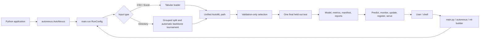

The stable contract includes the SDK, CLI, serialized run bundle, drift
baseline, local meta-memory, streaming source protocol, update gate, model
registry, and optional inference server. W&B experiment tracking, autonomous
agents, executable-file analysis, audio/video/text training, and neural
architecture search are not production runtime features.

## 3. Main Execution Path

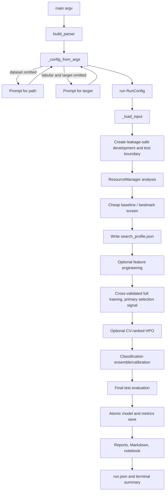

`RunConfig` is the immutable run contract. CLI values are validated before
training, paths are resolved, and image folders never require a target option.
The interactive path prompt also parses trailing options such as
`--adapt-lora`. Selecting a folder named `train` automatically resolves to its
parent when a sibling `test` folder is present.

### 3.1 SDK Lifecycle

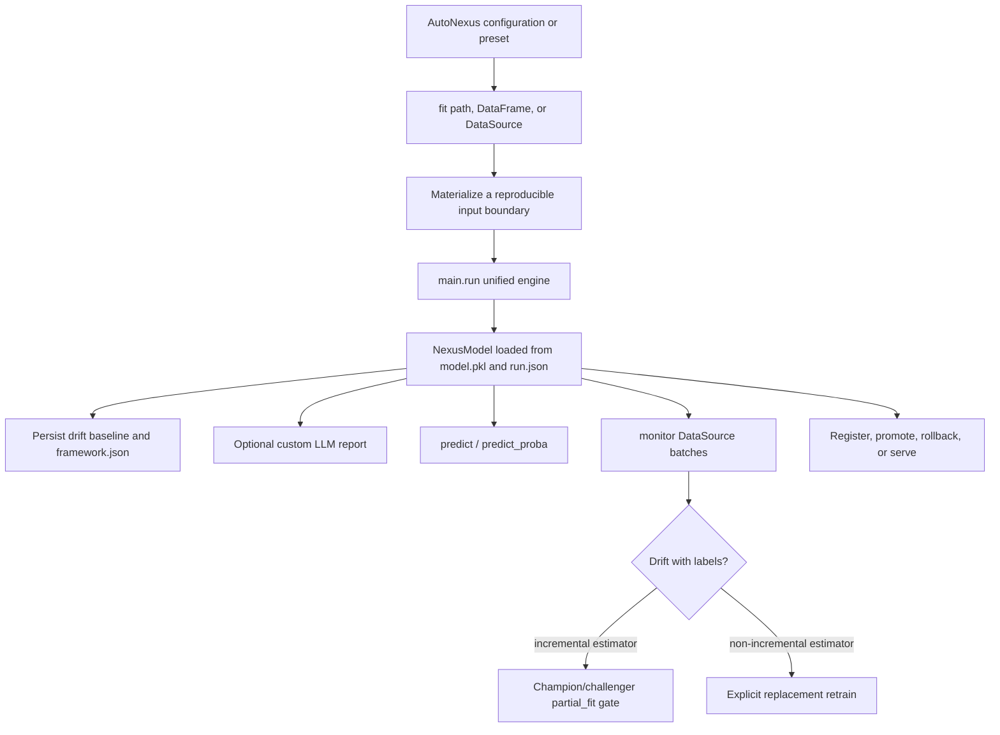

The SDK does not maintain a second training implementation. It translates
typed `NexusConfig` values into `RunConfig`, calls `main.run`, then adds
lifecycle metadata and a persisted monitoring baseline. This prevents CLI and
library behavior from diverging.

## 4. Input Workflows

### 4.1 Tabular Input

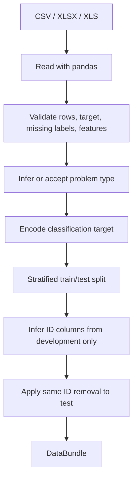

Important boundary: target-correlated feature removal is not automated.
Computing such a rule before the split would inspect test labels, and a highly
predictive legitimate feature can look identical to leakage. Domain-specific
leakage columns should be removed explicitly upstream.

### 4.2 Image Input With Explicit Splits

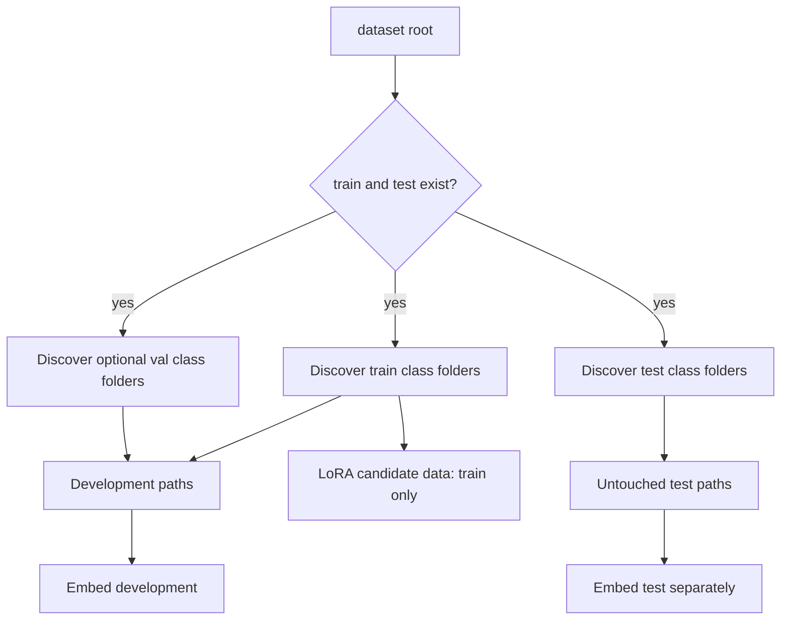

The optional `val/` folder joins downstream development data and acts as the
outer frozen-versus-adapted representation gate when available. LoRA itself
uses only `train/` and creates a separate internal early-stopping split. The
explicit `test/` folder is not used by adaptation, representation selection,
screening, model selection, ensembling, or calibration.

### 4.3 Image Input Without Explicit Splits

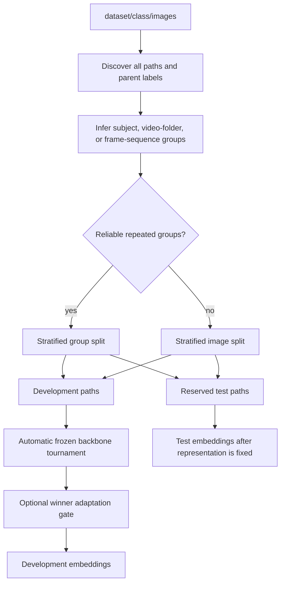

Splitting happens on file paths before model loading. Group inference is
conservative: ambiguous or mostly unique identifiers fall back to ordinary
stratification instead of inventing false groups. This reduces frame/session
leakage when a dataset contains repeated video or subject observations. Cache
keys are split-specific, so development and test embeddings cannot be
accidentally combined through the cache.

## 5. Image Backbone, Embedding, and LoRA Workflows

### 5.1 Embedding Cache

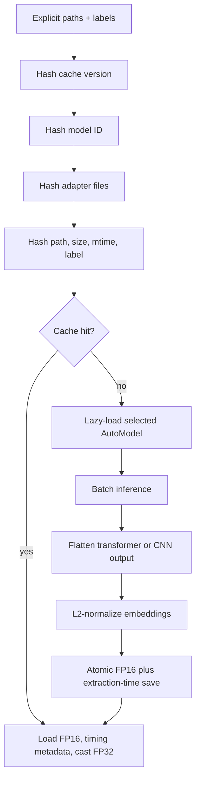

FP16 is a disk/storage optimization only. Values are restored to FP32 before
scikit-learn training. The cache identity includes its schema version, model
ID, resolved upstream commit, adapter file signature, cache-stage key, and
every file path, size, mtime, and label. The same resolved commit is used to
load the processor and weights. Historical extraction time is stored so a
cache hit cannot obtain an artificial latency advantage in a later tournament.

### 5.2 Automatic Backbone Tournament

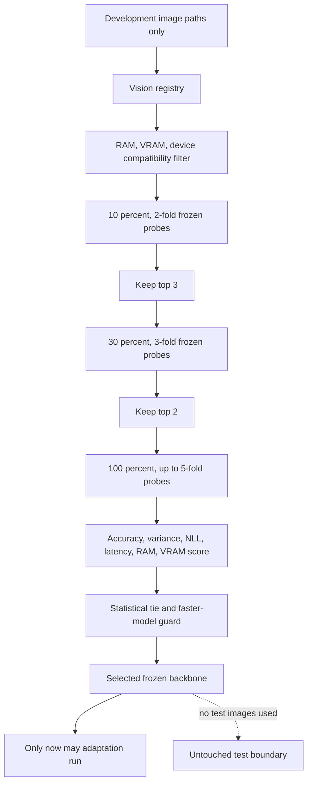

The registry includes CLIP ViT-B/32, DINOv2 Small, ResNet-50, and SigLIP Base.
It records family, model ID, input size, expected dimension, parameter count,
RAM/VRAM estimates, batch size, license identifier, and adaptation strategy.
SigLIP is excluded on CPU-only runs, and any candidate outside conservative
available-memory limits is removed before model loading.

Every stage uses the same regularized logistic probe and group-aware folds.
Stage samples are nested, so newly embedded rows accumulate rather than
recomputing earlier rows. The ranking score is:

```text
mean_accuracy
- 0.25 * fold_accuracy_standard_deviation
- normalized_NLL_penalty
- latency_penalty
- RAM_penalty
- VRAM_penalty
```

Accuracy remains dominant. A smaller model wins only within a statistical
tie. A slower candidate cannot replace a faster tied candidate unless it
improves accuracy by at least `0.002` or NLL by at least `0.01`. The
cooperative `--backbone-time` budget is checked between candidates and stages.
Candidate failures are isolated; CLIP is retained as the final fallback.

### 5.3 Frozen-versus-Adapted Winner

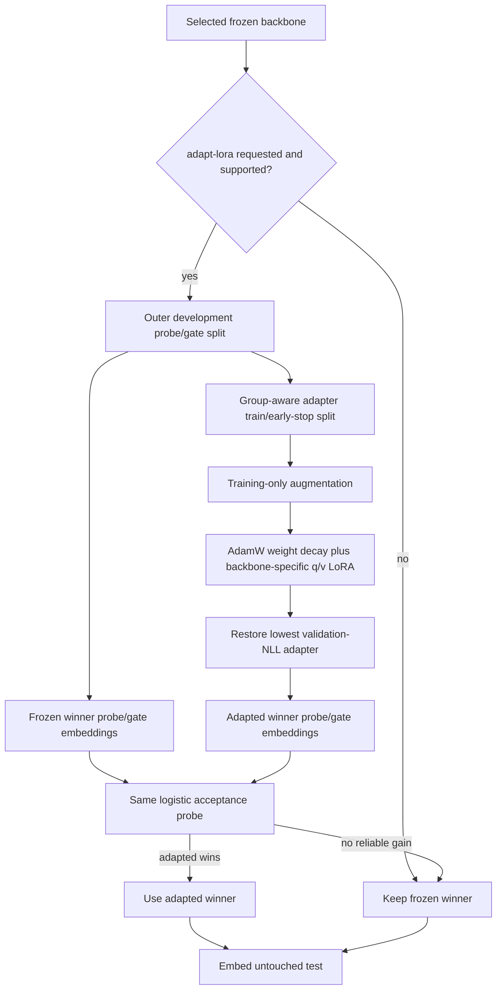

Gradient checkpointing is enabled for supported transformer winners on CUDA
devices with at most 12 GB VRAM. Augmentation is training-only and directional
labels disable horizontal flips. The gate accepts adaptation when accuracy
improves by at least `0.002` without material NLL regression, or accuracy is
non-worse while NLL improves by at least `0.01`. ResNet is frozen-only because
transformer q/v LoRA is invalid for convolutional blocks. Training, adapted
embedding, or adapted-test failure restarts the representation step in frozen
mode using cached tournament embeddings.

### 5.4 Backbone and Classifier Decisions

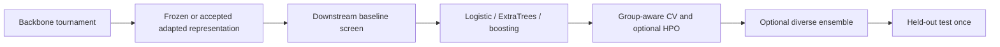

Backbone selection and classifier selection are independent. The first chooses
the representation. The second chooses the estimator operating on that
representation. LiteLLM receives results only after training for narrative
reporting and has no code path into either selection decision.

## 6. AutoML Workflow

### 6.1 Resource Analysis and Shortlisting

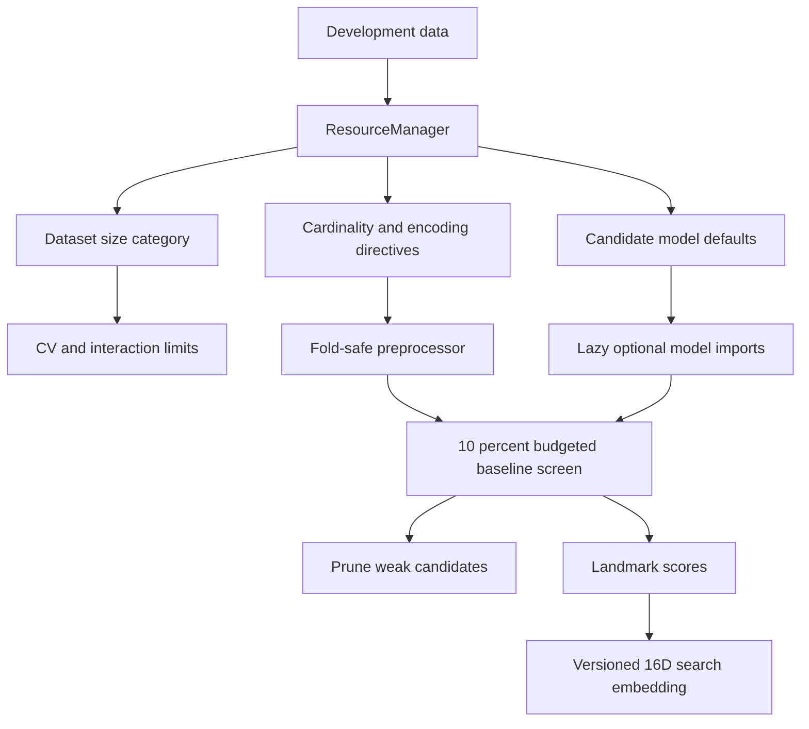

The baseline screen is the model-shortlist gatekeeper. It uses a stratified
sample for classification, at most two folds, and a separate time budget.
The search embedding combines statistical meta-features with observed
landmark performance. It is persisted for future retrieval systems, but the
production CLI does not currently query FAISS.

### 6.2 Feature and Preprocessing Workflow

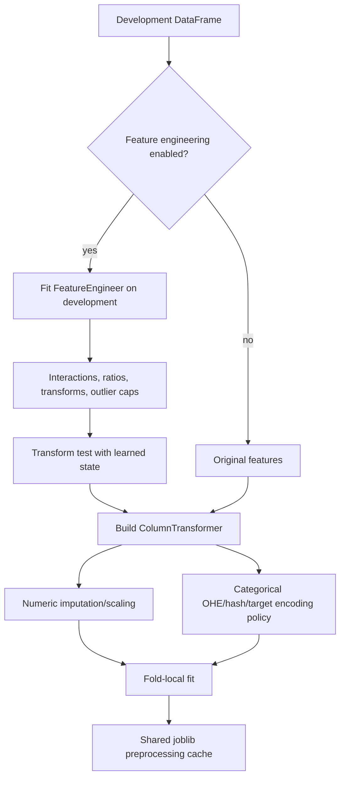

High-cardinality binary/regression target encoding is regularized and
out-of-fold. Multiclass high-cardinality data uses frequency encoding instead
of assigning an artificial numeric order to class labels.

Dense image embeddings bypass scaling when the embedding heuristic applies,
preserving their learned geometry and avoiding unnecessary copies.

### 6.3 Training and Early Stopping

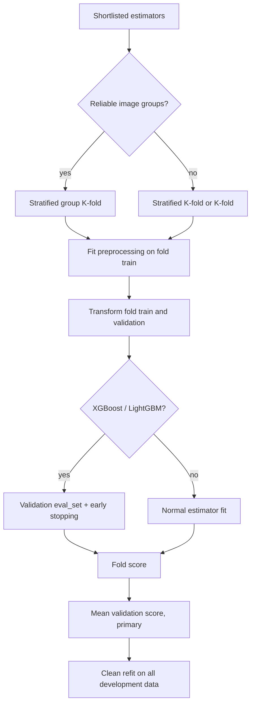

Class-aware fold counts are capped by the smallest class. This keeps every
classification fold valid and prevents multiclass labels from becoming
misaligned with XGBoost probability matrices. For grouped images, the fold
count is also capped by groups per class and no inferred video/subject group
can occur in both fold partitions.

The shared preprocessing cache reuses identical fold transformations across
model candidates. It never reuses a transformer fitted on validation or test
data. Logistic regression is retained as the linear control. ExtraTrees uses
bounded depth, larger leaves, feature subsampling, bootstrapped row sampling,
and OOB scoring instead of unconstrained memorization.

### 6.4 Optional Hyperparameter Search

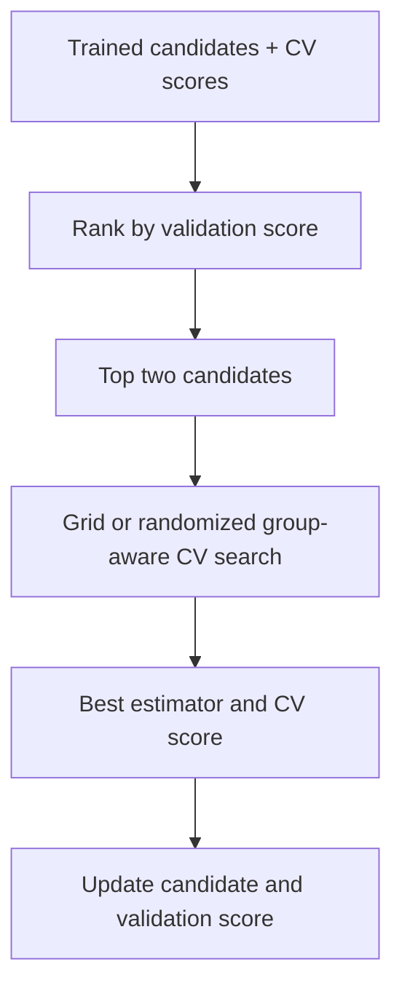

The held-out test metrics are not available to this workflow. This is a
critical production correction: earlier code ranked tuning candidates using
test results, which leaked test information into model selection. ExtraTrees
searches depth, leaf size, split size, feature fraction, tree count, and
bootstrapped sample fraction when `--tune` is enabled.

### 6.5 Diversity and Temperature Scaling

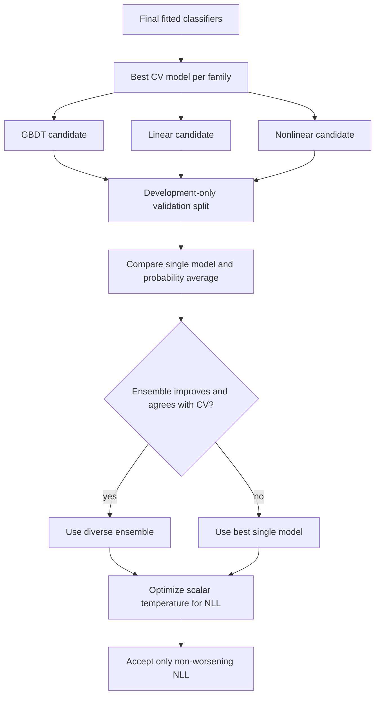

The ensemble is not mandatory. It must contain one available member from each
structural family and pass a validation gate. Temperature scaling changes
probability confidence but preserves class argmax predictions.

### 6.6 Final Evaluation and Persistence

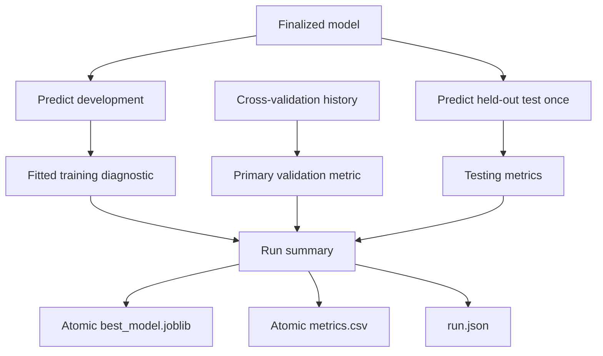

Classification reports accuracy, weighted precision, weighted recall,
weighted F1, and ROC AUC when probabilities permit it. Regression reports
RMSE, MAE, and R2. A selected ExtraTrees model also exposes its OOB score.
For an ensemble, the primary CV value is explicitly labeled as the best
member's CV reference; the separate ensemble gate score is never presented as
cross-validation.

### 6.7 Implemented Generalization Recommendations

| Recommendation | Production behavior |
|---|---|
| 1. Regularize ExtraTrees | Constrains depth/leaves/splits, subsamples rows/features, enables OOB scoring, and exposes a CV HPO grid through `--tune`. |
| 2. Compare logistic regression | Keeps the regularized linear family in resource-aware classification defaults and preserves its family winner after baseline pruning. |
| 3. Compare frozen winner | Scores frozen and adapted winner embeddings with the same logistic probe on the same development gate. |
| 4. Gate LoRA by validation | Uses adaptation only when the accuracy/NLL rule beats or safely matches the frozen selected backbone. |
| 5. Training-only augmentation | Applies crop, brightness/contrast/color jitter, and random erasing only inside LoRA training; flips are disabled for directional class labels. |
| 6. Group images by source | Infers conservative subject/video/frame groups and keeps them disjoint through splitting, CV, HPO, and gates. |
| 7. Make CV primary | Selects and reports fold mean as primary; fitted training accuracy, OOB, gate, and held-out test values are separate diagnostics. |

## 7. Reporting Workflow

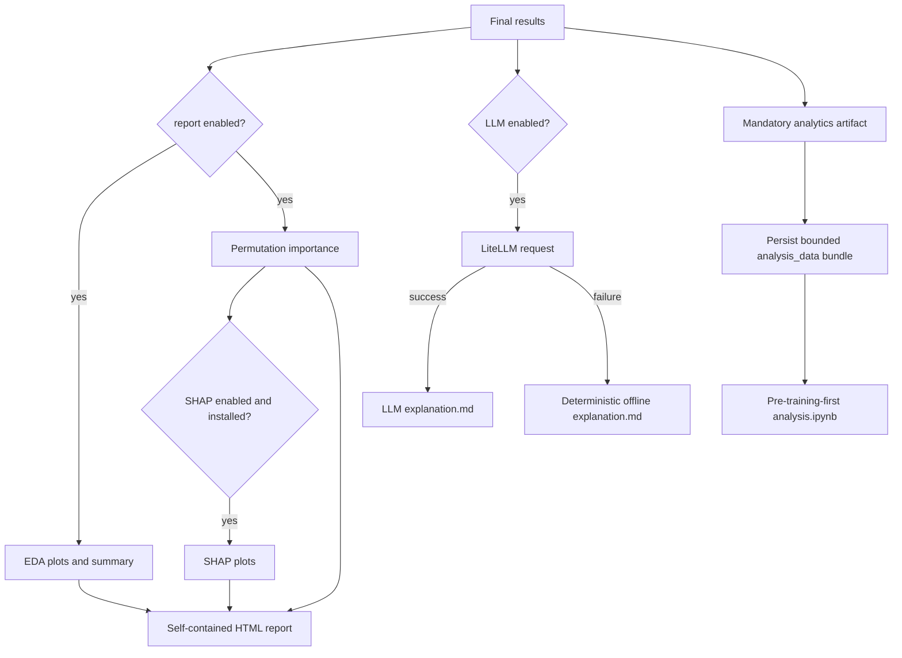

Optional HTML/plot failures are isolated and logged. Markdown and notebook
generation are part of the successful-run artifact contract; the Markdown file
is still produced without network access because the LLM path has an offline
fallback.

### 7.1 Notebook Analysis Workflow

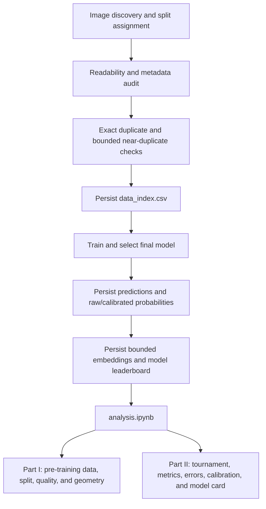

The notebook is generated after a run so it can reference final artifacts, but
its narrative deliberately presents pre-training evidence first. Expensive
pixel, near-duplicate, embedding, UMAP, and learning-curve operations are
bounded. Exact class coverage is retained through paginated representative
grids, and exact duplicate leakage checks operate across every same-size file.
Grad-CAM is not fabricated for a downstream model that consumes saved vectors;
nearest embedding neighbors are used as representation-faithful explanations.

### 7.2 Runtime Timing Workflow

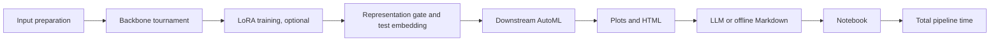

The nested LoRA and embedding values explain the image portion of input
preparation; they are not added to it a second time. Total runtime includes
every stage plus lightweight orchestration and persistence, while downstream
training time includes only baseline screening, CV/HPO, generalization,
calibration, final evaluation, and model persistence.

## 8. Key Architectural Ideas

| Idea | Why it matters |
|---|---|
| One public CLI | Users test any supported dataset without editing source. |
| Immutable run configuration | Every runtime choice can be serialized into the manifest. |
| Modality adapter, shared AutoML core | Images become numeric DataFrames, then reuse the tabular model path. |
| Test-set firewall | Selection and calibration happen before the test set is evaluated. |
| Conservative group isolation | Repeated subject/video frames stay together; uncertain grouping falls back safely. |
| Staged backbone tournament | Full embeddings are limited to finalists rather than every registered model. |
| Representation acceptance gate | LoRA must beat the frozen winning backbone on unseen development data before it can reach test. |
| Cheap-to-expensive search | A bounded baseline screen avoids full CV for clearly weak models. |
| CV-first diagnostics | Fold performance drives selection; fitted accuracy is only an overfitting signal. |
| Structural diversity gate | An ensemble is considered only across GBDT, linear, and nonlinear families. |
| Calibration after selection | Temperature scaling improves probability NLL without changing class predictions. |
| Fold-local transformations | Imputation, encoding, scaling, and target statistics avoid validation leakage. |
| Lazy heavy dependencies | Boosters, Torch, Transformers, PEFT, SHAP, and LiteLLM load only when needed. |
| Content-aware caching | Embeddings require matching model, adapter, files, labels, and cache schema. |
| Graceful optional failures | Missing optional packages reduce capabilities instead of breaking core tabular runs. |
| Artifact-first observability | Metrics, configuration, timing, memory, and report paths are persisted. |
| One SDK/CLI engine | Programmatic and shell users share `main.run`; there is no duplicate training pipeline. |
| Mandatory run bundle | Every successful run contains the same five minimum deployment/audit artifacts. |
| Provider-independent LLM | Reports can use LiteLLM, Ollama, local Transformers, custom callables, or generic JSON APIs without influencing model selection. |
| Local opt-out meta-memory | Statistical/landmark vectors contribute by default; raw examples are excluded and contribution can be disabled. |
| Drift as evidence, not auto-promotion | Schema, feature, prediction, and labelled performance signals trigger policy, while candidate promotion remains gated. |
| Capability-aware updates | Native `partial_fit` is used only when supported; other models request explicit replacement training. |
| Pluggable boundaries | Estimators, callbacks, data sources, detectors, LLMs, monitoring sinks, and registries have extension points. |
| Pre-training-first analytics | Data quality, split leakage, class balance, image statistics, and representation geometry are presented before model outcomes. |
| Bounded deep diagnostics | Large-dataset analytics use deterministic class-covering samples while exact representative class coverage and split fingerprints remain available. |

## 9. Production Source Files

These are the modules explicitly included in the wheel by `pyproject.toml`.

| File | Responsibility |
|---|---|
| `main.py` | CLI parser, prompting, image representation gate, tabular/image orchestration, test firewall, stage timing, artifacts, and terminal summary. |
| `config.py` | Loads optional dotenv values and reads `LLM_MODEL` without embedding an invalid provider default. |
| `data_loader.py` | Reads tabular files, validates targets, infers task type, encodes labels, performs stratified splitting, and drops development-inferred ID columns. |
| `data_cleaner.py` | Removes duplicates, handles missing feature values conservatively, and preserves X/y alignment. |
| `resource_manager.py` | Categorizes dataset size and emits model, encoding, CV-related, and feature-interaction directives. |
| `feature_processing.py` | Builds numeric/categorical preprocessing pipelines, hashing, scaling, imputation, and dense-embedding bypass behavior. |
| `feature_engineering.py` | Learns optional interactions, ratios, transformations, outlier caps, regularized OOF target encoding, and transformation logs. |
| `model_trainer.py` | Defines regularized model catalogues, lazy boosters, stratified/grouped screening and CV, early stopping, preprocessing caching, and full-data refits. |
| `model_selector.py` | Final held-out metrics, grouped validation-ranked HPO including ExtraTrees regularization, and atomic persistence. |
| `generalization.py` | Probability alignment, grouped diverse-ensemble gate, scalar temperature optimization, calibrated wrapper, and distinct gate/CV metrics. |
| `dataset_embedding.py` | Computes statistical and landmark search embeddings and provides versioned serialization helpers. |
| `vision_backbones.py` | Declares CLIP, DINOv2, ResNet, and SigLIP capabilities and performs pre-load RAM/VRAM/device filtering. |
| `backbone_selector.py` | Runs nested successive-halving frozen probes, multi-objective ranking, tie policy, time budgeting, failure isolation, and CLIP fallback. |
| `image_splitting.py` | Conservatively infers subject/video/frame groups and performs stratified group splits with safe fallback. |
| `multimodal_extractor.py` | Discovers images, augments training rows, extracts generic transformer/CNN features, loads PEFT adapters, and manages timed FP16 caches. |
| `lora_config.py` | Provides backward-compatible default LoRA settings from the production vision registry. |
| `lora_adapter_trainer.py` | Performs winner-specific group-aware transformer LoRA with augmentation, AdamW, clipping/checkpointing, early stopping, and metadata. |
| `eda.py` | Produces dataset summaries, target distributions, feature distributions, and correlation plots using a non-interactive backend. |
| `explainer.py` | Produces permutation importance and optional SHAP explanations for fitted pipelines. |
| `report_generator.py` | Combines metrics, EDA, explanations, and feature-engineering logs into HTML. |
| `llm_explainer.py` | Requests a constrained LiteLLM report and writes a deterministic Markdown fallback on any failure. |
| `analytics_artifacts.py` | Audits images before training and persists bounded predictions, probabilities, embeddings, leaderboards, fingerprints, versions, hardware, and notebook context. |
| `notebook_generator.py` | Writes the pre-training-first investigation notebook with data quality, split, image, embedding, tournament, model, error, calibration, learning-curve, group, explainability, reproducibility, and model-card sections. |
| `nexus_predictor.py` | Serializable inference boundary that keeps feature engineering, the fitted model, label mapping, modality, and metadata together in `model.pkl`. |
| `AutoNexus.py` | Compatibility shim for `import AutoNexus`; the canonical package import remains `from autonexus import AutoNexus`. |
| `autonexus/__init__.py` | Curated public API and framework version. |
| `autonexus/api.py` | High-level fit/load facade, DataFrame/source materialization, callbacks, framework metadata, drift-baseline creation, and custom LLM reporting. |
| `autonexus/config.py` | Frozen public configuration, duration parsing, presets, overrides, and translation to the unified `RunConfig`. |
| `autonexus/model.py` | Loaded run lifecycle: tabular/image inference, artifact access, safe incremental gates, replacement retraining, monitoring, registry integration, and FastAPI serving. |
| `autonexus/drift.py` | Persisted reference distributions and deterministic schema, numeric, categorical, prediction, and task-aware performance drift signals. |
| `autonexus/monitoring.py` | Batch/stream monitor plus logging, JSONL, webhook, and Prometheus sinks. |
| `autonexus/data.py` | Restartable DataFrame, file, iterator, SQL, and optional Kafka/Redpanda batch sources. |
| `autonexus/memory.py` | Privacy-bounded local FAISS/NumPy meta-memory, locking, duplicate prevention, contribution policy, and nearest-run search. |
| `autonexus/llm.py` | Provider protocol and adapters for callables, LiteLLM, Ollama, local Transformers, and arbitrary JSON HTTP APIs. |
| `autonexus/registry.py` | Filesystem model versions with champion promotion and rollback history. |
| `autonexus/plugins.py` | Registration points for custom estimators and extension factories. |
| `autonexus/callbacks.py` | Failure-isolated lifecycle event callbacks. |
| `autonexus/exceptions.py` | Stable framework-specific exception hierarchy. |

## 10. Important Project and Test Files

| File | Meaning |
|---|---|
| `pyproject.toml` | Canonical package metadata, base/optional dependencies, console entrypoint, explicit wheel module list, and pytest settings. |
| `uv.lock` | Exact reproducible dependency resolution for base and optional extras. |
| `README.md` | Installation, CLI usage, supported layouts, outputs, and safety guarantees. |
| `understanding.md` | This architecture and operational reference. |
| `codes.md` | Copy-ready SDK, CLI, monitoring, streaming, update, registry, serving, memory, and LLM examples. |
| `.python-version` | Pins the local Python line to 3.12. |
| `.env.example` | Safe template for LiteLLM model/provider configuration; it contains no real secret. |
| `.gitignore` | Excludes datasets, secrets, environments, caches, builds, models, and run artifacts. |
| `tests/test_data_loader.py` | Verifies split preservation, development-only ID filtering, and retention of legitimate predictive features. |
| `tests/test_cli_calibration.py` | Verifies no-argument CLI parsing and that temperature scaling preserves predicted classes and normalized probabilities. |
| `tests/test_image_splitting.py` | Verifies group isolation/CV, nested tournament samples, automatic backbone selection, CLIP fallback, LoRA probing, and ExtraTrees defaults without model downloads. |
| `tests/test_notebook_analytics.py` | Verifies unreadable/duplicate image auditing, pre-training-first section order, code-cell syntax, persisted analysis artifacts, and end-to-end notebook-cell execution. |
| `tests/test_framework.py` | Verifies imports, drift, memory deduplication/search, the compact API, mandatory artifacts, inference, monitoring, and gated incremental update. |

## 11. Runtime Artifacts and Their Meaning

| Artifact | Meaning |
|---|---|
| `model.pkl` | Public deployable `NexusPredictor` bundle with fitted transformations, model, labels, and modality. Treat it as untrusted executable data if received from another source. |
| `best_model.joblib` | Internal fitted preprocessing/model object retained for compatibility and diagnostics. |
| `metrics.csv` | Final held-out metrics for the selected deployment model. |
| `run.json` | Model used, label column, configuration, every backbone stage/score/failure, selected representation, grouping, primary/gate/test metrics, timings, RAM/VRAM, calibration, ensemble, artifact contract, and memory contribution result. |
| `search_profile.json` | Versioned statistical and landmark vector used for optional local FAISS/NumPy nearest-run memory. |
| `report/report.html` | Human-readable combined report with embedded plots. |
| `report/explanation.md` | LLM-generated or deterministic offline model explanation. |
| `analysis.ipynb` | Pre-training-first data investigation and post-training model audit. |
| `analysis_data/data_index.csv` | Image path, split, class/group, readability, dimensions, format, file size, exact hash, bounded quality statistics, and near-duplicate candidates. |
| `analysis_data/prediction_index.csv` | Held-out labels, predictions, confidence, uncertainty, correctness/error, row/image identity, and optional groups. |
| `analysis_data/test_probabilities.npz` | Raw and temperature-scaled held-out probabilities used for calibration and per-class diagnostics. |
| `analysis_data/embedding_sample.npz` | Deterministic class-covering FP16 representation sample for PCA/UMAP, separation, learning curves, and nearest neighbors. |
| `analysis_data/model_leaderboard.csv` | Baseline, CV mean/std, completed folds, selected test metrics, runtime, and observed process RAM. |
| `analysis_data/run_context.json` | Configuration, final summary, hardware, package versions, exact split fingerprints, and artifact paths. |
| `report/eda/*.png` | Target, feature, and correlation diagnostics. |
| `report/explanations/*.png` | Permutation importance and optional SHAP diagnostics. |
| `.cache/preprocessing/` | Joblib cache of fold-specific fitted transformations. |
| `.cache/embeddings/*.npz` | Exact split/model/adapter-aware image embeddings stored as FP16. |
| `lora_adapter/<backbone-key>/` | Best candidate winner adapter and training metadata; `run.json` says whether the outer gate accepted it. |
| `monitoring/baseline.json` | Task-aware training distribution and expected-performance reference used by drift detection. |
| `monitoring/events.jsonl` | Append-only default drift observations when monitoring runs. |
| `monitoring/update_history.jsonl` | Append-only champion/challenger decisions for incremental updates. |
| `framework.json` | Compact public API context, class/feature names, preset, and lifecycle capabilities. |
| `~/.autonexus/memory/` | Default local meta-memory; contains dataset embeddings and sanitized run metadata, never raw rows or images. |
| `dist/*.whl` | Installable production wheel containing only declared production modules. |
| `dist/*.tar.gz` | Source distribution generated by `uv build`. |

Artifacts are generated outputs and should not be committed. The ignore policy
now enforces this for future runs.

## 12. Non-Production Files Still Present in the Worktree

The following files are disconnected from `main.py`, excluded from the wheel,
and are deletion candidates. They remain only because this environment
requires explicit approval for deleting the exact tracked set.

### Agent Prototype

| File | Historical purpose |
|---|---|
| `agents/agent_orchestrator.py` | Chained data, business, feature, model, and critic agents. |
| `agents/data_agent.py` | LLM data profiling and notebook request. |
| `agents/business_agent.py` | LLM business-context inference. |
| `agents/feature_agent.py` | LLM feature suggestions. |
| `agents/model_agent.py` | LLM model recommendations. |
| `agents/critic_agent.py` | LLM critique stage. |
| `agents/notebook_generator.py` | Older agent-specific notebook writer. |
| `test_agentic_pipeline.py` | Manual script for the removed agent workflow. |

### FAISS and Meta-Learning Prototype

| File | Historical purpose |
|---|---|
| `cold_start.py` | FAISS nearest-dataset routing and cold-start decisions. |
| `unified_memory.py` | Combined ML/DL memory abstraction. |
| `build_memory.py` | OpenML-driven memory construction. |
| `preseed_memory.py` | Synthetic/predefined memory population. |
| `update_memory_hparams.py` | Memory record hyperparameter update utility. |
| `delete_memory.py` | Memory deletion utility. |
| `extract_memory.py` | Source extraction/migration helper. |
| `task_encoder.py` | Siamese dataset task encoder training. |
| `dataset_profiler.py` | Older OpenML dataset profile script. |
| `heuristics.py` | Historical cold-start model heuristics. |
| `routing_engine.py` | Experimental routing score logic. |
| `paradigm_router.py` | LLM ML-vs-DL routing experiment. |
| `onboarding_agent.py` | Interactive onboarding configuration experiment. |
| `memory_store.faiss` | Historical serialized FAISS index. |
| `memory_store.pkl` | Historical metadata sidecar, ignored but still local. |
| `task_encoder.pt` | Historical task encoder checkpoint. |
| `test_cold_start.py` | Manual tests for the old cold-start system. |
| `test_embedding.py` | Manual tests for the old dataset embedding API. |
| `test_unified_memory.py` | Manual tests for the old unified memory system. |

### Multimodal Memory Prototype

| File | Historical purpose |
|---|---|
| `build_multimodal_faiss_hf.py` | Built image/video memories from Hugging Face datasets. |
| `dl_faiss_memory.py` | Modality-specific FAISS storage. |
| `domain_registry.py` | Broader experimental vision model/domain registry. |
| `dl_memory_vision.faiss` | Historical vision index. |
| `dl_memory_video.faiss` | Historical video index. |
| `dl_metadata_vision.json` | Historical vision index metadata. |
| `dl_metadata_video.json` | Historical video index metadata. |

### NAS, HPO, W&B, and Ensemble Prototype

| File | Historical purpose |
|---|---|
| `auto_dl_nas.py` | Standalone Torch/Optuna neural architecture experiment. |
| `hpo_optuna.py` | Older Optuna/W&B HPO implementation. |
| `multi_objective.py` | Experimental accuracy/time/complexity utility. |
| `weight_search.py` | Multi-objective weight sweep/report script. |
| `confidence_calibration.py` | Standalone confidence plotting with import-time W&B behavior. |
| `shap_explainer.py` | Older W&B-coupled SHAP script. |
| `llm_suggester.py` | Older LLM hyperparameter suggestion path. |
| `wandb_logger.py` | Global W&B logging wrapper. |
| `metaautoml/data/gpu_tabular_loader.py` | Experimental GPU data loader. |
| `metaautoml/ensembles/downstream_bagging.py` | Experimental downstream bagging. |
| `metaautoml/ensembles/embedding_cache.py` | PyArrow/Torch embedding cache experiment. |
| `metaautoml/ensembles/oof_stacking.py` | Experimental OOF stacker. |
| `metaautoml/evaluation/calibration_shap.py` | W&B calibration/SHAP experiment. |
| `metaautoml/nas/downstream_nas.py` | Optuna downstream NAS experiment. |
| `metaautoml/nas/regularized_objective.py` | Regularized booster/MLP objective. |
| `metaautoml/pipelines/autodl_router.py` | Experimental AutoDL route. |
| `metaautoml/pipelines/automl_router.py` | Experimental tabular router. |
| `metaautoml/pipelines/stacking_integration.py` | Experimental diverse stacking integration. |

### Redundant or Unsafe Repository Artifacts

| File/path | Why it should not be source |
|---|---|
| `requirements.txt` | Duplicates and conflicts with canonical `pyproject.toml`/`uv.lock`. |
| `.gitconfig` | Machine/user-specific Git configuration and personal identity data. |
| `artifacts/` | Historical fitted model and run output. |
| `embedding_cache/` | Historical generated embeddings. |
| `lora_adapters/` | Historical adapter with no dataset/version provenance. |
| `wandb/` | Historical experiment logs and environment metadata. |

## 13. Strengths

- One no-edit CLI supports both tabular and image classification workflows.
- The final test split is isolated from HPO and model selection.
- Repeated video/subject groups remain disjoint through test reservation, LoRA
  gates, downstream CV, HPO, and generalization gating.
- Model-family diversity is enforced structurally rather than by score alone.
- Calibration is accepted only when validation NLL does not worsen.
- Optional heavy libraries are lazy and grouped into install extras.
- Backbone choice covers vision-language, self-supervised, and CNN families
  using a reproducible development-only tournament.
- LoRA is augmented and regularized, then rejected when the frozen winner
  generalizes as well or better.
- Logistic regression and regularized ExtraTrees provide linear and nonlinear
  controls, including an independent OOB diagnostic.
- Embedding and preprocessing caches reduce repeated compute and memory churn.
- Model and metrics writes are atomic.
- Every normal run produces reproducibility and resource metadata.
- LLM/report failures degrade gracefully instead of losing the trained model.
- The project builds successfully as both a wheel and source distribution.

## 14. Weaknesses and Remaining Risks

| Risk | Impact | Current mitigation / next step |
|---|---|---|
| Legacy files remain in the Git worktree | Confuses maintainers and expands attack/dependency surface | Excluded from wheel; delete exact approved set. |
| `.gitconfig` contains personal identity | Privacy and machine-specific configuration risk | Remove it from version control after explicit approval. |
| `--max-time` is cooperative | A single estimator fit can exceed the budget | Documented; hard isolation would require subprocess workers. |
| Image models download on first use | Offline image runs fail without a local model cache | Actionable dependency/runtime error; pre-provision models in deployment. |
| Backbone probes are approximate | A 10% or 30% ranking can eliminate a late-improving candidate | Nested stages retain three then two candidates; force an explicit list or one key when domain knowledge is stronger. |
| First automatic image run downloads multiple models | Startup time and disk use can be substantial | Resource filtering, successive halving, exact caches, a separate time budget, and `--backbones clip` limit the cost. |
| Upstream model metadata can change | Weights, processors, or licensing can change outside this repository | Pin deployment cache/revisions and review upstream model cards before commercial deployment. |
| LoRA defaults are fixed | May be suboptimal across domains and dataset sizes | Early stopping and weight decay reduce risk; expose advanced options only with evidence. |
| Automatic grouping is heuristic | Unusual filenames/layouts can hide real subjects or videos | Conservative patterns avoid false groups; use explicit train/val/test folders when provenance is known. |
| Calibration uses one internal split | Small datasets can produce noisy temperature estimates | Skip when data is insufficient; accept only non-worsening NLL. |
| RAM peak is platform-dependent | Some platforms expose only current RSS | Manifest labels both current and peak; use container telemetry in production. |
| VRAM metrics require CUDA Torch | CPU systems report N/A/zero | Expected and surfaced explicitly. |
| Meta-memory is local retrieval, not automatic transfer | Neighbors are available, but blindly biasing model selection could amplify historical mistakes | Keep retrieval advisory until benchmarked routing and anti-memory penalties show consistent out-of-sample benefit. |
| Default memory contribution is an operational policy choice | Sanitized run metadata may still be unsuitable for some regulated environments | Raw data and clear-text paths are excluded; use `contribute_memory=False` or an isolated `memory_dir`. |
| Incremental learning is estimator-dependent | Tree ensembles and vision adapters cannot safely use generic `partial_fit` | Capability detection returns `retrain_required`; use the online SGD preset or an explicit challenger retrain. |
| Automatic drift-triggered updates can react to transient shifts | A short-lived batch may not justify promotion | Require labels, a holdout gate, minimum batch sizes, monitoring thresholds, and human approval for high-risk systems. |
| No image end-to-end CI fixture | Model downloads are too large for fast unit tests | Cache logic is isolated; add a mocked processor/model integration test. |
| Joblib model loading executes Python objects | Untrusted model files are unsafe | Load only artifacts produced by trusted runs. |
| XLS parsing adds an old-format dependency | Extra base dependency for a legacy format | Drop XLS if only modern XLSX is required. |

## 15. Production Readiness Assessment

The packaged runtime is production-oriented for local/batch AutoML:

- Source compiles successfully.
- The 21-test production suite passes, including framework lifecycle, local
  memory, drift, mandatory artifacts, grouped CV, automatic backbone
  selection, calibration, and executable notebook tests.
- The installed CLI help works with no required target argument.
- A synthetic end-to-end tabular run completes and writes model, metrics, and
  manifest artifacts with training/validation/testing metrics and RAM/VRAM.
- `uv build` produces a valid wheel and source distribution.
- The wheel contains 43 files: the production modules listed in Section 9,
  the `autonexus` package, and distribution metadata. Historical prototypes
  are absent.

Repository cleanup is the remaining operational task. The runtime package is
already isolated from the historical prototypes, but the repository itself
will not be clean until the exact legacy/artifact set in Section 12 is deleted.

## 16. Summary

The core design is a leakage-safe, resource-aware funnel:

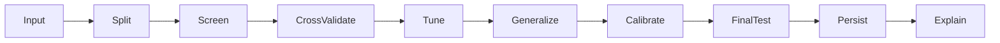

The highest-value architectural property is the test-set firewall. The
highest-value efficiency properties are successive-halving backbone selection,
incremental timed FP16 caches, cheap classifier screening, shared fold
preprocessing, and lazy heavy imports. The highest-value generalization
controls are group-aware backbone and classifier CV, frozen-versus-adapted
winner gating, training-only augmentation, regularized ExtraTrees, a linear
logistic control, validation-gated family diversity, early stopping, LoRA
weight decay, and non-worsening temperature scaling.

The production wheel is unified and verified. The old experimental stack has
no runtime role and is excluded from installation; Section 12 records the
remaining repository-only cleanup boundary separately from runtime readiness.
