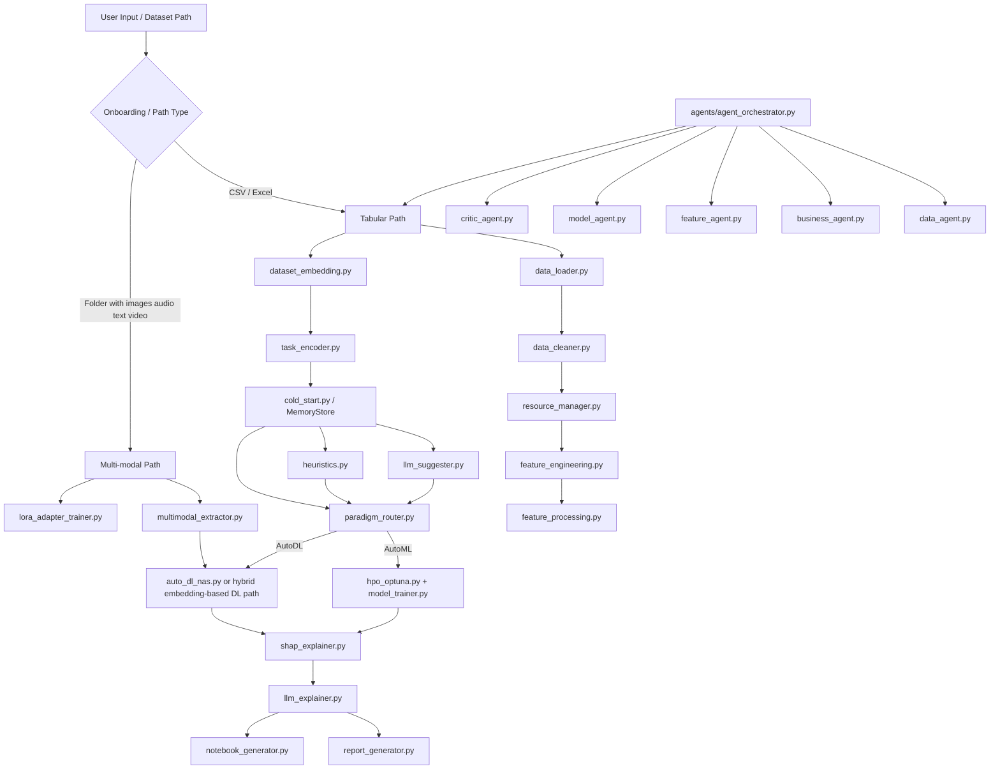

# ML-Builder Understanding

> Production update: the earlier architecture analysis below describes the
> research repository before consolidation. `main.py` is now the only public
> entrypoint. The interactive Phase 4, agentic, benchmark, patch, and scratch
> runners referenced below have been removed. The stable product contract is
> the non-interactive tabular CLI documented in `README.md`; memory,
> multimodal, and agent modules are retained only as internal research code.

This document is my consolidated understanding of the `ML-Builder` repository after reading the repository layout, the main entry points, the core pipeline modules, the agent layer, the memory system, the multi-modal path, and the existing internal documentation.

## 1. What This Project Is

`ML-Builder` is a research-oriented AutoML system that tries to go beyond a normal tabular ML pipeline.

At a high level, it combines:

- A conventional tabular AutoML flow for loading data, cleaning, feature engineering, training, evaluation, and reporting.
- A meta-learning layer that stores previous experiment outcomes in a FAISS-backed memory store.
- A learned task encoder that maps dataset fingerprints into an embedding space so similar datasets can retrieve similar winning configurations.
- An LLM-assisted routing and recommendation layer.
- A second path for multi-modal data such as vision, audio, text, and video.
- An optional agentic workflow that uses several LLM-driven “agents” to critique and plan the pipeline before execution.

The repository contains both:

- A cleaner, more standard CLI pipeline in `main.py`.
- A larger, more experimental “Phase 4” pipeline in `phase4_pipeline.py`.

That split matters: the repo is not one perfectly unified system yet. It is more like a mainline AutoML project plus a research branch that became part of the same codebase.

## 2. Main Execution Paths

There are three real entry styles in this repo.

### A. Legacy / Standard AutoML path

Entrypoint: `main.py`

This path is a classic tabular pipeline:

1. Load dataset
2. Clean dataset
3. Analyze resource constraints
4. Optionally run feature engineering
5. Build preprocessing pipeline
6. Run baseline model screening
7. Train promising models fully
8. Evaluate and select the best model
9. Optionally tune
10. Generate EDA, explanations, and HTML report

This path does not really depend on meta-learning memory or paradigm routing.

### B. Meta-learning / research path

Entrypoint: `phase4_pipeline.py`

This is the most important file architecturally. It introduces:

- Dataset embedding
- Siamese task encoder
- FAISS memory retrieval
- Cold-start vs memory-based reuse
- LLM model suggestions
- Heuristic model suggestions
- Paradigm routing between AutoML and AutoDL
- SHAP reporting and LLM narrative reporting

For tabular datasets, this is the “smart” path.

For non-tabular datasets, this file also acts as the bridge into the multi-modal flow.

### C. Agentic orchestration path

Entrypoint: `run_agentic_pipeline.py`

This path runs a sequence of LLM-based agents first, then, if the critic approves, hands execution back to the Phase 4 pipeline.

So the agentic layer is not a separate trainer. It is more of a planning, reviewing, and approval layer sitting in front of the main execution pipeline.

## 3. High-Level Architecture



## 4. Actual Workflow By Data Type

### 4.1 Tabular workflow

```text
CSV/Excel
  -> load_dataset / load_local_dataset
  -> clean
  -> resource analysis
  -> feature engineering and preprocessing
  -> compute dataset fingerprint
  -> encode fingerprint into learned embedding
  -> query FAISS memory
  -> combine memory + heuristics + LLM signals
  -> route to AutoML or AutoDL
  -> train / optimize
  -> explain
  -> generate report and notebook
  -> optionally write back to memory
```

### 4.2 Multi-modal workflow

```text
Image / audio / text / video folder
  -> onboarding detects modality
  -> select domain-specific foundation model
  -> optionally train or reuse LoRA adapter
  -> extract embeddings
  -> reduce / prepare embeddings
  -> force AutoDL / hybrid ML-on-embeddings path
  -> run search / ensemble
  -> evaluate
  -> explain and report
  -> optionally store modality-specific memory
```

### 4.3 Agentic workflow

```text
Dataset path
  -> DataUnderstandingAgent
  -> BusinessContextAgent
  -> CriticAgent pass 1
  -> FeatureEngineeringAgent
  -> ModelSelectionAgent
  -> CriticAgent pass 2
  -> final report / plan
  -> if approved, execute main pipeline
```

## 5. Key Architectural Ideas

### 5.1 Dataset fingerprinting

The project computes a compact vector describing a dataset statistically. Based on the code and docs, it includes things like:

- Number of samples
- Number of features
- Sample-to-feature ratio
- Missingness
- Skewness
- Correlation structure
- Class count / target entropy

That is the raw dataset representation used for memory retrieval.

### 5.2 Learned task encoder

The raw fingerprint is not used directly forever. A Siamese encoder in `task_encoder.py` learns a 32D representation intended to place datasets requiring similar model families closer together.

This is one of the main research ideas in the repo.

### 5.3 FAISS memory

The memory layer stores:

- Dataset embedding
- Best model(s)
- Metadata like score, timing, and hyperparameters

The store is persisted mainly in:

- `memory_store.faiss`
- `memory_store.pkl`

The purpose is to warm-start future searches and avoid fully starting from scratch each time.

### 5.4 Cold-start decision

The system does not blindly trust retrieved neighbors. `cold_start.py` computes a weighted score using:

- Similarity
- Past performance
- Recency

Then it compares that against an adaptive threshold. If the neighbor quality is too weak, it falls back to broader search.

### 5.5 Paradigm router

The repo has a second, separate routing problem:

- Should this dataset use classical AutoML?
- Or should it use the AutoDL / hybrid path?

That decision is made in `paradigm_router.py` by combining:

- LLM score
- Memory score
- Heuristic score

This is a higher-level decision than cold-start.

### 5.6 Multi-modal support

For vision, audio, text, and video, the system extracts embeddings using foundation-model-style encoders and then trains downstream models or ensembles over those embeddings.

In practice, the multi-modal path is less “end-to-end deep learning training from raw input” and more “embedding extraction + downstream optimization + optional LoRA adaptation”.

## 6. What The Important Top-Level Files Are Doing

### Core entry and orchestration

- `main.py`
  Legacy but usable CLI pipeline for tabular AutoML. It is more structured and easier to follow than `phase4_pipeline.py`.

- `phase4_pipeline.py`
  Main research orchestrator. This is the central file for memory, routing, AutoML vs AutoDL branching, SHAP generation, reporting, and the interactive ingestion flow.

- `phase4_pipeline_new.py`
  Alternate / earlier or parallel version of the Phase 4 pipeline. It appears to preserve another iteration of the same research pipeline rather than being the active stable replacement.

- `run_metaautoml(ml).py`
  Benchmark-style runner for a tabular dataset with memory loading, encoder loading, pipeline execution, RAM monitoring, and result printing.

- `run_metaautoml(dl).py`
  Benchmark-style runner for the deep / multi-modal path. It initializes W&B, ensures LoRA adapter availability, extracts embeddings, runs the pipeline, and reports RAM/VRAM/time.

- `run_agentic_pipeline.py`
  Runs the agentic planner / reviewer stack, and if approved, triggers actual training through the main pipeline.

### Data ingestion and cleaning

- `data_loader.py`
  Handles reading local tabular datasets, detecting problem type, and checking for things like leakage or suspicious columns.

- `data_cleaner.py`
  Removes duplicates and imputes missing values while keeping target alignment safe.

- `dataset_profiler.py`
  Builds a compact structural profile of a dataset for LLM prompting and routing.

- `onboarding_agent.py`
  First user-facing intake logic. Detects modality and gathers context such as target column and business intent.

### Feature engineering and preprocessing

- `feature_engineering.py`
  The adaptive feature-engineering engine. It applies skew fixes, category handling, interactions, ratios, and some text-stat extraction depending on data and configured FE level.

- `feature_processing.py`
  Builds the sklearn preprocessing pipeline, likely via `ColumnTransformer`, with scaling and encoding choices.

- `resource_manager.py`
  Prevents the pipeline from doing expensive transformations or model searches that do not fit the dataset size or cardinality.

### Meta-learning and memory

- `dataset_embedding.py`
  Computes the raw statistical fingerprint vector for a dataset.

- `task_encoder.py`
  Defines, trains, loads, and applies the Siamese task encoder used to move from raw fingerprint space into learned embedding space.

- `cold_start.py`
  Contains the memory store, FAISS index logic, adaptive thresholding, retrieval scoring, fallback logic, and persistence utilities.

- `build_memory.py`
  Bulk memory builder. Trains on many datasets, stores winners in memory, and is one of the main offline preparation scripts.

- `preseed_memory.py`
  Another memory seeding script, likely an earlier or lighter route to initialize the memory store.

- `delete_memory.py`
  Removes items from memory.

- `extract_memory.py`
  Exports or inspects memory content for analysis.

- `update_memory_hparams.py`
  Updates stored hyperparameter metadata inside memory records.

- `unified_memory.py`
  A broader memory abstraction that tries to support both ML and DL paradigms in one place.

### Model training and selection

- `model_trainer.py`
  Defines the model catalog and runs baseline and fuller training loops.

- `model_selector.py`
  Evaluates models, compares them, saves metrics/models, and can tune top candidates.

- `hpo_optuna.py`
  Runs Optuna-based hyperparameter search, including warm-starting from memory.

- `multi_objective.py`
  Converts pure score into a utility function that also rewards speed and lower complexity.

- `weight_search.py`
  Experiments with weight combinations, likely for retrieval or utility-related settings.

- `routing_engine.py`
  Combines different recommendation signals and ranks candidate models.

- `heuristics.py`
  Rule-based model recommendations based on dataset properties.

- `llm_suggester.py`
  LLM-based model shortlist generation with output validation.

- `paradigm_router.py`
  Decides between classical ML and DL-style pipeline execution.

### Explainability and reporting

- `explainer.py`
  General explanation orchestration, likely including feature importance and SHAP hooks for the standard pipeline.

- `shap_explainer.py`
  Standalone SHAP explanation generator for the Phase 4 flow.

- `llm_explainer.py`
  Converts technical results into a consultant-style narrative report.

- `report_generator.py`
  Generates a standalone HTML report.

- `notebook_generator.py`
  Creates analysis notebooks for results and EDA.

- `eda.py`
  Generates exploratory visual artifacts.

- `confidence_calibration.py`
  Evaluates confidence calibration and reliability behavior.

- `shap_explainer.py`
  Produces SHAP outputs and top features.

### Multi-modal and DL-related

- `multimodal_extractor.py`
  The main multi-modal embedding extractor. This is the key file for vision/audio/text/video representations.

- `domain_registry.py`
  Maps domains to preferred backbone models or extractor choices.

- `lora_config.py`
  Stores LoRA-related configuration choices.

- `lora_adapter_trainer.py`
  Fine-tunes or trains modality/domain-specific LoRA adapters.

- `dl_faiss_memory.py`
  Separate FAISS memory layer for deep / modality-specific embedding experiments.

- `auto_dl_nas.py`
  Search-space and objective definition for neural architecture search or downstream DL optimization.

### Agent system

- `agents/agent_orchestrator.py`
  Coordinates the full multi-agent flow.

- `agents/data_agent.py`
  Understands the dataset and proposes a structured profile.

- `agents/business_agent.py`
  Translates business context into ML objectives and constraints.

- `agents/feature_agent.py`
  Recommends feature-engineering decisions.

- `agents/model_agent.py`
  Uses memory and LLM context to recommend model choices.

- `agents/critic_agent.py`
  Reviews and challenges the plan for mismatch, leakage, and feasibility issues.

- `agents/notebook_generator.py`
  Agent-specific notebook generation helper.

### MetaAutoML package files

These appear to be a more modularized subpackage that complements or prototypes pieces of the top-level pipeline:

- `metaautoml/pipelines/automl_router.py`
  Router for AutoML-related decisions or flow control.

- `metaautoml/pipelines/autodl_router.py`
  Router for AutoDL-specific execution.

- `metaautoml/pipelines/stacking_integration.py`
  Stacking ensemble helpers and integration logic.

- `metaautoml/nas/downstream_nas.py`
  NAS logic for downstream tasks.

- `metaautoml/nas/regularized_objective.py`
  A regularized objective class for search / optimization.

- `metaautoml/ensembles/oof_stacking.py`
  Out-of-fold stacking implementation with attention to leakage prevention.

- `metaautoml/ensembles/downstream_bagging.py`
  Bagging helper for downstream workflows.

- `metaautoml/ensembles/embedding_cache.py`
  Caching manager for expensive embedding computations.

- `metaautoml/evaluation/calibration_shap.py`
  Evaluation utilities combining calibration and SHAP ideas.

- `metaautoml/data/gpu_tabular_loader.py`
  GPU-oriented tabular data loader / preprocessing helper.

## 7. Tests and Validation Files

- `test_cold_start.py`
  Exercises memory retrieval and cold-start logic.

- `test_embedding.py`
  Tests dataset embedding or encoder behavior.

- `test_unified_memory.py`
  Tests the unified memory abstraction.

- `test_agentic_pipeline.py`
  Tests the multi-agent orchestration behavior.

- `tests/test_oof_leakage.py`
  Important test verifying out-of-fold stacking is not leaking information.

- `tests/test_ensemble_gpu.py`
  Checks GPU-related ensemble behavior.

These tests suggest the repo’s strongest explicit validation focus is around:

- Memory / retrieval
- Stacking leakage
- GPU ensemble behavior

The project appears less comprehensively unit-tested in other areas than a productionized library would be.

## 8. Non-Code Artifacts and What They Mean

### Documentation

- `README.md`
  Project-facing overview and positioning document.

- `walkthrough.md`
  A system walkthrough that explains the architecture in prose.

- `codebase_analysis.md`
  Another internal analysis file that already summarizes much of the repository.

### Model and memory artifacts

- `task_encoder.pt`
  Saved trained weights for the Siamese task encoder.

- `memory_store.faiss`
  Saved FAISS index for the main memory store.

- `memory_store.pkl`
  Pickled metadata for memory entries.

- `dl_memory_vision.faiss`, `dl_memory_video.faiss`
  Modality-specific deep-learning memory indices.

- `dl_metadata_vision.json`, `dl_metadata_video.json`
  Metadata for deep-learning memory stores.

- `lora_adapters/...`
  Saved LoRA adapter artifacts and configs.

- `embedding_cache/*.npz`
  Cached extracted embeddings to avoid repeating expensive extraction.

### Reports and outputs

- `reports/`
  Generated reports, likely notebooks, plots, markdown consultant reports, and HTML outputs.

- `shap_plots/`
  SHAP visual outputs.

- `wandb/`
  Weights & Biases run artifacts.

### Logs and scratch files

There are many files that are clearly experiment outputs, debug logs, or one-off scripts:

- `clean_logs.txt`
- `fe_test_log*.txt`
- `test_log*.txt`
- `stress_test.log`
- `run_err.log`
- `scratch_*.py`
- `patch_phase4.py`
- `refactor_script*.py`
- `refactor_phase4_final.py`

My interpretation is that this repo is under active research-style development, so these files capture experiments, patching, ad hoc analysis, and iteration history rather than core product code.

## 9. Package / Dependency Intent

From the code and config files, the project is built around:

- `pandas`, `numpy`
- `scikit-learn`
- `optuna`
- `faiss`
- `torch`
- `transformers`
- `sentence-transformers`
- `peft`
- `wandb`
- `shap`
- `litellm`

So the system is basically:

- sklearn for tabular pipelines
- PyTorch / HF tooling for learned embeddings and adapters
- FAISS for memory retrieval
- Optuna for search
- W&B for experiment tracking
- litellm for model-agnostic LLM calls

## 10. How I Think The Repo Is Organized Conceptually

I would describe the repository as five concentric layers:

1. Data and preprocessing layer
2. Model training and evaluation layer
3. Meta-learning memory layer
4. LLM / routing / agent intelligence layer
5. Reporting and artifact layer

The most novel layer is the meta-learning memory layer.
The most practically usable layer is still the standard AutoML tabular pipeline.
The most experimental layer is the Phase 4 + multi-modal + agentic combination.

## 11. Strengths I See In The Design

- Clear ambition to reduce repeated search via memory.
- Good separation between retrieval, routing, training, and reporting at the conceptual level.
- Useful fallback behavior when LLMs are unavailable.
- Resource-aware controls to prevent runaway preprocessing or search.
- Explicit concern for explainability, calibration, and reporting.
- Multi-modal support is meaningfully integrated rather than just named.
- There is evidence of research thinking around leakage prevention and fair validation.

## 12. Risks / Complexity I See

- `phase4_pipeline.py` is very large and mixes many concerns in one file.
- There are multiple generations of pipeline code living together.
- Some top-level scripts are clearly experiment-oriented and may not all be equally current.
- The codebase has strong research energy, but less evidence of strict production packaging boundaries.
- The `metaautoml/` package suggests an ongoing refactor or modularization effort that may not yet be complete.

## 13. File Inventory Summary

This is a concise inventory of the visible project files by purpose.

### Root configuration and docs

- `.env`, `.env.example`
- `.gitignore`, `.python-version`
- `pyproject.toml`, `requirements.txt`, `uv.lock`
- `README.md`, `walkthrough.md`, `codebase_analysis.md`

### Main pipeline and orchestration

- `main.py`
- `phase4_pipeline.py`
- `phase4_pipeline_new.py`
- `run_metaautoml(ml).py`
- `run_metaautoml(dl).py`
- `run_agentic_pipeline.py`

### Data / profiling / onboarding

- `data_loader.py`
- `data_cleaner.py`
- `dataset_profiler.py`
- `onboarding_agent.py`

### Feature and resource logic

- `feature_engineering.py`
- `feature_processing.py`
- `resource_manager.py`

### Memory and meta-learning

- `dataset_embedding.py`
- `task_encoder.py`
- `cold_start.py`
- `unified_memory.py`
- `build_memory.py`
- `preseed_memory.py`
- `delete_memory.py`
- `extract_memory.py`
- `update_memory_hparams.py`
- `weight_search.py`

### Training, routing, optimization

- `model_trainer.py`
- `model_selector.py`
- `hpo_optuna.py`
- `multi_objective.py`
- `routing_engine.py`
- `heuristics.py`
- `llm_suggester.py`
- `paradigm_router.py`
- `auto_dl_nas.py`

### Explainability and output

- `explainer.py`
- `shap_explainer.py`
- `llm_explainer.py`
- `report_generator.py`
- `notebook_generator.py`
- `eda.py`
- `confidence_calibration.py`
- `wandb_logger.py`

### Multi-modal support

- `multimodal_extractor.py`
- `domain_registry.py`
- `lora_config.py`
- `lora_adapter_trainer.py`
- `dl_faiss_memory.py`

### Agent system

- `agents/agent_orchestrator.py`
- `agents/data_agent.py`
- `agents/business_agent.py`
- `agents/feature_agent.py`
- `agents/model_agent.py`
- `agents/critic_agent.py`
- `agents/notebook_generator.py`

### Modular `metaautoml` package

- `metaautoml/pipelines/automl_router.py`
- `metaautoml/pipelines/autodl_router.py`
- `metaautoml/pipelines/stacking_integration.py`
- `metaautoml/nas/downstream_nas.py`
- `metaautoml/nas/regularized_objective.py`
- `metaautoml/ensembles/oof_stacking.py`
- `metaautoml/ensembles/downstream_bagging.py`
- `metaautoml/ensembles/embedding_cache.py`
- `metaautoml/evaluation/calibration_shap.py`
- `metaautoml/data/gpu_tabular_loader.py`

### Tests

- `test_cold_start.py`
- `test_embedding.py`
- `test_unified_memory.py`
- `test_agentic_pipeline.py`
- `tests/test_oof_leakage.py`
- `tests/test_ensemble_gpu.py`

### Saved artifacts / caches

- `memory_store.faiss`
- `memory_store.pkl`
- `task_encoder.pt`
- `dl_memory_*.faiss`
- `dl_metadata_*.json`
- `embedding_cache/*`
- `lora_adapters/*`
- `reports/*`
- `wandb/*`
- `shap_plots/*`

### Logs / outputs / scratch / temporary work

- `test_output.txt`
- `test_log*.txt`
- `clean_logs.txt`
- `fe_test_log*.txt`
- `stress_test.log`
- `err.log`
- `run_err.log`
- `scratch_*.py`
- `refactor_*.py`
- `patch_phase4.py`
- `multi_objective_report.pdf`

## 14. Final Understanding In One Paragraph

This project is a hybrid of an AutoML framework and a research platform for memory-augmented model selection. The central idea is that each dataset gets embedded into a compact representation, retrieved against a FAISS knowledge base of earlier experiments, and then routed through either a classical AutoML path or a DL / embedding-driven path with help from heuristics and LLM reasoning. Around that core, the repo adds reporting, SHAP explainability, W&B logging, optional LoRA-based multi-modal support, and a planning/review layer of LLM agents. The codebase is ambitious and fairly rich, with the clearest “core brain” living in `phase4_pipeline.py`, the memory machinery in `cold_start.py` and `task_encoder.py`, and the practical tabular baseline living in `main.py`.
