# AutoNexus: Project Understanding

## 1. Executive Summary

AutoNexus is a Python 3.12 AutoML framework with three interfaces over one
training engine:

- `autonexus.AutoNexus` is the compact SDK used by applications.
- `main.py`, `autonexus`, and `ml-builder` expose the same engine as a CLI.
- `autonexus-web` launches the local Auto Nexus Studio for browser users.

The current source declares version `0.3.1`, author `Dinesh`, and
the SPDX license expression `Apache-2.0`. The canonical, cross-platform Python
import is `from autonexus import AutoNexus`. The capitalized `import AutoNexus`
compatibility path is also supported: package initialization aliases both
spellings before loading canonical `autonexus.*` submodules, preventing
duplicate class identities on case-insensitive filesystems.

It accepts:

- Tabular classification or regression data in CSV, XLSX, or XLS format.
- Image classification data arranged in class-named folders.

The system separates development data from an untouched test split. Image
runs automatically shortlist and compare registered frozen backbones before
optional winner-only adaptation. Both modalities then screen classifiers,
train with cross-validation, optionally tune and ensemble, calibrate
classification probabilities, evaluate once on test, and write a reusable
model plus reports and reproducibility metadata.

Every successful run has a strict artifact contract: `run.json`, `model.pkl`,
`analysis.ipynb`, portable `analysis_bundle.zip`, `report/explanation.md`, and
`search_profile.json`.
The production distribution is explicitly declared in `pyproject.toml`.
Historical W&B, agentic, NAS, and superseded meta-learning prototypes were
removed from the active source tree and remain recoverable from Git history.
Versions `0.1.0` through `0.3.1` form the published release line. Version
`0.3.0` added the hybrid Vercel/Railway boundary, Firebase-backed owner
isolation, SQLite and filesystem persistence, and a permission-gated local
CPU/GPU agent. Version `0.3.1` is a focused correctness patch: tabular duplicate
cleaning now applies the same positional mask to targets, row identifiers, and
optional split groups before analytics persistence. This prevents mismatched
array lengths in `prediction_index.csv` and related notebook artifacts. The
Docker image and hosted topology are implemented in source but have not yet
completed deployment-specific acceptance testing.

## 2. System Boundary

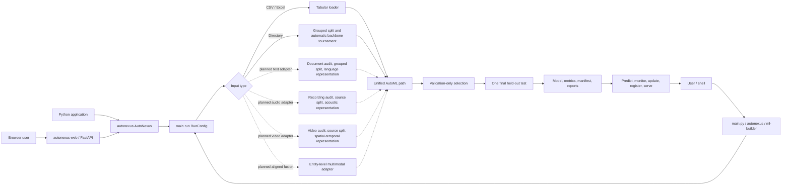

The stable contract includes the SDK, CLI, local Web Studio, serialized run bundle, drift
baseline, local meta-memory, streaming source protocol, update gate, model
registry, and optional inference server. W&B experiment tracking, autonomous
agents, executable-file analysis, audio/video/text training, and neural
architecture search are not production runtime features.

Solid arrows in the diagram are implemented. Dashed arrows describe extension
boundaries, not currently available training modes.

| Modality | Current status | Production input boundary |
|---|---|---|
| Tabular | Implemented | CSV, XLSX, or XLS with an explicit target column |
| Image | Implemented for classification | Class-named folders with explicit or automatic splits |
| Text | Planned, not implemented | Requires a document/manifest loader, text-aware audit, grouped splitter, and representation registry |
| Audio | Planned, not implemented | Requires decoding, recording-level splitting, bounded segmentation, acoustic representations, and temporal aggregation |
| Video | Planned, not implemented | Requires video decoding, clip sampling, source-aware splitting, and a spatial-temporal backbone registry |
| Multimodal fusion | Planned, not implemented | Requires entity alignment, one shared split, independently validated modality adapters, and missing-modality policies |

## 3. Main Execution Path

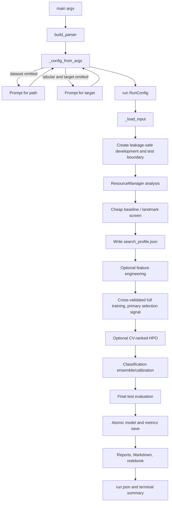

`RunConfig` is the immutable run contract. CLI values are validated before
training, paths are resolved, and image folders never require a target option.
The interactive path prompt also parses trailing options such as
`--adapt-lora`. Selecting a folder named `train` automatically resolves to its
parent when a sibling `test` folder is present.

### 3.1 SDK Lifecycle

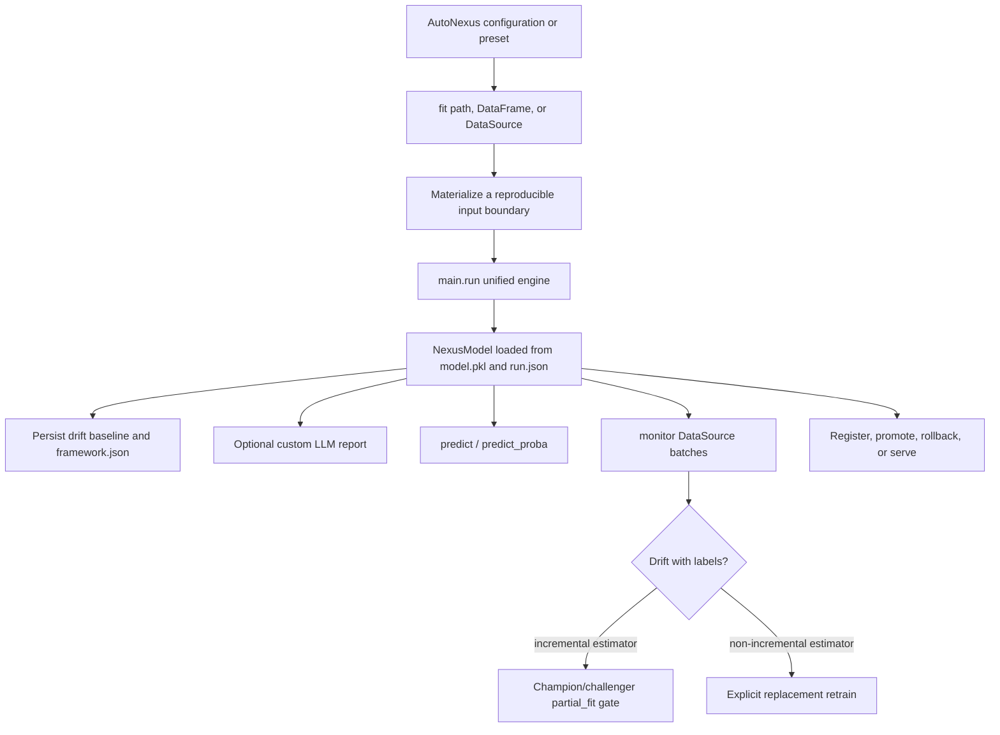

The SDK does not maintain a second training implementation. It translates
typed `NexusConfig` values into `RunConfig`, calls `main.run`, then adds
lifecycle metadata and a persisted monitoring baseline. This prevents CLI and
library behavior from diverging.

### 3.2 Web Studio Lifecycle

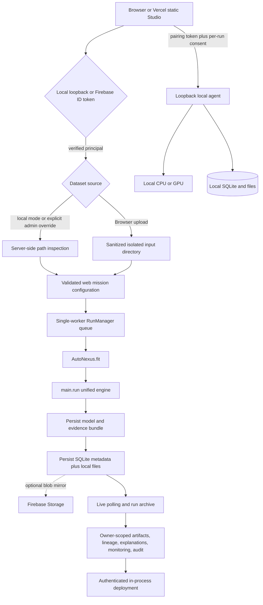

`autonexus/web.py` is a control plane, not a model-training implementation.
It validates browser input, persists mission state atomically, serializes
training jobs to avoid uncontrolled RAM/VRAM contention, invokes the public
SDK, and exposes only fixed artifact names. Interrupted queued/running jobs are
marked explicitly when the service restarts. Local mode is restricted to
loopback. Firebase mode verifies ID tokens server-side and filters every run,
artifact, evidence image, deployment, monitoring request, and audit event by
UID. Remote users are upload-only unless an administrator explicitly permits
server-local paths. Runs default to the user's application-data directory, not
the Git worktree.

Hosted mode separates a static Vercel frontend from the Railway FastAPI control
plane. Railway uses SQLite plus a mounted filesystem volume; Firebase Storage
is an optional dataset/artifact mirror and Firestore is not used. A hosted page
can request local compute only through a loopback-only paired agent. The agent
uses an ephemeral token and rejects missions without explicit per-run CPU/GPU
consent.

The Studio now has seven operational views: overview, mission composer, run
archive, interactive pipeline/data lineage with a 2D ledger, scientifically
labelled explainability geometry, live monitoring/incremental updates, and an
owner-scoped audit log. Deployment is a real authenticated in-process endpoint,
not a fabricated cloud deployment; it becomes inactive when the Studio process
restarts.

Web LLM configuration has four modes: server environment, hosted BYOK, local
Ollama, and deterministic offline. Hosted BYOK accepts a provider, exact model
identifier, optional custom HTTP endpoint, and API key. Validation separates
public metadata from a private secret dictionary before `RunManager.enqueue`.
Only public fields enter `web_run.json`; secrets remain in an in-memory map,
are converted to a redacting provider inside the worker, and are removed in a
`finally` block. Provider exceptions have credential values replaced before
the SDK can append a fallback error to `explanation.md`. The LLM receives the
final manifest context after training and cannot affect model selection.

## 4. Input Workflows

### 4.1 Tabular Input

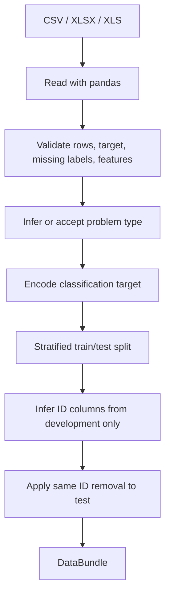

Important boundary: target-correlated feature removal is not automated.
Computing such a rule before the split would inspect test labels, and a highly
predictive legitimate feature can look identical to leakage. Domain-specific
leakage columns should be removed explicitly upstream.

### 4.2 Image Input With Explicit Splits

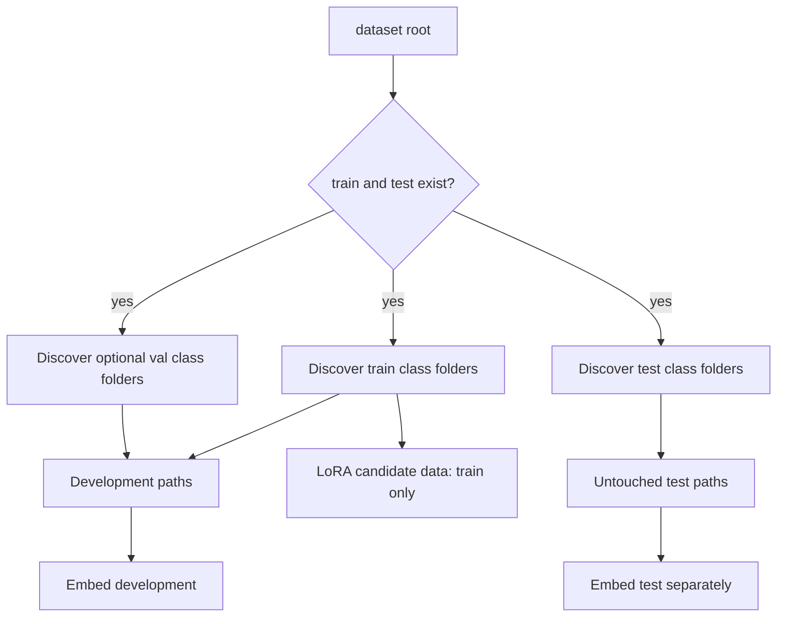

The optional `val/` folder joins downstream development data and acts as the
outer frozen-versus-adapted representation gate when available. LoRA itself
uses only `train/` and creates a separate internal early-stopping split. The
explicit `test/` folder is not used by adaptation, representation selection,
screening, model selection, ensembling, or calibration.

### 4.3 Image Input Without Explicit Splits

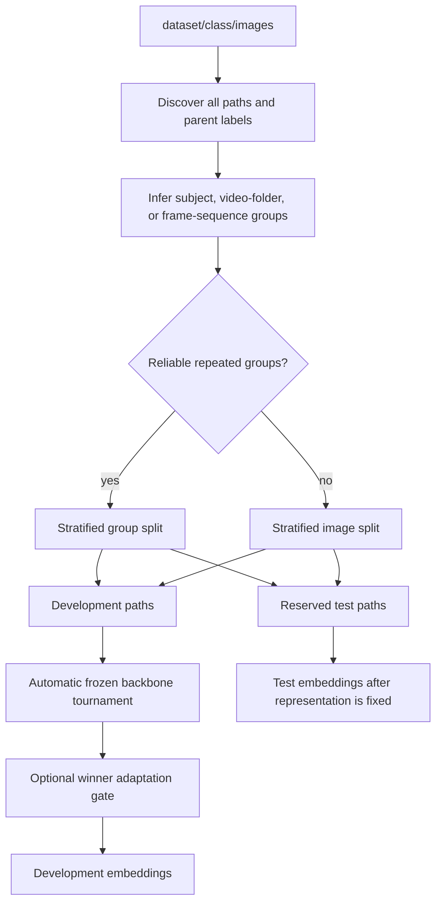

Splitting happens on file paths before model loading. Group inference is
conservative: ambiguous or mostly unique identifiers fall back to ordinary
stratification instead of inventing false groups. This reduces frame/session
leakage when a dataset contains repeated video or subject observations. Cache
keys are split-specific, so development and test embeddings cannot be
accidentally combined through the cache.

### 4.4 Planned Text Dataset Pipeline (Not Implemented)

AutoNexus does not currently provide a semantic NLP pipeline. A text column in
a tabular file is treated by the generic tabular preprocessor; that behavior is
not equivalent to tokenization, language-model embeddings, transformer
fine-tuning, or document-level explainability. A production text adapter should
use the following boundary:

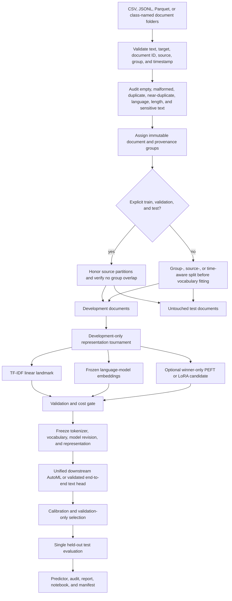

The split must happen before fitting a tokenizer vocabulary, TF-IDF statistics,
target encoding, embedding reducer, or adapter. Exact and semantic duplicates,
conversation threads, authors, customers, sources, and time windows should stay
within one partition when their presence could leak context. The representation
tournament should compare an inexpensive sparse linear landmark against frozen
language embeddings; adaptation should be accepted only when a separate
development gate improves generalization and probability quality after
accounting for latency and memory.

Text inference would restore the exact tokenizer and normalization contract,
produce probabilities through the persisted calibration layer, and retain
document IDs for monitoring. Text-specific analytics should include length and
language distributions, duplicate/leakage evidence, token coverage, class-wise
error slices, calibration, nearest semantic neighbors, and attribution methods
that are valid for the selected representation.

Implementing this path requires new text loader, splitter, audit, representation,
inference, and notebook components; CLI/SDK modality selection; optional NLP
dependencies; model-revision pinning; and dedicated tests. It must not be
presented as supported until those pieces and real-dataset acceptance tests are
complete.

### 4.5 Planned Audio Dataset Pipeline (Not Implemented)

AutoNexus does not currently decode audio, extract acoustic representations, or
aggregate segment predictions. Treating precomputed audio statistics as tabular
features is possible, but it does not constitute an audio pipeline. The first
bounded production target should be supervised recording-level classification;
automatic speech recognition, speaker diarization, source separation, retrieval,
and generation need separate task and artifact contracts.

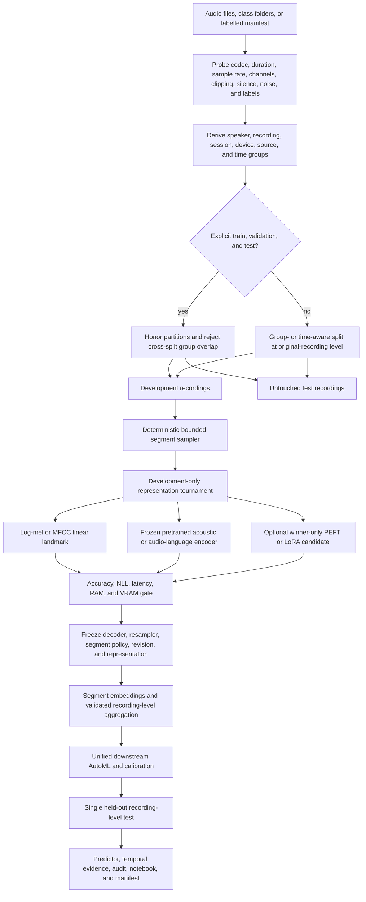

The split must be created before segmentation. Randomly splitting chunks from
one recording, speaker, session, or acoustic environment would allow highly
correlated waveforms into development and test. Any resampling statistics,
normalization, augmentation policy, vocabulary, adapter, reducer, or aggregation
rule must be fitted or selected from development data only.

An audio predictor would persist decoding and resampling parameters, segment
length/stride, silence policy, representation revision, label map, aggregation
rule, and calibration layer. Analytics should include duration, sample-rate,
channel, loudness, clipping, silence, signal-to-noise, spectrogram, source/group,
temporal confidence, error-segment, and calibration diagnostics. Cache identity
must include the source hash, decoder and resampler versions, segment timestamps,
augmentation policy, backbone revision, and adapter digest.

Implementation requires an audio loader/decoder, streaming segment sampler,
recording-aware splitter, acoustic backbone registry, aggregation and predictor
contracts, resource controls, notebook sections, optional dependencies, and
real-dataset tests. None of these components are shipped in `0.3.1`.

### 4.6 Planned Video Dataset Pipeline (Not Implemented)

The current image grouping logic can recognize likely frame sequences to keep
related images together, but AutoNexus does not decode video files or train a
temporal model. Historical video FAISS files were prototype memory assets, not
a production video pipeline. A safe video adapter should follow this workflow:

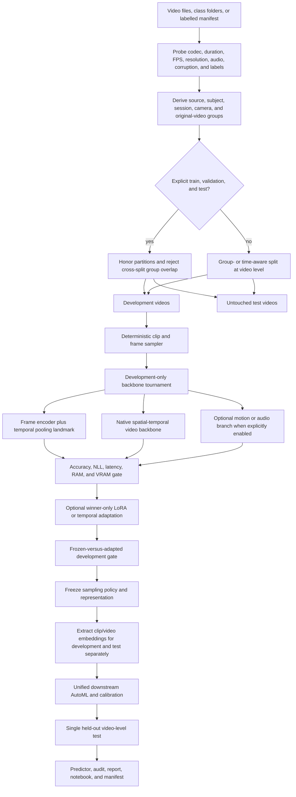

The test boundary must be created at the original-video or source level before
frames and clips are sampled. Splitting extracted frames independently would
allow nearly identical neighboring frames into development and test and produce
severely optimistic accuracy. Cache fingerprints must include the source-video
hash, decoder version, sampling policy, clip timestamps, augmentation policy,
backbone revision, and adapter digest.

Video inference should sample clips with the persisted policy, aggregate
frame/clip probabilities using a validated rule, and return both video-level
predictions and temporal evidence. Analytics should cover corrupt media,
duration/FPS/resolution distributions, class and source balance, sampled-frame
grids, temporal confidence, confusing clips, embedding trajectories, and
attention or saliency only where technically valid.

Implementing this path requires a decoder backend, bounded streaming sampler,
video-aware splitter, spatial-temporal model registry, cache schema, serialized
video predictor, resource controls, analytics, and tests. GPU memory pressure
and decoding throughput also require separate budgets from the image pipeline.
Until those components exist, a folder of extracted frames can only use the
image classifier and must retain reliable video groups; it is not equivalent to
video understanding.

### 4.7 Planned Multimodal Fusion Pipeline (Not Implemented)

Multimodal learning should be added only after each participating adapter has a
stable inference and evidence contract. The core safety rule is one shared
entity/group/time split across every modality; independently splitting tables,
images, documents, recordings, or videos can leak observations from the same
person, session, source, or event across the test firewall.

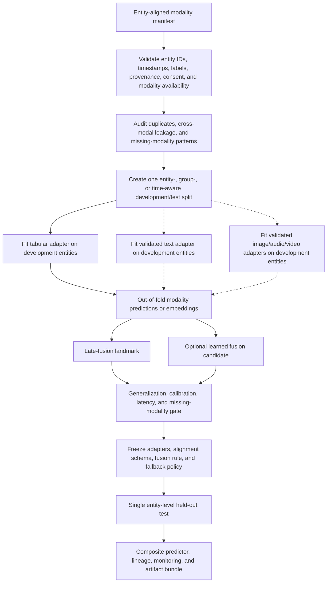

Late fusion is the safer first implementation because modality-specific models
remain independently testable and missing inputs can have explicit fallbacks.
Learned fusion should be a gated challenger, trained on out-of-fold development
predictions or embeddings rather than in-sample outputs. Evaluation must include
complete-case performance, each missing-modality scenario, group slices,
calibration, latency, and the incremental value of every modality.

The composite predictor would need an alignment schema, per-modality artifact
references and revisions, synchronized preprocessing, missing/late data policy,
fusion weights or model, calibration, and lineage fingerprints. Drift monitoring
must distinguish individual modality drift, alignment drift, availability drift,
and final performance degradation. This architecture is a roadmap boundary only;
`0.3.1` has no multimodal router or fusion estimator.

## 5. Image Backbone, Embedding, and LoRA Workflows

### 5.1 Embedding Cache

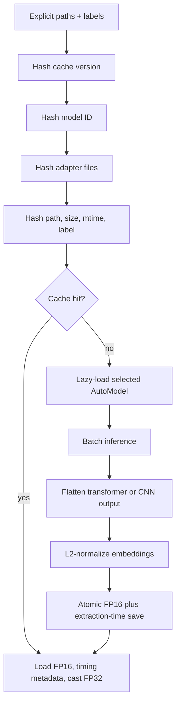

FP16 is a disk/storage optimization only. Values are restored to FP32 before
scikit-learn training. The cache identity includes its schema version, model
ID, resolved upstream commit, adapter file signature, cache-stage key, and
every file path, size, mtime, and label. The same resolved commit is used to
load the processor and weights. Historical extraction time is stored so a
cache hit cannot obtain an artificial latency advantage in a later tournament.

### 5.2 Automatic Backbone Tournament

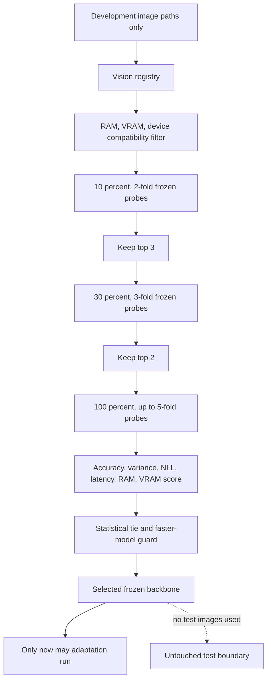

The registry includes CLIP ViT-B/32, DINOv2 Small, ResNet-50, and SigLIP Base.
It records family, model ID, input size, expected dimension, parameter count,
RAM/VRAM estimates, batch size, license identifier, and adaptation strategy.
SigLIP is excluded on CPU-only runs, and any candidate outside conservative
available-memory limits is removed before model loading.

Every stage uses the same regularized logistic probe and group-aware folds.
Stage samples are nested, so newly embedded rows accumulate rather than
recomputing earlier rows. The ranking score is:

```text
mean_accuracy
- 0.25 * fold_accuracy_standard_deviation
- normalized_NLL_penalty
- latency_penalty
- RAM_penalty
- VRAM_penalty
```

Accuracy remains dominant. A smaller model wins only within a statistical
tie. A slower candidate cannot replace a faster tied candidate unless it
improves accuracy by at least `0.002` or NLL by at least `0.01`. The
cooperative `--backbone-time` budget is checked between candidates and stages.
Candidate failures are isolated; CLIP is retained as the final fallback.

### 5.3 Frozen-versus-Adapted Winner

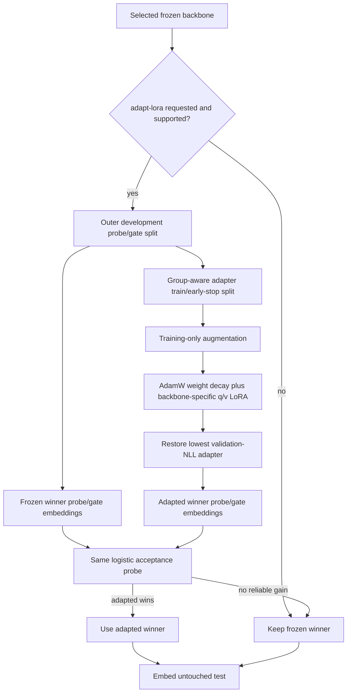

Gradient checkpointing is enabled for supported transformer winners on CUDA
devices with at most 12 GB VRAM. Augmentation is training-only and directional
labels disable horizontal flips. The gate accepts adaptation when accuracy
improves by at least `0.002` without material NLL regression, or accuracy is
non-worse while NLL improves by at least `0.01`. ResNet is frozen-only because
transformer q/v LoRA is invalid for convolutional blocks. Training, adapted
embedding, or adapted-test failure restarts the representation step in frozen
mode using cached tournament embeddings.

### 5.4 Backbone and Classifier Decisions

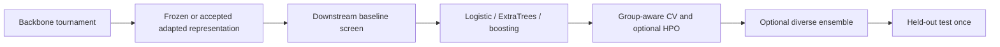

Backbone selection and classifier selection are independent. The first chooses
the representation. The second chooses the estimator operating on that
representation. LiteLLM receives results only after training for narrative
reporting and has no code path into either selection decision.

## 6. AutoML Workflow

### 6.1 Resource Analysis and Shortlisting

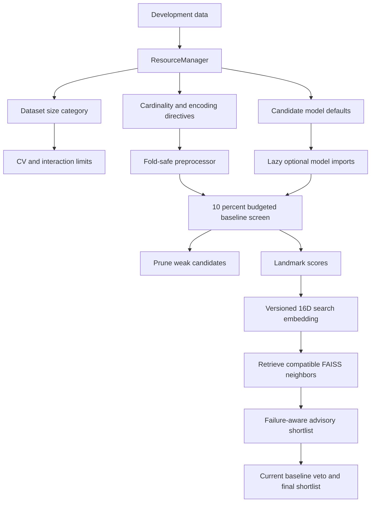

The baseline screen is the model-shortlist gatekeeper. It uses a stratified
sample for classification, at most two folds, and a separate time budget.
The search embedding combines statistical meta-features with observed
landmark performance. The active CLI and SDK retrieve only compatible nearby
runs, use validation-based success/failure evidence to reorder or prune the
shortlist, and preserve current-dataset baseline evidence as the final veto.
Held-out test metrics are excluded from new routing evidence.

### 6.2 Feature and Preprocessing Workflow

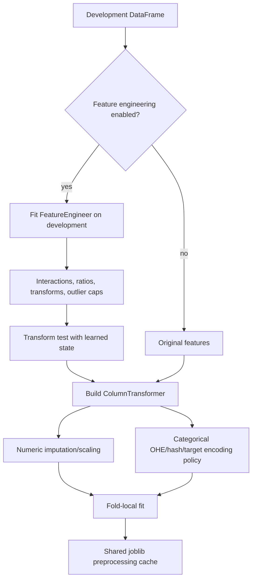

High-cardinality binary/regression target encoding is regularized and
out-of-fold. Multiclass high-cardinality data uses frequency encoding instead
of assigning an artificial numeric order to class labels.

Dense image embeddings bypass scaling when the embedding heuristic applies,
preserving their learned geometry and avoiding unnecessary copies.

### 6.3 Training and Early Stopping

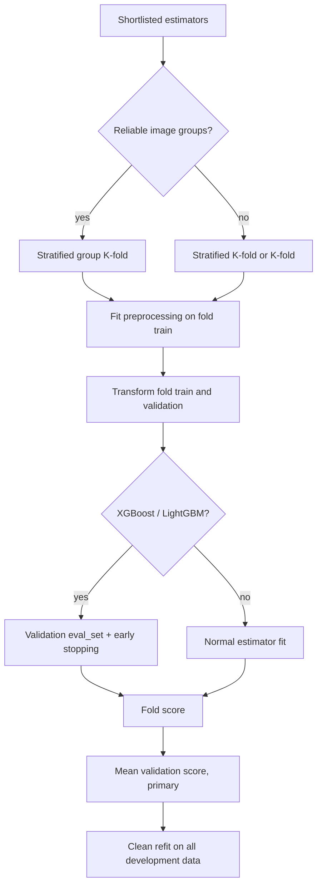

Class-aware fold counts are capped by the smallest class. This keeps every
classification fold valid and prevents multiclass labels from becoming
misaligned with XGBoost probability matrices. For grouped images, the fold
count is also capped by groups per class and no inferred video/subject group
can occur in both fold partitions.

The shared preprocessing cache reuses identical fold transformations across
model candidates. It never reuses a transformer fitted on validation or test
data. Logistic regression is retained as the linear control. ExtraTrees uses
bounded depth, larger leaves, feature subsampling, bootstrapped row sampling,
and OOB scoring instead of unconstrained memorization.

### 6.4 Optional Hyperparameter Search

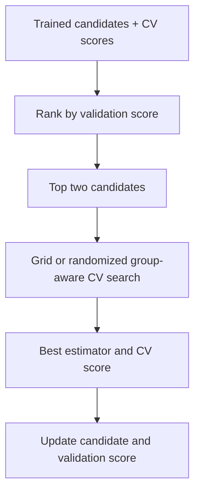

The held-out test metrics are not available to this workflow. This is a
critical production correction: earlier code ranked tuning candidates using
test results, which leaked test information into model selection. ExtraTrees
searches depth, leaf size, split size, feature fraction, tree count, and
bootstrapped sample fraction when `--tune` is enabled.

### 6.5 Diversity and Temperature Scaling

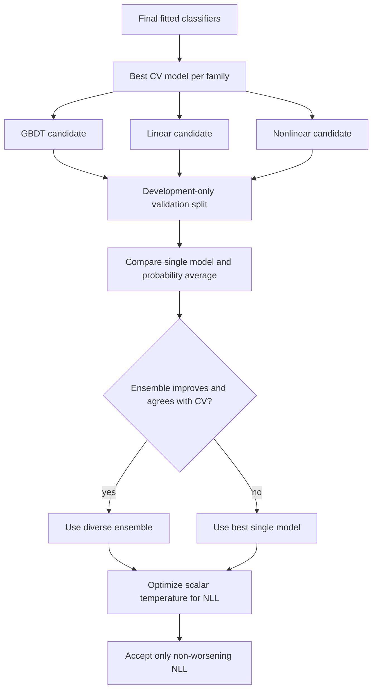

The ensemble is not mandatory. It must contain one available member from each
structural family and pass a validation gate. Temperature scaling changes
probability confidence but preserves class argmax predictions.

### 6.6 Final Evaluation and Persistence

```mermaid
flowchart TD
    A[Finalized model] --> B[Predict development]
    A --> C[Predict held-out test once]
    B --> D[Fitted training diagnostic]
    E[Cross-validation history] --> F[Primary validation metric]
    C --> G[Testing metrics]
    D --> H[Run summary]
    F --> H
    G --> H
    H --> I[Atomic best_model.joblib]
    H --> J[Atomic metrics.csv]
    H --> K[run.json]
```

Classification reports accuracy, weighted precision, weighted recall,
weighted F1, and ROC AUC when probabilities permit it. Regression reports
RMSE, MAE, and R2. A selected ExtraTrees model also exposes its OOB score.
For an ensemble, the primary CV value is explicitly labeled as the best
member's CV reference; the separate ensemble gate score is never presented as
cross-validation.

### 6.7 Implemented Generalization Recommendations

| Recommendation | Production behavior |
|---|---|
| 1. Regularize ExtraTrees | Constrains depth/leaves/splits, subsamples rows/features, enables OOB scoring, and exposes a CV HPO grid through `--tune`. |
| 2. Compare logistic regression | Keeps the regularized linear family in resource-aware classification defaults and preserves its family winner after baseline pruning. |
| 3. Compare frozen winner | Scores frozen and adapted winner embeddings with the same logistic probe on the same development gate. |
| 4. Gate LoRA by validation | Uses adaptation only when the accuracy/NLL rule beats or safely matches the frozen selected backbone. |
| 5. Training-only augmentation | Applies crop, brightness/contrast/color jitter, and random erasing only inside LoRA training; flips are disabled for directional class labels. |
| 6. Group images by source | Infers conservative subject/video/frame groups and keeps them disjoint through splitting, CV, HPO, and gates. |
| 7. Make CV primary | Selects and reports fold mean as primary; fitted training accuracy, OOB, gate, and held-out test values are separate diagnostics. |

## 7. Reporting Workflow

```mermaid
flowchart TD
    A[Final results] --> B{report enabled?}
    B -->|yes| C[EDA plots and summary]
    B -->|yes| D[Permutation importance]
    D --> E{SHAP enabled and installed?}
    E -->|yes| F[SHAP plots]
    C --> G[Self-contained HTML report]
    D --> G
    F --> G
    A --> H{LLM enabled?}
    H -->|yes| I[LiteLLM request]
    I -->|success| J[LLM explanation.md]
    I -->|failure| K[Deterministic offline explanation.md]
    A --> L[Mandatory analytics artifact]
    L --> M[Persist bounded analysis_data bundle]
    M --> N[Pre-training-first analysis.ipynb]
```

Optional HTML/plot failures are isolated and logged. Markdown and notebook
generation are part of the successful-run artifact contract; the Markdown file
is still produced without network access because the LLM path has an offline
fallback.

### 7.1 Notebook Analysis Workflow

```mermaid
flowchart TD
    A[Image discovery and split assignment] --> B[Readability and metadata audit]
    B --> C[Exact duplicate and bounded near-duplicate checks]
    C --> D[Persist data_index.csv]
    D --> E[Train and select final model]
    E --> F[Persist predictions and raw/calibrated probabilities]
    F --> G[Persist bounded embeddings and model leaderboard]
    G --> H[analysis.ipynb]
    H --> I[Part I: pre-training data, split, quality, and geometry]
    H --> J[Part II: tournament, metrics, errors, calibration, and model card]
```

The notebook is generated after a run so it can reference final artifacts, but
its narrative deliberately presents pre-training evidence first. Expensive
pixel, near-duplicate, embedding, UMAP, and learning-curve operations are
bounded. Exact class coverage is retained through paginated representative
grids, and exact duplicate leakage checks operate across every same-size file.
Grad-CAM is not fabricated for a downstream model that consumes saved vectors;
nearest embedding neighbors are used as representation-faithful explanations.

### 7.2 Runtime Timing Workflow

```mermaid
flowchart LR
    A[Input preparation] --> B[Backbone tournament]
    B --> C[LoRA training, optional]
    C --> D[Representation gate and test embedding]
    D --> E[Downstream AutoML]
    E --> F[Plots and HTML]
    F --> G[LLM or offline Markdown]
    G --> H[Notebook]
    H --> I[Total pipeline time]
```

The nested LoRA and embedding values explain the image portion of input
preparation; they are not added to it a second time. Total runtime includes
every stage plus lightweight orchestration and persistence, while downstream
training time includes only baseline screening, CV/HPO, generalization,
calibration, final evaluation, and model persistence.

## 8. Key Architectural Ideas

| Idea | Why it matters |
|---|---|
| One public CLI | Users test any supported dataset without editing source. |
| One local Web Studio | Nontechnical users configure and inspect runs without creating a second training pipeline. |
| Immutable run configuration | Every runtime choice can be serialized into the manifest. |
| Modality adapter, shared AutoML core | Images become numeric DataFrames, then reuse the tabular model path. |
| Test-set firewall | Selection and calibration happen before the test set is evaluated. |
| Conservative group isolation | Repeated subject/video frames stay together; uncertain grouping falls back safely. |
| Staged backbone tournament | Full embeddings are limited to finalists rather than every registered model. |
| Representation acceptance gate | LoRA must beat the frozen winning backbone on unseen development data before it can reach test. |
| Cheap-to-expensive search | A bounded baseline screen avoids full CV for clearly weak models. |
| CV-first diagnostics | Fold performance drives selection; fitted accuracy is only an overfitting signal. |
| Structural diversity gate | An ensemble is considered only across GBDT, linear, and nonlinear families. |
| Calibration after selection | Temperature scaling improves probability NLL without changing class predictions. |
| Fold-local transformations | Imputation, encoding, scaling, and target statistics avoid validation leakage. |
| Lazy heavy dependencies | Boosters, Torch, Transformers, PEFT, SHAP, and LiteLLM load only when needed. |
| Content-aware caching | Embeddings require matching model, adapter, files, labels, and cache schema. |
| Graceful optional failures | Missing optional packages reduce capabilities instead of breaking core tabular runs. |
| Artifact-first observability | Metrics, configuration, timing, memory, and report paths are persisted. |
| One SDK/CLI engine | Programmatic and shell users share `main.run`; there is no duplicate training pipeline. |
| Mandatory run bundle | Every successful run contains the same five minimum deployment/audit artifacts. |
| Provider-independent LLM | Reports can use LiteLLM, Ollama, local Transformers, custom callables, or generic JSON APIs without influencing model selection. |
| Ephemeral Web BYOK | Hosted keys are separated from public mission state, memory-only, redacted from failures, and destroyed after each run. |
| Local opt-out meta-memory | Statistical/landmark vectors contribute by default; raw examples are excluded and contribution can be disabled. |
| Drift as evidence, not auto-promotion | Schema, feature, prediction, and labelled performance signals trigger policy, while candidate promotion remains gated. |
| Capability-aware updates | Native `partial_fit` is used only when supported; other models request explicit replacement training. |
| Pluggable boundaries | Estimators, callbacks, data sources, detectors, LLMs, monitoring sinks, and registries have extension points. |
| Pre-training-first analytics | Data quality, split leakage, class balance, image statistics, and representation geometry are presented before model outcomes. |
| Bounded deep diagnostics | Large-dataset analytics use deterministic class-covering samples while exact representative class coverage and split fingerprints remain available. |

## 9. Production Source Files

These are the modules explicitly included in the wheel by `pyproject.toml`.

| File | Responsibility |
|---|---|
| `main.py` | CLI parser, prompting, image representation gate, tabular/image orchestration, duplicate-cleaning metadata alignment, test firewall, stage timing, artifacts, and terminal summary. |
| `config.py` | Loads optional dotenv values and reads `LLM_MODEL` without embedding an invalid provider default. |
| `data_loader.py` | Reads tabular files, validates targets, infers task type, encodes labels, performs stratified splitting, and drops development-inferred ID columns. |
| `data_cleaner.py` | Removes duplicates, handles missing feature values conservatively, and preserves X/y alignment. |
| `resource_manager.py` | Categorizes dataset size and emits model, encoding, CV-related, and feature-interaction directives. |
| `feature_processing.py` | Builds numeric/categorical preprocessing pipelines, hashing, scaling, imputation, and dense-embedding bypass behavior. |
| `feature_engineering.py` | Learns optional interactions, ratios, transformations, outlier caps, regularized OOF target encoding, and transformation logs. |
| `model_trainer.py` | Defines regularized model catalogues, lazy boosters, stratified/grouped screening and CV, early stopping, preprocessing caching, and full-data refits. |
| `model_selector.py` | Final held-out metrics, grouped validation-ranked HPO including ExtraTrees regularization, and atomic persistence. |
| `generalization.py` | Probability alignment, grouped diverse-ensemble gate, scalar temperature optimization, calibrated wrapper, and distinct gate/CV metrics. |
| `dataset_embedding.py` | Computes statistical and landmark search embeddings and provides versioned serialization helpers. |
| `vision_backbones.py` | Declares CLIP, DINOv2, ResNet, and SigLIP capabilities and performs pre-load RAM/VRAM/device filtering. |
| `backbone_selector.py` | Runs nested successive-halving frozen probes, multi-objective ranking, tie policy, time budgeting, failure isolation, and CLIP fallback. |
| `image_splitting.py` | Conservatively infers subject/video/frame groups and performs stratified group splits with safe fallback. |
| `multimodal_extractor.py` | Discovers images, augments training rows, extracts generic transformer/CNN features, loads PEFT adapters, and manages timed FP16 caches. |
| `lora_config.py` | Provides backward-compatible default LoRA settings from the production vision registry. |
| `lora_adapter_trainer.py` | Performs winner-specific group-aware transformer LoRA with augmentation, AdamW, clipping/checkpointing, early stopping, and metadata. |
| `eda.py` | Produces dataset summaries, target distributions, feature distributions, and correlation plots using a non-interactive backend. |
| `explainer.py` | Unwraps calibrated estimators and produces permutation importance plus SHAP beeswarm, global importance, dependence, local waterfall, and cumulative decision evidence. |
| `report_generator.py` | Combines metrics, EDA, explanations, and feature-engineering logs into HTML. |
| `llm_explainer.py` | Requests a constrained LiteLLM report and writes a deterministic Markdown fallback on any failure. |
| `analytics_artifacts.py` | Audits images before training and persists bounded predictions, probabilities, embeddings, leaderboards, fingerprints, versions, hardware, and notebook context. |
| `notebook_generator.py` | Writes the pre-training-first investigation notebook with data quality, split, image, embedding, tournament, model, error, calibration, learning-curve, group, explainability, reproducibility, and model-card sections. |
| `nexus_predictor.py` | Serializable inference boundary that keeps feature engineering, the fitted model, label mapping, modality, and metadata together in `model.pkl`. |
| `AutoNexus.py` | Compatibility shim for `import AutoNexus`; `autonexus/__init__.py` canonicalizes both package spellings before submodule imports so Windows and case-sensitive platforms expose the same framework classes. |
| `autonexus/__init__.py` | Curated public API and framework version. |
| `autonexus/api.py` | High-level fit/load facade, DataFrame/source materialization, callbacks, framework metadata, drift-baseline creation, and custom LLM reporting. |
| `autonexus/config.py` | Frozen public configuration, duration parsing, presets, overrides, and translation to the unified `RunConfig`. |
| `autonexus/model.py` | Loaded run lifecycle: inference, artifact access, immutable incremental challengers with strict promotion gates, replacement retraining, monitoring, registry integration, and FastAPI serving. |
| `autonexus/deployment.py` | Safe one-line localhost deployment, optional bearer authentication, public-bind guardrails, and background server lifecycle handles. |
| `autonexus/drift.py` | Compact persisted reference distributions plus always-on schema/type validation and minimum-sample-gated missingness, outlier, duplicate, constant-column, numeric, categorical, prediction, and task-aware performance signals. |
| `autonexus/monitoring.py` | Batch/stream monitor plus logging, JSONL, webhook, and Prometheus sinks. |
| `autonexus/data.py` | Restartable DataFrame, file, iterator, SQL, and optional Kafka/Redpanda batch sources. |
| `autonexus/memory.py` | Privacy-bounded local FAISS/NumPy meta-memory, locking, duplicate prevention, contribution policy, and nearest-run search. |
| `autonexus/llm.py` | Provider protocol and adapters for callables, LiteLLM, Ollama, local Transformers, and arbitrary JSON HTTP APIs. |
| `autonexus/registry.py` | Filesystem model versions with champion promotion and rollback history. |
| `autonexus/plugins.py` | Registration points for custom estimators and extension factories. |
| `autonexus/callbacks.py` | Failure-isolated lifecycle event callbacks. |
| `autonexus/exceptions.py` | Stable framework-specific exception hierarchy. |
| `autonexus/web.py` | FastAPI control plane, CORS boundary, authenticated owner isolation, safe upload/path policy, SQLite-backed run queue, optional Firebase Storage mirroring, lineage/evidence APIs, monitoring, updates, deployment, audit events, and allowlisted artifact delivery. |
| `autonexus/web_auth.py` | Local-loopback, paired-agent, and Firebase Admin ID-token verification boundary, including Railway service-account JSON loading. |
| `autonexus/web_store.py` | Thread-safe SQLite run-state index stored locally or on the Railway persistent volume; no Firestore dependency. |
| `autonexus/web_storage.py` | Optional owner/run-scoped Firebase Storage mirror for datasets and artifacts. |
| `autonexus/railway.py` | Railway ASGI application entry point. |
| `autonexus/local_agent.py` | Loopback-only local training agent with an ephemeral pairing token and trusted-origin allowlist. |
| `autonexus/web_static/index.html` | Seven-view Studio structure with research-document slots, auth gate, mission composer, lineage, explainability, monitoring, updates, deployments, and audit history. |
| `autonexus/web_static/styles.css` | Responsive visual system, motion, layout, form controls, mission cards, and accessible reduced-motion behavior. |
| `autonexus/web_static/app.js` | Runtime-configured Railway routing, Firebase login/session refresh, cloud/local compute selection, explicit local GPU consent, dataset selection, mission submission, polling, canvas lineage, interactive model geometry, evidence downloads, monitoring, updates, deployment, and audit rendering. |

## 10. Important Project and Test Files

| File | Meaning |
|---|---|
| `pyproject.toml` | Canonical `AutoNexus` `0.3.1` metadata, author, Apache-2.0 SPDX declaration, base/optional dependencies, CLI/Web/agent entrypoints, packaged static assets, explicit wheel module list, and pytest settings. |
| `uv.lock` | Exact reproducible dependency resolution for base and optional extras. |
| `README.md` | Publication-quality project overview with abstract, architecture, methodology, API/CLI usage, artifact contract, qualified case-study results, limitations, future work, references, and license status. |
| `understanding.md` | This architecture and operational reference. |
| `codes.md` | Copy-ready SDK, CLI, monitoring, streaming, update, registry, serving, memory, and LLM examples. |
| `LICENSE` | Complete Apache-2.0 license text in the regular root file required by the distribution metadata. |
| `.python-version` | Pins the local Python line to 3.12. |
| `.env.example` | Safe template for LiteLLM, Studio workspace, remote-path policy, and Firebase public configuration; it contains no real secret. |
| `DEPLOYMENT.md` | Exact Firebase Authentication/Storage, Railway volume, Vercel frontend, and paired local-agent deployment procedure. |
| `Dockerfile`, `railway.json` | Reproducible Railway backend image, health check, and process policy. |
| `vercel.json`, `scripts/build_vercel_frontend.py` | Static Vercel build and safe injection of the public Railway API base URL. |
| `.gitignore` | Excludes datasets, secrets, environments, caches, builds, models, and run artifacts. |
| `tests/test_data_loader.py` | Verifies split preservation, development-only ID filtering, retention of legitimate predictive features, and row/group metadata alignment after duplicate cleaning. |
| `tests/test_cli_calibration.py` | Verifies no-argument CLI parsing and that temperature scaling preserves predicted classes and normalized probabilities. |
| `tests/test_image_splitting.py` | Verifies group isolation/CV, nested tournament samples, automatic backbone selection, CLIP fallback, LoRA probing, and ExtraTrees defaults without model downloads. |
| `tests/test_notebook_analytics.py` | Verifies unreadable/duplicate image auditing, pre-training-first section order, code-cell syntax, persisted analysis artifacts, and end-to-end notebook-cell execution. |
| `tests/test_framework.py` | Verifies imports, drift, memory deduplication/search, the compact API, mandatory artifacts, inference, monitoring, and gated incremental update. |
| `tests/test_web.py` | Verifies upload path safety, tabular inspection, configuration validation, background run persistence, completion metadata, and artifact allowlisting. |

## 11. Runtime Artifacts and Their Meaning

| Artifact | Meaning |
|---|---|
| `model.pkl` | Public deployable `NexusPredictor` bundle with fitted transformations, model, labels, and modality. Treat it as untrusted executable data if received from another source. |
| `best_model.joblib` | Internal fitted preprocessing/model object retained for compatibility and diagnostics. |
| `metrics.csv` | Final held-out metrics for the selected deployment model. |
| `run.json` | Model used, label column, configuration, every backbone stage/score/failure, selected representation, grouping, primary/gate/test metrics, timings, RAM/VRAM, calibration, ensemble, artifact contract, and memory contribution result. |
| `search_profile.json` | Versioned statistical and landmark vector used for optional local FAISS/NumPy nearest-run memory. |
| `report/report.html` | Human-readable combined report with embedded plots. |
| `report/explanation.md` | LLM-generated or deterministic offline model explanation. |
| `analysis.ipynb` | Pre-training-first data investigation and post-training model audit. |
| `analysis_bundle.zip` | Portable notebook bundle containing `analysis.ipynb`, bounded `analysis_data`, metrics, and referenced plots. Extract before execution. |
| `analysis_data/data_index.csv` | Image path, split, class/group, readability, dimensions, format, file size, exact hash, bounded quality statistics, and near-duplicate candidates. |
| `analysis_data/prediction_index.csv` | Held-out labels, predictions, confidence, uncertainty, correctness/error, row/image identity, and optional groups. |
| `analysis_data/test_probabilities.npz` | Raw and temperature-scaled held-out probabilities used for calibration and per-class diagnostics. |
| `analysis_data/embedding_sample.npz` | Deterministic class-covering FP16 representation sample for PCA/UMAP, separation, learning curves, and nearest neighbors. |
| `analysis_data/lora_movement.npz` | Bounded paired frozen/adapted embeddings for honest PCA movement arrows when LoRA was evaluated. |
| `analysis_data/model_leaderboard.csv` | Baseline, CV mean/std, completed folds, selected test metrics, runtime, and observed process RAM. |
| `analysis_data/run_context.json` | Configuration, final summary, hardware, package versions, exact split fingerprints, and artifact paths. |
| `report/eda/*.png` | Target, feature, and correlation diagnostics. |
| `report/explanations/*.png` | Permutation importance and optional SHAP diagnostics. |
| `.cache/preprocessing/` | Joblib cache of fold-specific fitted transformations. |
| `.cache/embeddings/*.npz` | Exact split/model/adapter-aware image embeddings stored as FP16. |
| `lora_adapter/<backbone-key>/` | Best candidate winner adapter and training metadata; `run.json` says whether the outer gate accepted it. |
| `monitoring/baseline.json` | Task-aware training distribution and expected-performance reference used by drift detection. |
| `monitoring/events.jsonl` | Append-only default drift observations when monitoring runs. |
| `monitoring/update_history.jsonl` | Append-only champion/challenger decisions for incremental updates. |
| `updates/<version>/` | Immutable incremental candidate model and decision metadata, retained whether promoted or rejected. |
| `framework.json` | Compact public API context, class/feature names, preset, and lifecycle capabilities. |
| `~/.autonexus/memory/` | Default local meta-memory; contains dataset embeddings and sanitized run metadata, never raw rows or images. |
| `dist/*.whl` | Installable production wheel containing only declared production modules. |
| `dist/*.tar.gz` | Source distribution generated by `uv build`. |

Artifacts are generated outputs and should not be committed. The ignore policy
excludes future runs, serialized FAISS indexes, and neural checkpoints; the
historical tracked copies were removed from the active tree.

## 12. Historical Source Cleanup

The disconnected agentic, W&B, NAS, multimodal-memory, and superseded
meta-learning prototypes were removed before the `0.2.0` release and remain
absent from `0.3.1`. Git history retains them for research provenance without
exposing their dependencies or generated model/index files in normal checkouts
or distributions.

The active local meta-memory implementation is `autonexus/memory.py`; it uses
the documented `~/.autonexus/memory/` runtime location and never relies on a
repository-committed FAISS index or neural checkpoint.

### Removed FAISS and Meta-Learning Prototype

| File | Historical purpose |
|---|---|
| `cold_start.py` | FAISS nearest-dataset routing and cold-start decisions. |
| `unified_memory.py` | Combined ML/DL memory abstraction. |
| `build_memory.py` | OpenML-driven memory construction. |
| `preseed_memory.py` | Synthetic/predefined memory population. |
| `update_memory_hparams.py` | Memory record hyperparameter update utility. |
| `delete_memory.py` | Memory deletion utility. |
| `extract_memory.py` | Source extraction/migration helper. |
| `task_encoder.py` | Siamese dataset task encoder training. |
| `dataset_profiler.py` | Older OpenML dataset profile script. |
| `heuristics.py` | Historical cold-start model heuristics. |
| `routing_engine.py` | Experimental routing score logic. |
| `paradigm_router.py` | LLM ML-vs-DL routing experiment. |
| `onboarding_agent.py` | Interactive onboarding configuration experiment. |
| `memory_store.faiss` | Historical serialized FAISS index. |
| `memory_store.pkl` | Historical metadata sidecar. |
| `task_encoder.pt` | Historical task encoder checkpoint. |
| `test_cold_start.py` | Manual tests for the old cold-start system. |
| `test_embedding.py` | Manual tests for the old dataset embedding API. |
| `test_unified_memory.py` | Manual tests for the old unified memory system. |

### Removed Multimodal Memory Prototype

| File | Historical purpose |
|---|---|
| `build_multimodal_faiss_hf.py` | Built image/video memories from Hugging Face datasets. |
| `dl_faiss_memory.py` | Modality-specific FAISS storage. |
| `domain_registry.py` | Broader experimental vision model/domain registry. |
| `dl_memory_vision.faiss` | Historical vision index. |
| `dl_memory_video.faiss` | Historical video index. |
| `dl_metadata_vision.json` | Historical vision index metadata. |
| `dl_metadata_video.json` | Historical video index metadata. |

### Removed NAS, HPO, W&B, and Ensemble Prototype

| File | Historical purpose |
|---|---|
| `hpo_optuna.py` | Older Optuna/W&B HPO implementation. |
| `multi_objective.py` | Experimental accuracy/time/complexity utility. |
| `weight_search.py` | Multi-objective weight sweep/report script. |
| `confidence_calibration.py` | Standalone confidence plotting with import-time W&B behavior. |
| `shap_explainer.py` | Older W&B-coupled SHAP script. |
| `llm_suggester.py` | Older LLM hyperparameter suggestion path. |
| `wandb_logger.py` | Global W&B logging wrapper. |
| `metaautoml/data/gpu_tabular_loader.py` | Experimental GPU data loader. |
| `metaautoml/ensembles/downstream_bagging.py` | Experimental downstream bagging. |
| `metaautoml/ensembles/embedding_cache.py` | PyArrow/Torch embedding cache experiment. |
| `metaautoml/ensembles/oof_stacking.py` | Experimental OOF stacker. |
| `metaautoml/evaluation/calibration_shap.py` | W&B calibration/SHAP experiment. |
| `metaautoml/pipelines/autodl_router.py` | Experimental AutoDL route. |
| `metaautoml/pipelines/automl_router.py` | Experimental tabular router. |
| `metaautoml/pipelines/stacking_integration.py` | Experimental diverse stacking integration. |

### Removed or Ignored Repository Artifacts

| File/path | Why it should not be source |
|---|---|
| `requirements.txt` | Duplicates and conflicts with canonical `pyproject.toml`/`uv.lock`. |
| `.gitconfig` | Machine/user-specific Git configuration and personal identity data. |
| `artifacts/` | Historical fitted model and run output. |
| `embedding_cache/` | Historical generated embeddings. |
| `lora_adapters/` | Historical adapter with no dataset/version provenance. |
| `wandb/` | Historical experiment logs and environment metadata. |

## 13. Strengths

- One no-edit CLI supports both tabular and image classification workflows.
- The final test split is isolated from HPO and model selection.
- Repeated video/subject groups remain disjoint through test reservation, LoRA
  gates, downstream CV, HPO, and generalization gating.
- Model-family diversity is enforced structurally rather than by score alone.
- Calibration is accepted only when validation NLL does not worsen.
- Optional heavy libraries are lazy and grouped into install extras.
- Backbone choice covers vision-language, self-supervised, and CNN families
  using a reproducible development-only tournament.
- LoRA is augmented and regularized, then rejected when the frozen winner
  generalizes as well or better.
- Logistic regression and regularized ExtraTrees provide linear and nonlinear
  controls, including an independent OOB diagnostic.
- Embedding and preprocessing caches reduce repeated compute and memory churn.
- Model and metrics writes are atomic.
- Every normal run produces reproducibility and resource metadata.
- LLM/report failures degrade gracefully instead of losing the trained model.
- The package boundary and active repository contain only maintained runtime,
  compatibility, test, documentation, and packaged Studio files.

## 14. Weaknesses and Remaining Risks

| Risk | Impact | Current mitigation / next step |
|---|---|---|
| Capitalized compatibility requires early aliasing | Without package-name canonicalization, Windows can load duplicate classes under `AutoNexus.*` and `autonexus.*` | Both names are registered before canonical submodule imports; tests cover canonical-first and capitalized-first import order. |
| Version `0.1.0` vision finalization can raise after successful training | Object-typed NPZ feature names are rejected by NumPy's safe loader, leaving framework and drift metadata incomplete | Version `0.1.1` writes Unicode arrays and safely recovers old bundles from the persisted predictor schema without enabling pickle. |
| Duplicate cleaning can desynchronize analytics metadata | Removing repeated feature rows while retaining original row IDs or split groups makes pandas artifact construction fail with arrays of different lengths | Version `0.3.1` applies the duplicate mask consistently to features, targets, row IDs, and optional groups; a regression test covers both train and test splits. |
| `--max-time` is cooperative | A single estimator fit can exceed the budget | Documented; hard isolation would require subprocess workers. |
| Image models download on first use | Offline image runs fail without a local model cache | Actionable dependency/runtime error; pre-provision models in deployment. |
| Backbone probes are approximate | A 10% or 30% ranking can eliminate a late-improving candidate | Nested stages retain three then two candidates; force an explicit list or one key when domain knowledge is stronger. |
| First automatic image run downloads multiple models | Startup time and disk use can be substantial | Resource filtering, successive halving, exact caches, a separate time budget, and `--backbones clip` limit the cost. |
| Upstream model metadata can change | Weights, processors, or licensing can change outside this repository | Pin deployment cache/revisions and review upstream model cards before commercial deployment. |
| LoRA defaults are fixed | May be suboptimal across domains and dataset sizes | Early stopping and weight decay reduce risk; expose advanced options only with evidence. |
| Automatic grouping is heuristic | Unusual filenames/layouts can hide real subjects or videos | Conservative patterns avoid false groups; use explicit train/val/test folders when provenance is known. |
| Calibration uses one internal split | Small datasets can produce noisy temperature estimates | Skip when data is insufficient; accept only non-worsening NLL. |
| RAM peak is platform-dependent | Some platforms expose only current RSS | Manifest labels both current and peak; use container telemetry in production. |
| VRAM metrics require CUDA Torch | CPU systems report N/A/zero | Expected and surfaced explicitly. |
| Meta-memory advice can amplify historical mistakes | Nearby success/failure evidence may not transfer to a new domain | Distance/version/task gates, current-baseline vetoes, family diversity, and persisted retrieval provenance keep routing advisory. |
| Default memory contribution is an operational policy choice | Sanitized run metadata may still be unsuitable for some regulated environments | Raw data and clear-text paths are excluded; use `contribute_memory=False` or an isolated `memory_dir`. |
| Incremental learning is estimator-dependent | Tree ensembles and vision adapters cannot safely use generic `partial_fit` | `strategy="auto"` uses `partial_fit` only when valid and otherwise gates an immutable retrained tabular challenger; vision still requires adapter/retraining workflows. |
| Automatic drift-triggered updates can react to transient shifts | A short-lived batch may not justify promotion | Require labels, a holdout gate, minimum batch sizes, monitoring thresholds, and human approval for high-risk systems. |
| Population drift is undefined for undersized batches | One observation can look constant or unlike the reference distribution | Batches below `minimum_samples` run schema/type checks only and return `insufficient_data`; population, prediction, and performance alarms remain gated. |
| Real pretrained-model downloads are excluded from standard CI | Upstream model-host or weight failures are not exercised on every commit | Mocked public-API vision finalization and Transformers output tests cover package integration; run a clean TestPyPI image smoke test before release. |
| Joblib model loading executes Python objects | Untrusted model files are unsafe | Load only artifacts produced by trusted runs. |
| Firebase protects application-level ownership, not worker/OS isolation | A hostile workload could still compete for shared CPU, RAM, VRAM, or disk | Remote users are upload-only, all APIs are UID-scoped, and non-loopback launch requires Firebase; production SaaS still needs quotas and isolated workers. |
| BYOK secrets live in process memory until a queued mission starts | A privileged process-memory inspector could access active credentials | Use a trusted local machine, keep the queue short, and use scoped/revocable provider keys. |
| Railway jobs execute in the application process | A process restart interrupts active work and Python threads cannot safely cancel model training | SQLite and volume state survive restarts and interrupted work is surfaced; multi-replica production still needs a durable external queue. |
| Local GPU access requires a browser-to-loopback connection | Private Network Access or corporate browser policy can block the hosted Studio from reaching localhost | Use a short-lived pairing token, an exact origin allowlist, per-run consent, and fall back to the local Studio when browser policy blocks loopback. |
| Browser uploads duplicate input data inside the run workspace | Very large image folders can consume disk and transfer time | Prefer local-path mode for large datasets and enforce `AUTONEXUS_MAX_UPLOAD_MB`. |
| One-click deployment is process-local | Restarting Studio disables the endpoint and it is not a managed cloud deployment | The archive marks deployments inactive on restart; use container/managed deployment for durable production traffic. |
| Firebase credentials are deployment-specific | Login cannot become active from source code alone | Configure Email/Password, public Web app values, and server-side Admin credentials before non-loopback launch. |
| XLS parsing adds an old-format dependency | Extra base dependency for a legacy format | Drop XLS if only modern XLSX is required. |
| Text, audio, video, and multimodal workflows are architecture only | Users could mistake diagrams for released support | Every roadmap path is marked not implemented; add loaders, splitters, predictors, analytics, optional dependencies, and acceptance tests before exposing it in the SDK or CLI. |
| Docker and hosted deployment remain unverified | Source-level tests do not prove Railway persistence, Firebase ownership, Vercel CORS, browser uploads, or local-agent connectivity | Complete the deployment acceptance matrix in `DEPLOYMENT.md` before public hosted use. |

## 15. Production Readiness Assessment

The `0.3.1` source, Git tag, wheel, and source distribution define the current
patch release. Its distribution artifacts are
`autonexus-0.3.1-py3-none-any.whl` and `autonexus-0.3.1.tar.gz`; the release
workflow includes clean-environment
installation and command-level smoke checks. The package boundary remains
isolated from historical prototypes and the root Apache-2.0 license is valid.

The released local and batch runtime has automated coverage for framework
lifecycle, mandatory artifacts, drift, local meta-memory, calibration,
group-aware image splitting, backbone selection/fallback, executable notebook
cells, Web input safety, Firebase owner scoping, BYOK redaction, SQLite-backed
run persistence, and local-agent permission boundaries. Large pretrained model
downloads and real cloud services are intentionally outside routine unit tests.

The following infrastructure gates remain open:

1. Build `Dockerfile` locally and run its `/api/health`, persistence, upload,
   artifact, restart, and resource-envelope checks against a mounted volume.
2. Deploy one Railway backend with one `/data` volume and one worker; validate
   interruption handling, storage growth, backups, quotas, and authenticated
   owner isolation with at least two Firebase users.
3. Deploy the static Vercel frontend; validate the final CORS origin, Firebase
   authorized domain, desktop/mobile behavior, browser uploads, and artifact
   downloads.
4. Test the hosted-page-to-loopback agent path on supported browsers, including
   Private Network Access prompts, invalid/expired pairing tokens, per-run GPU
   denial, consent, cancellation, and local data retention.
5. Run real tabular and image missions through local and Railway targets, then
   verify reports, notebooks, SHAP evidence where applicable, deployments,
   monitoring, and restart behavior end to end.

Consequently, `0.3.1` is the current framework release, but the Vercel/Railway
deployment should remain labelled pre-production until these environment-level
checks pass. Multi-user SaaS operation additionally needs durable external job
queues, per-user storage/compute quotas, isolated workers, rate limiting,
backup/restore exercises, and operational alerting.

## 16. Summary

The core design is a leakage-safe, resource-aware funnel:

```mermaid
flowchart LR
    Input --> Split --> Screen --> CrossValidate --> Tune
    Tune --> Generalize --> Calibrate --> FinalTest --> Persist --> Explain
```

The highest-value architectural property is the test-set firewall. The
highest-value efficiency properties are successive-halving backbone selection,
incremental timed FP16 caches, cheap classifier screening, shared fold
preprocessing, and lazy heavy imports. The highest-value generalization
controls are group-aware backbone and classifier CV, frozen-versus-adapted
winner gating, training-only augmentation, regularized ExtraTrees, a linear
logistic control, validation-gated family diversity, early stopping, LoRA
weight decay, and non-worsening temperature scaling.

The production runtime is unified, and the old experimental stack has no
runtime role in the declared distribution. Version `0.3.1` is current; its
local/package release gates are complete, while Docker and hosted deployment
acceptance remain the next operational milestone. Text, audio, video, and
multimodal fusion remain explicitly outside the released runtime.
